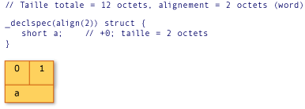
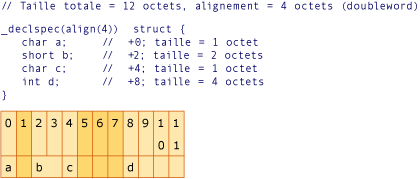
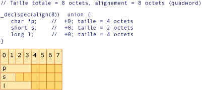

# Exemples d&#39;alignement de structure
[!INCLUDE[vs2017banner](../assembler/inline/includes/vs2017banner.md)]

Les quatre exemples suivants déclarent chacun une structure ou union alignée et les illustrations correspondantes illustrent la mise en page de cette structure ou union en mémoire.  Chaque colonne dans une illustration représente un octet de mémoire et le nombre dans la colonne indique le décalage de cet octet.  Le nom dans la deuxième ligne de chaque illustration correspond au nom d'une variable dans la déclaration.  Les colonnes grisées indiquent le remplissage requis pour obtenir l'alignement spécifié.  
  
   
Exemple 1  
  
   
Exemple 2  
  
   
Exemple 3  
  
   
Exemple 4  
  
## Voir aussi  
 [Types et stockage](../build/types-and-storage.md)