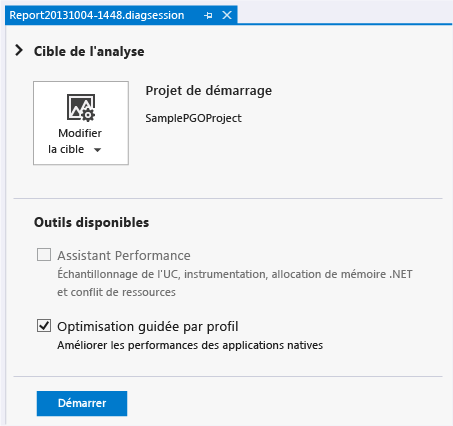
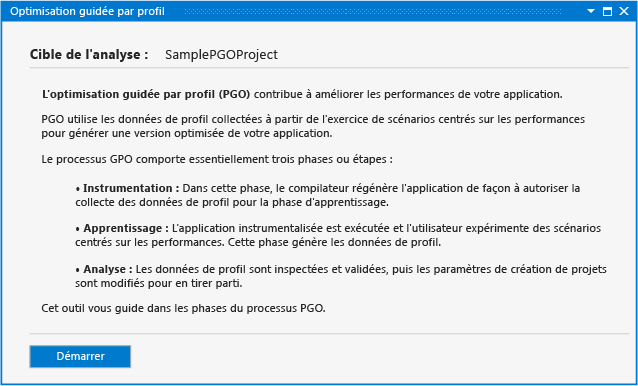
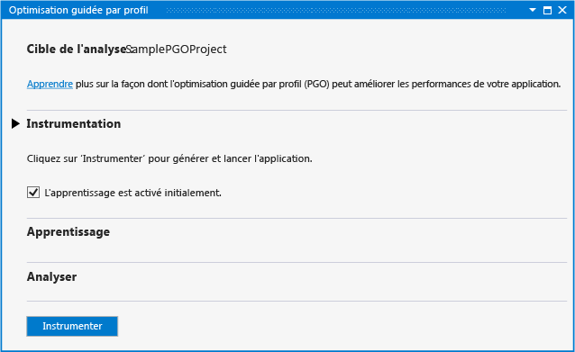
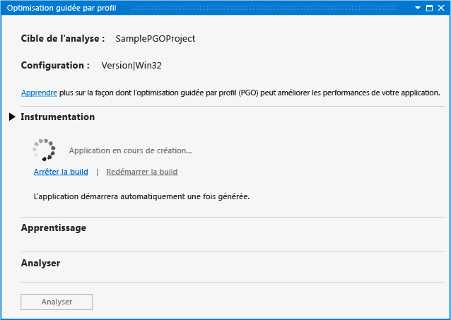
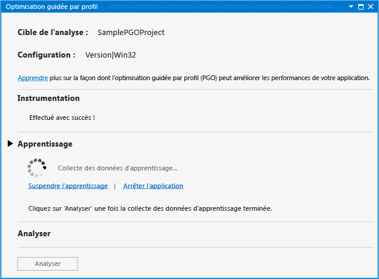
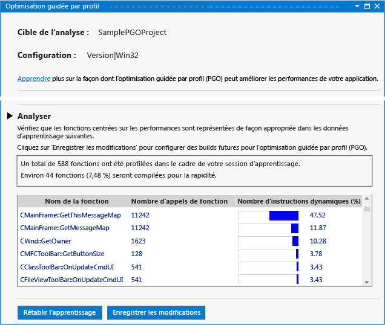
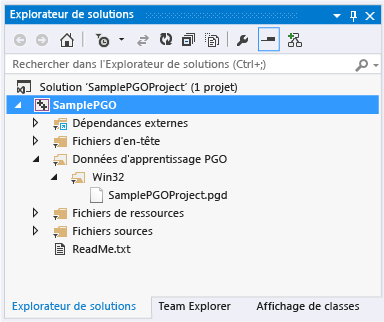
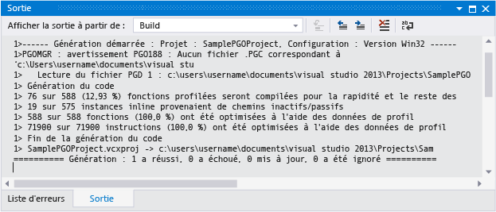

# Optimisation guid&#233;e par profil dans le concentrateur Performances et diagnostics
[!INCLUDE[vs2017banner](../../assembler/inline/includes/vs2017banner.md)]

L'optimisation guidée par profil du plug\-in Visual C\+\+ dans le concentrateur de performances et de diagnostics rationalise l'expérience d'optimisation guidée par profil des développeurs.  Vous pouvez [télécharger le plug\-in](http://go.microsoft.com/fwlink/p/?LinkId=327915) à partir du site web Visual Studio.  
  
 L'optimisation guidée par profil \(PGO\) vous aide à créer des builds d'applications natives x86 et x64 qui sont optimisées pour la manière dont les utilisateurs interagissent avec elles.  PGO est un processus à plusieurs étapes : vous créez une build d'application instrumentée pour le profilage, puis vous effectuez la "formation", c'est\-à\-dire, vous exécutez l'application instrumentée via des scénarios d'interaction utilisateur courants.  Vous enregistrez les données de profilage capturées, puis vous régénérez votre application en utilisant les résultats pour guider l'optimisation de l'ensemble du programme.  Bien que vous puissiez exécuter ces étapes individuellement dans Visual Studio ou sur la ligne de commande, le plug\-in PGO centralise et simplifie le processus.  Le plug\-in PGO définit toutes les options requises, vous guide tout au long de chaque étape, affiche l'analyse, puis utilise les résultats pour configurer la build et optimiser la taille ou la vitesse de chaque fonction.  Le plug\-in PGO facilite également la réexécution de votre formation d'application et la mise à jour des données d'optimisation de build lorsque vous modifiez votre code.  
  
## Conditions préalables  
 Vous devez [télécharger le plug\-in PGO](http://go.microsoft.com/fwlink/p/?LinkId=327915) et l'installer dans Visual Studio pour pouvoir l'utiliser dans le concentrateur de performances et de diagnostics.  
  
## Procédure pas à pas : utilisation du plug\-in PGO pour optimiser une application  
 D'abord, vous allez créer une application de bureau Win32 de base dans Visual Studio.  Si vous possédez déjà une application native que vous souhaitez optimiser, vous pouvez l'utiliser et ignorer cette étape.  
  
#### Pour créer une application  
  
1.  Dans la barre de menus, sélectionnez **Fichier**, **Nouveau**, **Projet**.  
  
2.  Dans le volet gauche de la boîte de dialogue **Nouveau projet**, développez **Installés**, **Modèles**, **Visual C\+\+**, puis sélectionnez **MFC**.  
  
3.  Dans le volet central, cliquez sur **Application MFC**.  
  
4.  Spécifiez un nom pour le projet, par exemple SamplePGOProject, dans la zone **Nom**.  Sélectionnez le bouton **OK**.  
  
5.  Dans la page **Vue d'ensemble** de la boîte de dialogue **Assistant Application MFC**, cliquez sur le bouton **Terminer**.  
  
 Ensuite, affectez à la configuration de build de votre application la valeur Version finale pour la préparer aux étapes de génération et de formation PGO.  
  
#### Pour définir la configuration de build  
  
1.  Dans la barre de menus, choisissez **Générer**, puis **Gestionnaire de configurations**.  
  
2.  Dans la boîte de dialogue **Gestionnaire de configurations**, cliquez sur le bouton de liste déroulante **Configuration de la solution active** et sélectionnez **Version finale**.  Cliquez sur le bouton **Fermer**.  
  
 Ouvrez le concentrateur de performances et de diagnostics en sélectionnant **Analyser**, **Performances et diagnostics** dans la barre de menus.  Cela ouvre une page de session de diagnostic qui contient les outils d'analyse disponibles pour votre type de projet.  
  
   
  
 Dans **Outils disponibles**, activez la case à cocher **Optimisation guidée par profil**.  Cliquez sur le bouton **Start** pour démarrer le plug\-in PGO.  
  
   
  
 La page **Optimisation guidée par profil** décrit les étapes que le plug\-in utilise pour améliorer les performances de votre application.  Cliquez sur le bouton **Start**.  
  
   
  
 Dans la section **Instrumentation**, utilisez l'option **Training is initially enabled** pour choisir d'inclure la phase de démarrage de votre application dans le cadre de la formation.  Si cette option n'est pas activée, les données de formation ne sont pas stockées dans une application instrumentée en cours d'exécution tant que vous n'activez pas explicitement la formation.  
  
 Cliquez sur le bouton **Instrument** pour générer votre application avec un jeu spécial d'options du compilateur.  Le compilateur insère des instructions de sonde dans le code généré.  Ces instructions enregistrent les données de profilage pendant la phase de formation.  
  
   
  
 Lorsque la génération instrumentée de votre application est terminée, l'application est lancée automatiquement.  
  
 Si des erreurs ou des avertissements se produisent pendant la génération, corrigez\-les, puis choisissez **Restart Build** pour redémarrer la génération instrumentée.  
  
 Lorsque votre application est lancée, vous pouvez utiliser les liens **Start Training** et **Pause Training** dans la section **Training** pour contrôler la date d'enregistrement des informations de profilage.  Vous pouvez utiliser les liens **Arrêter l'application** et **Démarrer l'application** pour arrêter et redémarrer l'application.  
  
   
  
 Pendant la formation, parcourez vos scénarios utilisateur pour capturer les informations de profilage dont le plug\-in PGO a besoin pour optimiser le code.  Lorsque vous avez terminé la formation, fermez votre application ou choisissez le lien **Arrêter l'application**.  Cliquez sur le bouton **Analyser** pour démarrer l'étape d'analyse.  
  
 Lorsque l'analyse est terminée, la section **Analyse** affiche un rapport des informations de profilage capturées pendant la phase de formation du scénario utilisateur.  Vous pouvez utiliser ce rapport pour examiner les fonctions que votre application a appelées le plus et dans lesquelles elle a passé le plus de temps.  Le plug\-in PGO utilise les informations pour déterminer les fonctions d'application à optimiser pour la vitesse et celles à optimiser pour la taille.  Le plug\-in PGO configure les optimisations de build pour créer l'application la plus petite et la plus rapide pour les scénarios utilisateur que vous avez enregistrés pendant la formation.  
  
   
  
 Si la formation a capturé les informations de profilage attendues, choisissez **Enregistrer les modifications** pour enregistrer les données de profil analysées dans votre projet en vue d'optimiser des builds futures.  Pour ignorer les données de profil et recommencer la formation à partir du début, choisissez **Redo Training**.  
  
 Le fichier des données de profil est stocké dans votre projet, dans le dossier **PGO Training Data**.  Ces données sont utilisées pour contrôler les paramètres d'optimisation de build du compilateur dans votre application.  
  
   
  
 Après l'analyse, le plug\-in PGO définit les options de build dans votre projet afin d'utiliser les données de profil pour optimiser sélectivement votre application pendant la compilation.  Vous pouvez continuer à modifier et à générer votre application avec les mêmes données de profil.  Lorsque l'application est générée, la sortie de génération indique le nombre de fonctions et d'instructions optimisées à l'aide des données de profil.  
  
   
  
 Si vous apportez des modifications de code significatives pendant le développement, vous devrez peut\-être recycler votre application pour obtenir les meilleures optimisations.  Nous vous recommandons de recycler votre application lorsque la sortie de génération indique que moins de 80 % des fonctions ou instructions ont été optimisées à l'aide des données de profil.