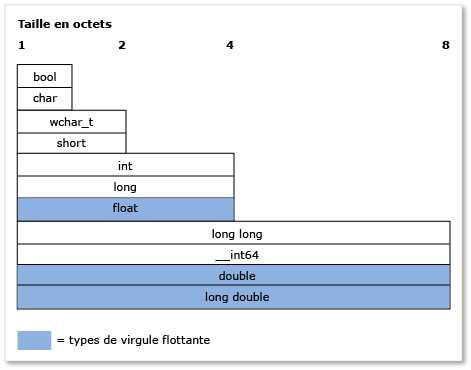

# <a name="c-type-system-modern-c"></a>Système de type C++ (Modern C++)
Le concept de *type* est très important en C++. Chaque variable, argument de fonction et valeur de retour de fonction doit avoir un type pour être compilé. En outre, chaque expression (y compris les valeurs littérales) reçoit implicitement un type du compilateur avant d'être évaluée. Des exemples de types `int` pour stocker les valeurs intégrales, `double` pour stocker les valeurs à virgule flottante (également appelé *scalaire* des types de données), ou de la classe de bibliothèque Standard [std::basic_string](../standard-library/basic-string-class.md) pour stocker du texte. Vous pouvez créer votre propre type en définissant une `class` ou un `struct`. Le type spécifie la quantité de mémoire qui sera allouée à la variable (ou au résultat de l'expression), les types de valeurs qui peuvent être stockés dans cette variable, la façon dont ces valeurs (en tant que séries de bits) sont interprétées et les opérations qu'il y est possible d'exécuter. Cet article contient une présentation informelle des principales fonctionnalités du système de type C++.  
  
## <a name="terminology"></a>Terminologie  
 **Variable**: le lien symbolique nom d’une quantité de données afin que le nom peut être utilisé pour accéder aux données qu’il fait référence à tout au long de l’étendue du code dans laquelle il est défini. En C++, *variable* est généralement utilisée pour faire référence à des instances de types de données scalaires, alors que les instances d’autres types sont généralement appelées *objets*.  
  
 **Objet**: pour des raisons de simplicité et de cohérence, cet article utilise le terme *objet* pour faire référence à n’importe quelle instance d’une classe ou une structure, et lorsqu’elle est utilisée dans le sens général inclut tous les types, y compris les variables scalaires.  
  
 **Type POD** (données) : cette catégorie informelle de types de données en C++ fait référence aux types qui sont scalaires (consultez la section types fondamentaux) ou sont *classes POD*. Une classe POD ne comporte pas de données membres static qui ne sont pas également des POD et ne comporte également aucun constructeur défini par l'utilisateur, aucun destructeur défini par l'utilisateur ou aucun opérateur d'assignation défini par l'utilisateur. En outre, une classe POD n'a aucune fonction virtuelle, aucune classe de base et aucune donnée membre non static privée ou protégée. Les types POD sont souvent utilisés pour l'échange de données externes, par exemple avec un module écrit en langage C (disposant de types POD uniquement).  
  
## <a name="specifying-variable-and-function-types"></a>Spécification des types de variable et de fonction  
 C++ est un *fortement typées* de langue et il est également *typé statiquement*; chaque objet possède un type et que le type ne change jamais (afin de ne pas pour confondre avec les objets de données statiques).   
**Lorsque vous déclarez une variable** dans votre code, vous devez spécifier son type explicitement, ou utiliser le `auto` (mot clé) pour indiquer au compilateur de déduire le type de l’initialiseur.   
**Lorsque vous déclarez une fonction** dans votre code, vous devez spécifier le type de chaque argument et sa valeur de retour, ou `void` si aucune valeur n’est retournée par la fonction. L’exception se produit lorsque vous utilisez des modèles de fonction, qui autorisent les arguments de types arbitraires.  
  
 Après avoir commencé par déclarer une variable, vous ne pouvez pas modifier son type à un stade ultérieur. Toutefois, vous pouvez copier la valeur de la variable ou la valeur de retour d'une fonction dans une autre variable d'un type différent. Ces opérations sont appelées *conversions de type*, qui sont parfois nécessaire mais sont également des sources potentielles de perte de données ou d’imprécision.  
  
 Lorsque vous déclarez une variable de type POD, nous vous recommandons fortement de l'initialiser, ce qui permet de lui attribuer une valeur initiale. Tant que vous n'avez pas initialisé une variable, elle a la valeur « garbage » qui se compose des bits, quels qu'ils soient, présents précédemment dans cet emplacement mémoire. Il s'agit d'un aspect important de C++ à ne pas oublier, surtout si vous venez d'un autre langage qui gère automatiquement l'initialisation. Lorsque vous déclarez une variable de type de classe non POD, le constructeur traite l'initialisation.  
  
 L'exemple suivant présente des déclarations de variable simples avec quelques descriptions. L'exemple montre également comment le compilateur utilise les informations de type pour autoriser ou interdire certaines opérations ultérieures sur la variable.  
  
```  
  
int result = 0;              // Declare and initialize an integer.  
double coefficient = 10.8;   // Declare and initialize a floating   
                             // point value.  
auto name = "Lady G.";       // Declare a variable and let compiler   
                             // deduce the type.  
auto address;                // error. Compiler cannot deduce a type   
                             // without an intializing value.  
age = 12;                    // error. Variable declaration must  
                             // specify a type or use auto!  
result = "Kenny G.";         // error. Can’t assign text to an int.  
string result = "zero";      // error. Can’t redefine a variable with  
                             // new type.  
int maxValue;                // Not recommended! maxValue contains   
                             // garbage bits until it is initialized.  
  
```  
  
## <a name="fundamental-built-in-types"></a>Types fondamentaux (intégrés)  
 Contrairement à certains langages, C++ n'a aucun type de base universel dont tous les autres types sont dérivés. L’implémentation Visual C++ du langage inclut une grande partie *types fondamentaux*, également appelé *types intégrés*. Cela inclut les types numériques tels que `int`, `double`, `long`, `bool`, ainsi que les types `char` et `wchar_t` pour les caractères ASCII et UNICODE, respectivement. La plupart des types fondamentaux (à l'exception de `bool`, `double`, `wchar_t` et des types connexes) ont tous des versions non signées, qui modifient la plage de valeurs que la variable peut stocker. Par exemple, un `int`, qui stocke un entier signé 32 bits peut représenter une valeur de -2 147 483 648 à 2 147 483 647. Un `unsigned int`, qui est également stocké sur 32 bits, peut stocker une valeur comprise entre 0 et 4 294 967 295. Le nombre total de valeurs possibles dans chaque cas est identique ; seule la plage est différente.  
  
 Les types fondamentaux sont identifiés par le compilateur, qui dispose de règles intégrées régissant les opérations que vous pouvez exécuter sur ces types, ainsi que la façon dont ces types peuvent être convertis en d'autres types fondamentaux. Pour obtenir une liste complète des types intégrés et leur taille et les limites numériques, consultez [Types fondamentaux](../cpp/fundamental-types-cpp.md).  
  
 L'illustration suivante montre les tailles relatives des types intégrés :  
  
   
  
 Le tableau suivant répertorie les types fondamentaux les plus souvent utilisés :  
  
|Type|Size|Commentaire|  
|----------|----------|-------------|  
|int|4 octets|Choix par défaut pour les valeurs intégrales.|  
|double|8 octets|Choix par défaut pour les valeurs à virgule flottante.|  
|bool|1 octet|Représente des valeurs qui peuvent être true ou false.|  
|char|1 octet|À utiliser pour les caractères ASCII dans les chaînes de style C plus anciennes ou les objets std::string qui ne devront jamais être convertis en UNICODE.|  
|wchar_t|2 octets|Représente les valeurs à caractères « larges » qui peuvent être encodées au format UNICODE (UTF-16 sur Windows, mais peut varier sur les autres systèmes d'exploitation). Type de caractère utilisé dans les chaînes de type `std::wstring`.|  
|unsigned char|1 octet|C++ n'a aucun type `byte` intégré.  Utilisez le caractère non signé pour représenter une valeur d'octet.|  
|unsigned int|4 octets|Option par défaut pour les bits indicateurs.|  
|long long|8 octets|Représente des valeurs entières très grandes.|  
  
## <a name="the-void-type"></a>Type void  
 Le type `void` est un type particulier ; vous ne pouvez pas déclarer une variable de type `void`, mais vous pouvez déclarer une variable de type `void *` (pointeur vers `void`), ce qui est parfois nécessaire lors de l'allocation de mémoire brute (non typée). Toutefois, les pointeurs vers `void` ne sont pas de type sécurisé et généralement leur utilisation est vivement déconseillée dans le C++ moderne. Dans une déclaration de fonction, une valeur de retour `void` signifie que la fonction ne retourne aucune valeur ; il s'agit d'une utilisation courante et acceptable de `void`. Même si le langage C nécessitait des fonctions ayant des paramètres nuls pour déclarer `void` dans la liste des paramètres, par exemple, `fou(void)`, cette pratique est déconseillée en C++ moderne et doit être déclarée `fou()`. Pour plus d’informations, consultez [les Conversions de Type et sécurité de Type](../cpp/type-conversions-and-type-safety-modern-cpp.md).  
  
## <a name="const-type-qualifier"></a>qualificateur de type const  
 Tout type intégré ou défini par l'utilisateur peut être qualifié par le mot clé const. En outre, les fonctions membres peuvent être qualifiées `const` et même surchargées `const`. La valeur d'un type `const` ne peut pas être modifiée après son initialisation.  
  
```  
  
const double PI = 3.1415;  
PI = .75 //Error. Cannot modify const variable.  
  
```  
  
 Le qualificateur `const` est largement utilisé dans les déclarations de fonction et de variable. La « vérification const » est un concept important en C++ ; cela signifie qu'il faut utiliser `const` pour s'assurer, au moment de la compilation, que les valeurs ne sont pas modifiées involontairement. Pour plus d’informations, consultez [const](../cpp/const-cpp.md).  
  
 Un type `const` est différent de sa version non-const ; par exemple, `const int` est un type différent de `int`. Vous pouvez utiliser le C++ `const_cast` opérateur dans les rares occasions où vous devez supprimer *const-ness* à partir d’une variable. Pour plus d’informations, consultez [les Conversions de Type et sécurité de Type](../cpp/type-conversions-and-type-safety-modern-cpp.md).  
  
## <a name="string-types"></a>Types chaîne  
 En principe, le langage C++ n’a aucun type de chaîne intégrées ; `char` et `wchar_t` stocker les caractères uniques, vous devez déclarer un tableau de ces types pour une chaîne, en ajoutant une valeur null de fin (par exemple, ASCII `'\0'`) à l’élément de tableau un après le dernier caractère valide (également appelé un *Chaîne de style C*). Les chaînes de style C exigent beaucoup plus de code pour être écrites ou l'utilisation de fonctions de bibliothèque d'utilitaires de chaînes externes. Mais le C++ moderne fournit des types de bibliothèque standard `std::string` (pour les chaînes de caractères de type `char` à 8 bits) ou `std::wstring` (pour les chaînes de caractères de type `wchar_t` à 16 bits). Ces conteneurs de bibliothèque C++ Standard peuvent être considérés comme types chaîne natifs, car ils font partie des bibliothèques standard qui sont inclus dans les environnements de génération C++ conforme. Utilisez simplement la directive `#include <string>` pour rendre ces types disponibles dans votre programme. (Si vous utilisez MFC ou ATL, la classe CString est également disponible, mais ne fait pas partie de la norme C++.) L'utilisation de tableaux de caractères se terminant par null (les chaînes de style C susmentionnées) est vivement déconseillée en C++ moderne.  
  
## <a name="user-defined-types"></a>Types définis par l'utilisateur  
 Lorsque vous définissez `class`, `struct`, `union` ou `enum`, cette construction est utilisée dans le reste de votre code comme s'il s'agissait d'un type fondamental. Il a une taille connue en mémoire, et certaines règles relatives à son utilisation s'appliquent à celui-ci pour la vérification au moment de la compilation et, au moment de l'exécution, pour la durée de vie de votre programme. Les principales différences entre les types intégrés fondamentaux et les types définis par l'utilisateur sont les suivantes :  
  
-   Le compilateur n'a pas connaissance de manière intégrée d'un type défini par l'utilisateur. Elle a appris du type quand il rencontre tout d’abord la définition pendant le processus de compilation.  
  
-   Vous spécifiez les opérations qui peuvent être exécutées sur votre type et comment il peut être converti en d'autres types, en définissant (via la surcharge) les opérateurs appropriés, comme membres de classe ou comme fonctions non membres. Pour plus d’informations, consultez [surcharge de fonction](function-overloading.md).  
  
-   Ils ne doivent pas être typés statiquement (règle selon laquelle un type d'objet ne change jamais). Les mécanismes de *héritage* et *le polymorphisme*, une variable déclarée comme un type défini par l’utilisateur de la classe (également appelé une instance d’objet d’une classe) peut avoir un type différent au moment de l’exécution qu’à moment de la compilation. Pour plus d’informations, consultez [Héritage](../cpp/inheritance-cpp.md).  
  
## <a name="pointer-types"></a>Types de pointeur  
 Comme dans les toutes premières versions du langage C, C++ continue à vous permettre de déclarer une variable d'un type pointeur en utilisant le déclarateur spécial `*` (astérisque). Un type pointeur stocke l'adresse de l'emplacement dans la mémoire où la valeur réelle des données est stockée. En C++ moderne, ils sont désignés en tant que *des pointeurs bruts*et sont accessibles dans votre code par le biais des opérateurs spéciaux `*` (astérisque) ou `->` (tiret-avec supérieur-que). Il s’agit *déréférencement*, et celui que vous utilisez varie selon que vous déréférencez un pointeur vers une valeur scalaire ou un pointeur vers un membre d’un objet. L'utilisation des types pointeur a longtemps été l'un des aspects les plus importants et les plus perturbants du développement de programmes en C et C++. Cette section décrit certains faits et pratiques pour aider à utiliser des pointeurs bruts si vous le souhaitez, mais en C++ moderne, il a n’est plus requis (ou recommandé) à utiliser les pointeurs bruts pour la propriété d’objet, en raison de l’évolution de la [pointeur intelligent](../cpp/smart-pointers-modern-cpp.md) () décrits plus précisément à la fin de cette section). Il est toujours utile et plus sûr d’utiliser des pointeurs bruts pour observer les objets. Toutefois, si vous devez les utiliser pour la propriété des objets, agissez avec précaution et tenez compte de la façon dont les objets détenus sont créés et détruits.  
  
 La première chose que vous devez savoir est que la déclaration d'une variable pointeur brut alloue uniquement la mémoire requise pour stocker une adresse de l'emplacement mémoire auquel le pointeur fait référence lorsqu'il est déréférencé. Allocation de la mémoire pour la valeur de données lui-même (également appelé *magasin de stockage*) n’est pas encore allouée. En d'autres termes, lorsque vous déclarez une variable de pointeur brut, vous créez une variable d'adresse mémoire et pas une variable de données réelle. Déréférencer une variable de pointeur avant de s'assurer qu'elle contient une adresse valide pour un magasin de stockage provoque un comportement indéfini (généralement une erreur irrécupérable) dans votre programme. L'exemple suivant illustre ce type d'erreur :  
  
```  
  
int* pNumber;       // Declare a pointer-to-int variable.  
*pNumber = 10;      // error. Although this may compile, it is  
                    // a serious error. We are dereferencing an  
                    // uninitialized pointer variable with no  
                    // allocated memory to point to.  
  
```  
  
 L'exemple déréférence un type pointeur sans avoir de mémoire allouée pour stocker les données entières réelles, ni d'adresse mémoire valide assignée. Le code suivant corrige les erreurs suivantes :  
  
```  
  
    int number = 10;          // Declare and initialize a local integer  
                              // variable for data backing store.  
    int* pNumber = &number;   // Declare and initialize a local integer  
                              // pointer variable to a valid memory  
                              // address to that backing store.  
...  
    *pNumber = 41;            // Dereference and store a new value in   
                              // the memory pointed to by  
                              // pNumber, the integer variable called  
                              // "number". Note "number" was changed, not  
                              // "pNumber".  
  
```  
  
 L'exemple de code corrigé utilise la mémoire de la pile locale pour créer le magasin de stockage vers lequel pointe `pNumber`. Nous utilisons un type fondamental pour des raisons de simplicité. Dans la pratique, le magasin de stockage pour les pointeurs sont la plupart des types souvent définis par l’utilisateur qui sont alloués dynamiquement dans une zone de mémoire appelée le *tas* (ou *magasin gratuit*) en utilisant un `new` (mot clé) expression (dans la programmation de style C, l’ancien `malloc()` fonction de la bibliothèque C runtime a été utilisée). Une fois allouée, ces variables sont généralement appelés objets, en particulier si elles sont basées sur une définition de classe. La mémoire allouée avec `new` doit être supprimée par une instruction `delete` correspondante (ou, si vous avez utilisé la fonction `malloc()` pour l'allouer, la fonction C Runtime `free()`).  
  
 Toutefois, il est facile d’oublier de supprimer un alloués dynamiquement par objet, en particulier dans un code complexe, ce qui provoque un bogue de ressource appelé une *fuite de mémoire*. Pour cette raison, l'utilisation des pointeurs bruts est vivement déconseillée dans le C++ moderne. Il est presque toujours préférable d’encapsuler un pointeur brut dans un [pointeur intelligent](../cpp/smart-pointers-modern-cpp.md), ce qui entraîne automatiquement la libération de la mémoire lorsque son destructeur est appelé (quand le code est hors de portée du pointeur intelligent) ; à l’aide de pointeurs intelligents vous virtuellement éliminer toute une classe de bogues dans vos programmes C++. Dans l'exemple suivant, supposez que `MyClass` est un type défini par l'utilisateur qui a une méthode `DoSomeWork();`publique  
  
```  
  
void someFunction() {  
    unique_ptr<MyClass> pMc(new MyClass);  
    pMc->DoSomeWork();  
}  
  // No memory leak. Out-of-scope automatically calls the destructor  
  // for the unique_ptr, freeing the resource.  
  
```  
  
 Pour plus d’informations sur les pointeurs intelligents, consultez [pointeurs intelligents](../cpp/smart-pointers-modern-cpp.md).  
  
 Pour plus d’informations sur les conversions de pointeur, consultez [les Conversions de Type et sécurité de Type](../cpp/type-conversions-and-type-safety-modern-cpp.md).  
  
 Pour plus d’informations sur les pointeurs en général, consultez [pointeurs](../cpp/pointers-cpp.md).  
  
## <a name="windows-data-types"></a>Types de données Windows  
 Dans la programmation Win32 classique pour C et C++, la plupart des fonctions utilisent des typedefs spécifiques de Windows et des macros #define (définies dans `windef.h`) pour spécifier les types des paramètres et valeurs de retour. Ces types de données Windows sont principalement simples noms spéciaux (alias) aux types intégrés C/C++. Pour obtenir une liste complète de ces typedefs et les définitions de préprocesseur, consultez [les Types de données Windows](http://msdn.microsoft.com/en-us/4553cafc-450e-4493-a4d4-cb6e2f274d46). Certains de ces typedefs, par exemple HRESULT et LCID, sont utiles et descriptifs. D'autres, par exemple INT, n'ont aucune signification particulière et sont simplement des alias pour les types C++ fondamentaux. D'autres types de données Windows ont des noms qui proviennent de l'époque de la programmation en C et des processeurs 16 bits ; ils n'ont aucune finalité ou signification particulière par rapport au matériel ou aux systèmes d'exploitation modernes. Il existe également des types de données spécifiques associées à la bibliothèque Windows Runtime, la mention [les types de données de base de Windows Runtime](http://msdn.microsoft.com/en-us/b5735851-ec07-48c1-92b4-ca9f768096f6). En C++ moderne, la règle générale consiste à préférer les types fondamentaux C++ sauf si le type Windows communique une certaine signification supplémentaire sur la manière dont la valeur doit être interprétée.  
  
## <a name="more-information"></a>Plus d'infos  
 Pour plus d'informations sur le système de types C++, consultez les rubriques suivantes.  
  
|||  
|-|-|  
|[Types valeur](../cpp/value-types-modern-cpp.md)|Décrit *types valeur* et les problèmes liés à leur utilisation.|  
|[Conversions de type et sécurité de Type](../cpp/type-conversions-and-type-safety-modern-cpp.md)|Décrit les problèmes de conversion des types courants et indique comment les éviter.|  
  
## <a name="see-also"></a>Voir aussi  
 [Bienvenue dans C++](../cpp/welcome-back-to-cpp-modern-cpp.md)   
 [Référence du langage C++](../cpp/cpp-language-reference.md)   
 [Bibliothèque C++ standard](../standard-library/cpp-standard-library-reference.md)