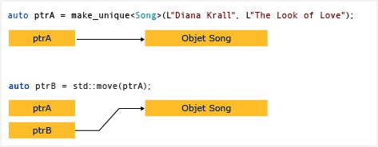

# Comment&#160;: cr&#233;er et utiliser des instances unique_ptr
[!INCLUDE[vs2017banner](../assembler/inline/includes/vs2017banner.md)]

Un [unique\_ptr](../standard-library/unique-ptr-class.md) ne partage pas son pointeur.  Il ne peut pas être copié vers un autre `unique_ptr`, passé par valeur à une fonction, ni utilisé dans un algorithme STL \(Standard Template Library\) qui nécessite d'effectuer des copies.  Un `unique_ptr` peut uniquement être déplacé.  Cela signifie que la propriété de la ressource mémoire est transférée à un autre `unique_ptr` et que le `unique_ptr` d'origine ne le possède plus.  Il est recommandé de restreindre un objet à un seul propriétaire, car la multiplicité des propriétaires ajoute de la complexité à la logique du programme.  Par conséquent, lorsque vous avez besoin d'un pointeur intelligent pour un objet ordinaire C\+\+, utilisez `unique_ptr`et, lorsque vous construisez un `unique_ptr`, utilisez la fonction d'assistance [make\_unique](../Topic/make_unique.md).  
  
 Le diagramme suivant illustre le transfert de propriété entre deux instances `unique_ptr`.  
  
   
  
 `unique_ptr` est défini dans l'en\-tête `<memory>` dans la bibliothèque STL.  Il est efficace comme pointeur brut et peut être utilisé dans des conteneurs STL.  L'ajout d'instances `unique_ptr` à des conteneurs STL est efficace, car le constructeur de déplacement de `unique_ptr` ne nécessite pas d'opération de copie.  
  
## Exemple  
 L'exemple suivant montre comment créer des instances `unique_ptr` et les passer entre des fonctions.  
  
 [!code-cpp[stl_smart_pointers#210](../cpp/codesnippet/CPP/how-to-create-and-use-unique-ptr-instances_1.cpp)]  
  
 Ces exemples illustrent cette caractéristique de base de `unique_ptr` : il peut être déplacé, mais pas copié. Le « déplacement » transfère la propriété à un nouvel `unique_ptr` et réinitialise l'ancien `unique_ptr`.  
  
## Exemple  
 L'exemple suivant montre comment créer des instances `unique_ptr` et les utiliser dans un vecteur.  
  
 [!code-cpp[stl_smart_pointers#211](../cpp/codesnippet/CPP/how-to-create-and-use-unique-ptr-instances_2.cpp)]  
  
 Dans la boucle for de plage, remarquez que `unique_ptr` est passé par référence.  Si vous essayez d'effectuer un passage par valeur ici, le compilateur génère une erreur, car le constructeur de copie `unique_ptr` est supprimé.  
  
## Exemple  
 L'exemple suivant montre comment initialiser un `unique_ptr` qui est un membre de classe.  
  
 [!code-cpp[stl_smart_pointers#212](../cpp/codesnippet/CPP/how-to-create-and-use-unique-ptr-instances_3.cpp)]  
  
## Exemple  
 Vous pouvez utiliser [make\_unique](../Topic/make_unique.md) pour créer un `unique_ptr` dans un tableau, mais vous ne pouvez pas utiliser `make_unique` pour initialiser les éléments du tableau.  
  
 [!code-cpp[stl_smart_pointers#213](../cpp/codesnippet/CPP/how-to-create-and-use-unique-ptr-instances_4.cpp)]  
  
 Pour plus d'exemples, consultez [make\_unique](../Topic/make_unique.md).  
  
## Voir aussi  
 [Pointeurs intelligents](../cpp/smart-pointers-modern-cpp.md)   
 [make\_unique](../Topic/make_unique.md)