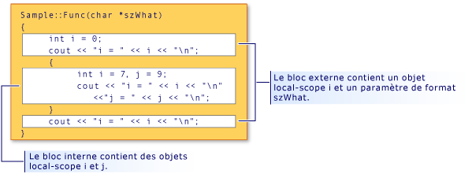

# <a name="scope-visual-c"></a>Portée (Visual C++)
Les noms C++ peuvent être utilisés uniquement dans certaines zones d'un programme. Cette zone est appelée « portée » du nom. La portée détermine la « durée de vie » d'un nom qui ne désigne pas un objet d'étendue static. La portée détermine également la visibilité d'un nom, lorsque les constructeurs et les destructeurs de classe sont appelés, et lorsque des variables locales à la portée sont initialisées. (Pour plus d’informations, consultez [constructeurs](../cpp/constructors-cpp.md) et [destructeurs](../cpp/destructors-cpp.md).) Il existe cinq types de portée :  
  
-   **Portée locale** un nom déclaré dans un bloc est uniquement accessible dans ce bloc et les blocs qu’il contient et uniquement après le point de déclaration. Les noms des arguments formels à une fonction dans la portée du bloc le plus à l’extérieur de la fonction ont une portée locale, comme s’ils avaient été déclarés dans le bloc contenant le corps de la fonction. Prenons le fragment de code suivant :  
  
    ```  
    {  
        int i;  
    }  
    ```  
  
     La déclaration de `i` étant dans un bloc entouré par des accolades, `i` a une portée locale et n'est jamais accessible, car aucun code n'y accède avant l'accolade fermante.  
  
-   **Portée de la fonction** étiquettes sont les seuls noms qui ont une portée de fonction. Elles peuvent être utilisées partout dans une fonction, mais ne sont pas accessibles en dehors de cette fonction. Les arguments formels (arguments spécifiés dans les définitions de fonctions) d’une fonction sont considérés comme étant dans la portée du bloc extérieur du corps de la fonction.  
  
-   **Portée de fichier** n’importe quel nom déclaré à l’extérieur de tous les blocs ou les classes a une portée de fichier. Elle est accessible n'importe où dans l'unité de traduction après sa déclaration. Les noms avec portée de fichier qui ne déclarent pas d'objets statiques sont souvent appelés noms globaux.  
  
     En C++, la portée de fichier est également appelée portée de l'espace de noms.  
  
-   **Portée de classe** noms de membres de classe ont une portée de classe. Fonctions membres de classe sont accessibles seulement via les opérateurs de sélection de membre (**.** ou ** -> **) ou des opérateurs de pointeur vers membre (**.\* ** ou ** -> \* **) sur un objet ou un pointeur vers un objet de cette classe ; les données de membre de classe non statique sont considérée comme locales à l’objet de cette classe. Prenons la déclaration de classe suivante :  
  
    ```  
    class Point  
    {  
        int x;  
        int y;  
    };  
    ```  
  
     Les membres des classes `x` et `y` sont considérés comme étant dans la portée de classe `Point`.  
  
-   **Portée de prototype** noms déclarés dans un prototype de fonction sont visibles uniquement jusqu'à la fin du prototype. Le prototype suivant déclare trois noms (`strDestination`, `numberOfElements` et `strSource`) ; ces noms sont hors de portée à la fin du prototype :  
  
    ```  
    errno_t strcpy_s( char *strDestination, size_t numberOfElements, const char *strSource );  
    ```  
  
## <a name="hiding-names"></a>Masquage des noms  
 Vous pouvez masquer un nom en le déclarant dans un bloc englobé. Dans l'illustration suivante, `i` est redéclaré dans le bloc interne, masquant ainsi la variable associée à `i` dans la portée de bloc externe.  
  
   
Masquage de la portée de bloc et du nom  
  
 La sortie du programme représentée dans l'illustration est la suivante :  
  
```  
i = 0  
i = 7  
j = 9  
i = 0  
```  
  
> [!NOTE]
>  L'argument `szWhat` est considéré comme étant dans la portée de la fonction. Par conséquent, il est traité comme s'il avait été déclaré dans le bloc le plus à l'extérieur de la fonction.  
  
## <a name="hiding-class-names"></a>Masquage des noms de classes  
 Vous pouvez masquer les noms de classe en déclarant une fonction, un objet, une variable ou un énumérateur dans la même portée. Toutefois, le nom de classe peut toujours être accessible lorsque précédé du mot clé **classe**.  
  
```  
// hiding_class_names.cpp  
// compile with: /EHsc  
#include <iostream>  
using namespace std;  
  
// Declare class Account at file scope.  
class Account  
{  
public:  
    Account( double InitialBalance )  
        { balance = InitialBalance; }  
    double GetBalance()  
        { return balance; }  
private:  
    double balance;  
};  
  
double Account = 15.37;            // Hides class name Account  
  
int main()  
{  
    class Account Checking( Account ); // Qualifies Account as   
                                       //  class name  
  
    cout << "Opening account with balance of: "  
         << Checking.GetBalance() << "\n";  
}  
//Output: Opening account with balance of: 15.37  
```  
  
> [!NOTE]
>  À chaque fois que le nom de classe (`Account`) est appelé, la classe de mots clés doit être utilisée pour le différencier du compte de variable avec portée de fichier. Cette règle ne s'applique pas lorsque le nom de classe apparaît à gauche de l'opérateur de résolution de portée (::). Les noms à gauche de l’opérateur de résolution de portée sont toujours considérés comme des noms de classe.  
  
 L’exemple suivant montre comment déclarer un pointeur vers un objet de type `Account` à l’aide de la **classe** (mot clé) :  
  
```  
class Account *Checking = new class Account( Account );  
```  
  
 Le `Account` dans l’initialiseur (entre parenthèses) dans l’instruction précédente a une portée de fichier ; il est de type **double**.  
  
> [!NOTE]
>  La réutilisation des noms d'identificateur, comme l'indique cet exemple, est considérée comme un style de programmation médiocre.  
  
 Pour plus d’informations sur les pointeurs, consultez [Types dérivés](http://msdn.microsoft.com/en-us/aa14183c-02fe-4d81-95fe-beddb0c01c7c). Pour plus d’informations sur la déclaration et l’initialisation des objets de classe, consultez [Classes, Structures et Unions](../cpp/classes-and-structs-cpp.md). Pour plus d’informations sur l’utilisation de la **nouveau** et **supprimer** opérateurs de magasin gratuit, consultez [nouveau et supprimer des opérateurs](new-and-delete-operators.md).  
  
## <a name="hiding-names-with-file-scope"></a>Masquage des noms avec la portée du fichier  
 Vous pouvez masquer des noms avec la portée de fichier en déclarant explicitement le même nom dans la portée de bloc. Toutefois, les noms de portée de fichier sont accessibles à l'aide de l'opérateur de résolution de portée (`::`).  
  
```  
// file_scopes.cpp  
// compile with: /EHsc  
#include <iostream>  
  
int i = 7;   // i has file scope, outside all blocks  
using namespace std;  
  
int main( int argc, char *argv[] ) {  
   int i = 5;   // i has block scope, hides i at file scope  
   cout << "Block-scoped i has the value: " << i << "\n";  
   cout << "File-scoped i has the value: " << ::i << "\n";  
}  
```  
  
```Output  
Block-scoped i has the value: 5  
File-scoped i has the value: 7  
```  
  
## <a name="see-also"></a>Voir aussi  
 [Concepts de base](../cpp/basic-concepts-cpp.md)
