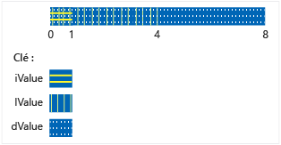

# <a name="unions"></a>Unions
Une `union` est un type défini par l'utilisateur dans lequel tous les membres partagent le même emplacement de mémoire. Cela signifie qu'à un moment donné une union ne peut pas contenir plusieurs objets de sa liste de membres. Cela signifie également que, quel que soit le nombre de membres dans une union, elle utilise toujours uniquement assez de mémoire pour stocker le plus grand membre.  
  
 Les unions peuvent être utiles pour économiser la mémoire lorsque vous avez un grand nombre d'objets et/ou une mémoire limitée. Toutefois, elles nécessitent une attention particulière pour une utilisation correcte, car vous êtes chargé de vérifier que vous accédez toujours au dernier membre qui a été écrit. Si des types de membres ont un constructeur non trivial, vous devez écrire un code supplémentaire pour construire et détruire ce membre explicitement. Avant d'utiliser une union, déterminez si le problème que vous essayez de résoudre pourrait être mieux exprimé à l'aide d'une classe de base et de classes dérivées.  
  
## <a name="syntax"></a>Syntaxe  
  
```cpp  
union [name]  { member-list };  
```  
  
#### <a name="parameters"></a>Paramètres  
 `name`  
 Nom du type donné à l'union.  
  
 `member-list`  
 Membres que l'union peut contenir. Consultez la section Notes.  
  
## <a name="remarks"></a>Remarques  
  
## <a name="declaring-a-union"></a>Déclaration d'une union  
 Commencez la déclaration d'une union avec le mot clé `union` et placez la liste des membres entre accolades :  
  
```cpp  
// declaring_a_union.cpp  
union RecordType    // Declare a simple union type  
{  
    char   ch;  
    int    i;  
    long   l;  
    float  f;  
    double d;  
    int *int_ptr;  
};   
int main()  
{  
    RecordType t;  
    t.i = 5; // t holds an int  
    t.f = 7.25 // t now holds a float   
}  
```  
  
## <a name="using-unions"></a>Utilisation d'unions  
 Dans l'exemple précédent, tout code qui accède à l'union doit connaître le membre qui détient les données. La solution la plus courante à ce problème consiste à placer l'union dans un struct avec un membre enum supplémentaire qui indique le type de données actuellement stockées dans l'union. Cela s’appelle un *union discriminée* et l’exemple suivant montre le modèle de base.  
  
```cpp  
#include "stdafx.h"  
#include <queue>  
  
using namespace std;  
  
enum class WeatherDataType  
{  
    Temperature, Wind  
};  
  
struct TempData  
{  
    int StationId;  
    time_t time;  
    double current;  
    double max;  
    double min;  
};  
  
struct WindData  
{  
    int StationId;  
    time_t time;  
    int speed;  
    short direction;  
};  
  
struct Input  
{  
    WeatherDataType type;  
    union  
    {  
        TempData temp;  
        WindData wind;  
    };  
};  
  
// Functions that are specific to data types  
void Process_Temp(TempData t) {}  
void Process_Wind(WindData w) {}  
  
// Container for all the data records  
queue<Input> inputs;  
void Initialize();  
  
int main(int argc, char* argv[])  
{  
    Initialize();  
    while (!inputs.empty())  
    {  
        Input i = inputs.front();  
        switch (i.type)  
        {  
        case WeatherDataType::Temperature:  
            Process_Temp(i.temp);  
            break;  
        case WeatherDataType::Wind:  
            Process_Wind(i.wind);  
            break;  
        default:  
            break;  
        }  
        inputs.pop();  
  
    }  
    return 0;  
}  
  
void Initialize()  
{  
    Input first, second;  
    first.type = WeatherDataType::Temperature;  
    first.temp = { 101, 1418855664, 91.8, 108.5, 67.2 };  
    inputs.push(first);  
  
    second.type = WeatherDataType::Wind;  
    second.wind = { 204,1418859354, 14, 27 };  
    inputs.push(second);  
}  
  
```  
  
 Dans l'exemple précédent, notez que l'union dans le struct d'entrée n'a aucun nom. Il s'agit d'une union anonyme et ses membres sont accessibles comme s'ils étaient des membres directs du struct. Pour plus d'informations sur les unions anonymes, consultez la section ci-dessous.  
  
 Bien sûr, l'exemple précédent indique un problème qui peut également être résolu en utilisant des classes qui dérivent d'une classe de base commune et en créant une branche pour votre code en fonction du type d'exécution de chaque objet dans le conteneur. Le code obtenu peut être plus simple à gérer et à comprendre, mais peut également être plus lent que l'utilisation d'unions. En outre, avec une union, vous pouvez stocker des types complètement indépendants et modifier dynamiquement le type de la valeur qui est stockée sans modifier le type de la variable d'union elle-même. Par conséquent, vous pouvez créer un tableau hétérogène de MyUnionType dont les éléments stockent différentes valeurs de types différents.  
  
 Notez que le struct `Input` dans l'exemple précédent peut être facilement utilisé à mauvais escient. Il revient entièrement à l'utilisateur d'utiliser le discriminateur correctement pour accéder au membre qui contient les données. Vous pouvez vous protéger contre toute utilisation inappropriée en rendant l'union privée et en fournissant des fonctions d'accès spéciales, comme indiqué dans l'exemple suivant.  
  
## <a name="unrestricted-unions-c11"></a>Unions illimitées (C++11)  
 En C++03 et versions antérieures, une union peut contenir des données membres non statiques avec le type de classe, tant que le type n'a aucun opérateur d'assignation, destructeur ni constructeur fourni par l'utilisateur. En C++11, ces restrictions sont supprimées. Si vous incluez un tel membre dans votre union, le compilateur marque automatiquement toutes les fonctions membres spéciales qui ne sont pas fournies par l'utilisateur comme supprimées. Si l'union est une union anonyme à l'intérieur d'une classe ou d'un struct, toutes les fonctions membres spéciales de la classe ou du struct qui ne sont pas fournies par l'utilisateur sont marquées comme supprimées. L'exemple suivant montre comment gérer le cas où l'un des membres de l'union a un membre qui requiert ce traitement spécial :  
  
```cpp  
// for MyVariant  
#include <crtdbg.h>  
#include <new>  
#include <utility>  
  
// for sample objects and output  
#include <string>  
#include <vector>  
#include <iostream>  
  
using namespace std;  
  
struct A   
{  
    A() = default;  
    A(int i, const string& str) : num(i), name(str) {}  
  
    int num;  
    string name;  
    //...  
};  
  
struct B   
{  
    B() = default;  
    B(int i, const string& str) : num(i), name(str) {}  
  
    int num;  
    string name;  
    vector<int> vec;  
    // ...  
};  
  
enum class Kind { None, A, B, Integer };  
  
#pragma warning (push)  
#pragma warning(disable:4624)  
class MyVariant  
{  
public:  
    MyVariant()  
        : kind_(Kind::None)  
    {  
    }  
  
    MyVariant(Kind kind)  
        : kind_(kind)  
    {  
        switch (kind_)  
        {  
        case Kind::None:  
            break;  
        case Kind::A:  
            new (&a_) A();  
            break;  
        case Kind::B:  
            new (&b_) B();  
            break;  
        case Kind::Integer:  
            i_ = 0;  
            break;  
        default:  
            _ASSERT(false);  
            break;  
        }  
    }  
  
    ~MyVariant()  
    {  
        switch (kind_)  
        {  
        case Kind::None:  
            break;  
        case Kind::A:  
            a_.~A();  
            break;  
        case Kind::B:  
            b_.~B();  
            break;  
        case Kind::Integer:  
            break;  
        default:  
            _ASSERT(false);  
            break;  
        }  
        kind_ = Kind::None;  
    }  
  
    MyVariant(const MyVariant& other)  
        : kind_(other.kind_)  
    {  
        switch (kind_)  
        {  
        case Kind::None:  
            break;  
        case Kind::A:  
            new (&a_) A(other.a_);  
            break;  
        case Kind::B:  
            new (&b_) B(other.b_);  
            break;  
        case Kind::Integer:  
            i_ = other.i_;  
            break;  
        default:  
            _ASSERT(false);  
            break;  
        }  
    }  
  
    MyVariant(MyVariant&& other)  
        : kind_(other.kind_)  
    {  
        switch (kind_)  
        {  
        case Kind::None:  
            break;  
        case Kind::A:  
            new (&a_) A(move(other.a_));  
            break;  
        case Kind::B:  
            new (&b_) B(move(other.b_));  
            break;  
        case Kind::Integer:  
            i_ = other.i_;  
            break;  
        default:  
            _ASSERT(false);  
            break;  
        }  
        other.kind_ = Kind::None;  
    }  
  
    MyVariant& operator=(const MyVariant& other)  
    {  
        if (&other != this)  
        {  
            switch (other.kind_)  
            {  
            case Kind::None:  
                this->~MyVariant();  
                break;  
            case Kind::A:  
                *this = other.a_;  
                break;  
            case Kind::B:  
                *this = other.b_;  
                break;  
            case Kind::Integer:  
                *this = other.i_;  
                break;  
            default:  
                _ASSERT(false);  
                break;  
            }  
        }  
        return *this;  
    }  
  
    MyVariant& operator=(MyVariant&& other)  
    {  
        _ASSERT(this != &other);  
        switch (other.kind_)  
        {  
        case Kind::None:  
            this->~MyVariant();  
            break;  
        case Kind::A:  
            *this = move(other.a_);  
            break;  
        case Kind::B:  
            *this = move(other.b_);  
            break;  
        case Kind::Integer:  
            *this = other.i_;  
            break;  
        default:  
            _ASSERT(false);  
            break;  
        }  
        other.kind_ = Kind::None;  
        return *this;  
    }  
  
    MyVariant(const A& a)  
        : kind_(Kind::A), a_(a)  
    {  
    }  
  
    MyVariant(A&& a)  
        : kind_(Kind::A), a_(move(a))  
    {  
    }  
  
    MyVariant& operator=(const A& a)  
    {  
        if (kind_ != Kind::A)  
        {  
            this->~MyVariant();  
            new (this) MyVariant(a);  
        }  
        else  
        {  
            a_ = a;  
        }  
        return *this;  
    }  
  
    MyVariant& operator=(A&& a)  
    {  
        if (kind_ != Kind::A)  
        {  
            this->~MyVariant();  
            new (this) MyVariant(move(a));  
        }  
        else  
        {  
            a_ = move(a);  
        }  
        return *this;  
    }  
  
    MyVariant(const B& b)  
        : kind_(Kind::B), b_(b)  
    {  
    }  
  
    MyVariant(B&& b)  
        : kind_(Kind::B), b_(move(b))  
    {  
    }  
  
    MyVariant& operator=(const B& b)  
    {  
        if (kind_ != Kind::B)  
        {  
            this->~MyVariant();  
            new (this) MyVariant(b);  
        }  
        else  
        {  
            b_ = b;  
        }  
        return *this;  
    }  
  
    MyVariant& operator=(B&& b)  
    {  
        if (kind_ != Kind::B)  
        {  
            this->~MyVariant();  
            new (this) MyVariant(move(b));  
        }  
        else  
        {  
            b_ = move(b);  
        }  
        return *this;  
    }  
  
    MyVariant(int i)  
        : kind_(Kind::Integer), i_(i)  
    {  
    }  
  
    MyVariant& operator=(int i)  
    {  
        if (kind_ != Kind::Integer)  
        {  
            this->~MyVariant();  
            new (this) MyVariant(i);  
        }  
        else  
        {  
            i_ = i;  
        }  
        return *this;  
    }  
  
    Kind GetKind() const  
    {  
        return kind_;  
    }  
  
    A& GetA()  
    {  
        _ASSERT(kind_ == Kind::A);  
        return a_;  
    }  
  
    const A& GetA() const  
    {  
        _ASSERT(kind_ == Kind::A);  
        return a_;  
    }  
  
    B& GetB()  
    {  
        _ASSERT(kind_ == Kind::B);  
        return b_;  
    }  
  
    const B& GetB() const  
    {  
        _ASSERT(kind_ == Kind::B);  
        return b_;  
    }  
  
    int& GetInteger()  
    {  
        _ASSERT(kind_ == Kind::Integer);  
        return i_;  
    }  
  
    const int& GetInteger() const  
    {  
        _ASSERT(kind_ == Kind::Integer);  
        return i_;  
    }  
  
private:  
    Kind kind_;  
    union  
    {  
        A a_;  
        B b_;  
        int i_;  
    };  
};  
#pragma warning (pop)  
  
int main()  
{  
    A a(1, "Hello from A");  
    B b(2, "Hello from B");  
  
    MyVariant mv_1 = a;  
  
    cout << "mv_1 = a: " << mv_1.GetA().name << endl;  
    mv_1 = b;  
    cout << "mv_1 = b: " << mv_1.GetB().name << endl;  
    mv_1 = A(3, "hello again from A");  
    cout << R"aaa(mv_1 = A(3, "hello again from A"): )aaa" << mv_1.GetA().name << endl;  
    mv_1 = 42;  
    cout << "mv_1 = 42: " << mv_1.GetInteger() << endl;  
  
    b.vec = { 10,20,30,40,50 };  
  
    mv_1 = move(b);  
    cout << "After move, mv_1 = b: vec.size = " << mv_1.GetB().vec.size() << endl;  
  
    cout << endl << "Press a letter" << endl;  
    char c;  
    cin >> c;  
}  
#include <queue>  
#include <iostream>  
using namespace std;  
  
enum class WeatherDataType  
{  
    Temperature, Wind  
};  
  
struct TempData  
{  
    TempData() : StationId(""), time(0), current(0), maxTemp(0), minTemp(0) {}  
    TempData(string id, time_t t, double cur, double max, double min)  
        : StationId(id), time(t), current(cur), maxTemp(max), minTemp(0) {}  
    string StationId;  
    time_t time = 0;  
    double current;  
    double maxTemp;  
    double minTemp;  
};  
  
struct WindData  
{  
    int StationId;  
    time_t time;  
    int speed;  
    short direction;  
};  
  
struct Input  
{  
    Input() {}  
    Input(const Input&) {}  
  
    ~Input()  
    {  
        if (type == WeatherDataType::Temperature)  
        {  
            temp.StationId.~string();  
        }  
    }  
  
    WeatherDataType type;  
    void SetTemp(const TempData& td)  
    {  
        type = WeatherDataType::Temperature;  
  
        // must use placement new because of string member!  
        new(&temp) TempData(td);  
    }  
  
    TempData GetTemp()  
    {  
        if (type == WeatherDataType::Temperature)  
            return temp;  
        else  
            throw logic_error("Can't return TempData when Input holds a WindData");  
    }  
    void SetWind(WindData wd)  
    {  
        // Explicitly delete struct member that has a   
        // non-trivial constructor  
        if (type == WeatherDataType::Temperature)  
        {  
            temp.StationId.~string();  
        }  
        wind = wd; //placement new not required.  
    }  
    WindData GetWind()  
    {  
        if (type == WeatherDataType::Wind)  
        {  
            return wind;  
        }  
        else  
            throw logic_error("Can't return WindData when Input holds a TempData");  
    }  
  
private:  
  
    union  
    {  
        TempData temp;  
        WindData wind;  
    };  
};  
  
```  
  
 Les unions ne peuvent pas stocker de références. Les unions ne prennent pas en charge l'héritage ; par conséquent, une union elle-même ne peut pas être utilisée comme classe de base, ni hériter d'une autre classe ni avoir des fonctions virtuelles.  
  
## <a name="initializing-unions"></a>Initialisation des unions  
 Vous pouvez déclarer et initialiser une union dans la même instruction en assignant une expression placée entre accolades. L'expression est évaluée et assignée au premier champ de l'union.  
  
```cpp  
#include <iostream>  
using namespace std;  
  
union NumericType  
{  
    short       iValue;  
    long        lValue;    
    double      dValue;    
};  
  
int main()  
{  
    union NumericType Values = { 10 };   // iValue = 10  
    cout << Values.iValue << endl;  
    Values.dValue = 3.1416;  
    cout << Values.dValue) << endl;  
}  
/* Output:  
 10  
 3.141600  
*/  
  
```  
  
 L'union `NumericType` est organisée en mémoire (conceptuellement) comme l'illustre la figure ci-dessous.  
  
   
Stockage de données dans l'union NumericType  
  
## <a name="anonymous_unions"></a>Unions anonymes  
 Les unions anonymes sont des unions déclarées sans un *-nom de la classe* ou *declarator-list*.  
  
```cpp  
union  {  member-list  }    
```  
  
Les noms déclarés dans une union anonyme sont utilisés directement comme les variables non membres. Par conséquent, les noms déclarés dans une union anonyme doivent être uniques dans la portée environnante.  
  
Outre les restrictions pour les unions nommées, les unions anonymes sont soumis aux restrictions suivantes :  
  
-   Ils doivent également être déclarés en tant que **statique** si déclaré dans la portée de fichier ou l’espace de noms.  
  
-   Elles ne peuvent avoir que des membres publics. Les membres privés et protégés des unions anonymes génèrent des erreurs.  
  
-   Ils ne peuvent pas avoir de fonctions membres.  
  
## <a name="see-also"></a>Voir aussi  
 [Classes et structs](../cpp/classes-and-structs-cpp.md)   
 [Mots clés](../cpp/keywords-cpp.md)   
 [class](../cpp/class-cpp.md)   
 [struct](../cpp/struct-cpp.md)
