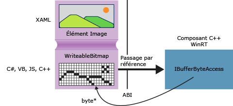

# Obtention de pointeurs vers les tampons de donn&#233;es (C++/CX)
Dans Windows Runtime, l’interface [Windows::Storage::Streams::IBuffer](http://msdn.microsoft.com/library/windows/apps/windows.storage.streams.ibuffer.aspx) fournit une méthode indépendante du langage, basée sur les flux, pour accéder aux mémoires tampons de données. En C\+\+, vous pouvez obtenir un pointeur brut vers le tableau d'octets sous\-jacent à l'aide de l'interface IBufferByteAccess de la bibliothèque Windows Runtime, qui est définie dans robuffer.h. En utilisant cette approche, vous pouvez modifier le tableau d'octets sur place sans effectuer de copies non nécessaires des données.  
  
 Le diagramme suivant illustre un élément image XAML, dont la source est [Windows::UI::Xaml::Media::Imaging WriteableBitmap](http://msdn.microsoft.com/%20library/windows/apps/windows.ui.xaml.media.imaging.writeablebitmap.aspx). Une application cliente écrite dans un langage, quel qu'il soit, peut passer une référence à `WriteableBitmap` au code C\+\+, lequel peut ensuite utiliser la référence pour atteindre la mémoire tampon sous\-jacente. Dans une application du [!INCLUDE[win8_appname_long](../cppcx/includes/win8-appname-long-md.md)] écrite en C\+\+, vous pouvez utiliser la fonction de l'exemple suivant directement dans le code source sans l'empaqueter dans un composant [!INCLUDE[wrt](../cppcx/includes/wrt-md.md)].  
  
   
  
## GetPointerToPixelData  
 La méthode suivante accepte [Windows::Storage::Streams::IBuffer](http://msdn.microsoft.com/library/windows/apps/windows.storage.streams.ibuffer.aspx) et retourne un pointeur brut au tableau d’octets sous\-jacent. Pour appeler la fonction, passez une propriété [WriteableBitmap::PixelBuffer](http://msdn.microsoft.com/library/windows/apps/windows.ui.xaml.media.imaging.writeablebitmap.pixelbuffer.aspx).  
  
```  
  
#include <wrl.h> #include <robuffer.h> using namespace Windows::Storage::Streams; using namespace Microsoft::WRL; typedef uint8 byte; // Retrieves the raw pixel data from the provided IBuffer object. // Warning: The lifetime of the returned buffer is controlled by // the lifetime of the buffer object that's passed to this method. // When the buffer has been released, the pointer becomes invalid // and must not be used. byte* Class1::GetPointerToPixelData(IBuffer^ pixelBuffer, unsigned int *length) { if (length != nullptr) { *length = pixelBuffer ->Length; } // Query the IBufferByteAccess interface. ComPtr<IBufferByteAccess> bufferByteAccess; reinterpret_cast<IInspectable*>( pixelBuffer)->QueryInterface(IID_PPV_ARGS(&bufferByteAccess)); // Retrieve the buffer data. byte* pixels = nullptr; bufferByteAccess->Buffer(&pixels); return pixels; }  
```  
  
## Exemple complet  
 Les étapes suivantes montrent comment créer une application du [!INCLUDE[win8_appname_long](../cppcx/includes/win8-appname-long-md.md)] en C\#, qui passe `WriteableBitmap` à une DLL de composant [!INCLUDE[wrt](../cppcx/includes/wrt-md.md)] en C\+\+. Le code C\+\+ obtient un pointeur vers la mémoire tampon de pixels, et effectue une simple modification sur place de l'image. À défaut, vous pouvez créer l'application cliente en Visual Basic, JavaScript ou C\+\+ au lieu du C\#. Si vous utilisez le C\+\+, vous n'avez pas besoin de la DLL de composant. Il vous suffit d'ajouter ces méthodes directement à la classe MainPage ou à une autre classe que vous définissez.  
  
#### Créer le client  
  
1.  Utilisez le modèle de projet Application vide pour créer une application du [!INCLUDE[win8_appname_long](../cppcx/includes/win8-appname-long-md.md)] en C\#.  
  
2.  Dans MainPage.xaml  
  
    -   Utilisez ce code XAML pour remplacer l'élément `Grid` :  
  
        ```vb  
        <Grid Background="{StaticResource ApplicationPageBackgroundThemeBrush}"> <StackPanel HorizontalAlignment="Left" Margin="176,110,0,0" VerticalAlignment="Top" Width="932"> <Image x:Name="Pic"/> <Button Content="Process Image" HorizontalAlignment="Stretch" VerticalAlignment="Stretch" Height="47" Click="Button_Click_1"/> </StackPanel> </Grid>  
        ```  
  
3.  Dans MainPage.xaml.cs  
  
    1.  Ajoutez ces déclarations d'espaces de noms :  
  
        ```  
        using Windows.Storage; using Windows.Storage.FileProperties; using Windows.UI.Xaml.Media.Imaging; using Windows.Storage.Streams; using Windows.Storage.Pickers;  
        ```  
  
    2.  Ajoutez une variable membre `WriteableBitmap` à la classe `MainPage`, puis nommez\-la `m_bm`.  
  
        ```  
        private WriteableBitmap m_bm;  
        ```  
  
    3.  Utilisez le code suivant pour remplacer le stub de méthode `OnNavigatedTo`. Cela permet d'ouvrir le sélecteur de fichiers au démarrage de l'application. \(Notez que le mot clé `async` est ajouté à la signature de la fonction\).  
  
        ```csharp  
        async protected override void OnNavigatedTo(NavigationEventArgs e) { FileOpenPicker openPicker = new FileOpenPicker(); openPicker.ViewMode = PickerViewMode.Thumbnail; openPicker.SuggestedStartLocation = PickerLocationId.PicturesLibrary; openPicker.FileTypeFilter.Add(".jpg"); openPicker.FileTypeFilter.Add(".jpeg"); openPicker.FileTypeFilter.Add(".png"); StorageFile file = await openPicker.PickSingleFileAsync(); if (file != null) { // Get the size of the image for the WriteableBitmap constructor. ImageProperties props = await file.Properties.GetImagePropertiesAsync(); m_bm = new WriteableBitmap((int)props.Height, (int)props.Width); m_bm.SetSource(await file.OpenReadAsync()); Pic.Source = m_bm; } else { //  Handle error... } }  
        ```  
  
    4.  Ajoutez le gestionnaire d'événements correspondant au clic sur un bouton. \(Dans la mesure où la référence d'espace de noms `ImageManipCPP` n'a pas encore été créée, il se peut qu'il y ait une ligne ondulée dans la fenêtre de l'éditeur.\)  
  
        ```  
        async private void Button_Click_1(object sender, RoutedEventArgs e) { ImageManipCPP.Class1 obj = new ImageManipCPP.Class1(); await obj.Negativize(m_bm); Pic.Source = m_bm; }  
        ```  
  
#### Créer le composant C\+\+  
  
1.  Ajoutez un nouveau composant [!INCLUDE[wrt](../cppcx/includes/wrt-md.md)] en C\+\+ à la solution existante, puis nommez\-le `ImageManipCPP`. Ajoutez une référence à ce dernier dans le projet C\# en cliquant avec le bouton droit sur le projet dans l'**Explorateur de solutions**, puis en choisissant **Ajouter**, **Référence**.  
  
2.  Dans Class1.h  
  
    1.  Ajoutez ce `typedef` à la deuxième ligne, juste après `#pragma once` :  
  
        ```  
        typedef uint8 byte;  
  
        ```  
  
    2.  Ajoutez l'attribut `WebHostHidden` juste au\-dessus du début de la déclaration de `Class1`.  
  
        ```  
        [Windows::Foundation::Metadata::WebHostHidden]  
        ```  
  
    3.  Ajoutez cette signature de méthode publique à `Class1` :  
  
        ```  
        Windows::Foundation::IAsyncAction^ Negativize(Windows::UI::Xaml::Media::Imaging::WriteableBitmap^ bm);  
        ```  
  
    4.  Ajoutez la signature à partir de la méthode `GetPointerToPixelData` indiquée dans l'extrait de code fourni précédemment. Assurez\-vous que cette méthode est privée.  
  
3.  Dans Class1.cpp  
  
    1.  Ajoutez les directives `#include` et les déclarations d'espaces de noms suivantes :  
  
        ```  
  
        #include <ppltasks.h> #include <wrl.h> #include <robuffer.h> using namespace Windows::Storage; using namespace Windows::UI::Xaml::Media::Imaging; using namespace Windows::Storage::Streams; using namespace Microsoft::WRL;  
  
        ```  
  
    2.  Ajoutez l'implémentation de `GetPointerToPixelData` à partir de l'extrait de code fourni précédemment.  
  
    3.  Ajoutez l'implémentation de `Negativize`. Cette méthode permet de créer un effet semblable à celui d'un film négatif en inversant la valeur de chaque valeur RVB dans le pixel. Nous rendons la méthode asynchrone, car sur les images de grande taille, elle peut nécessiter un délai d'exécution assez long.  
  
        ```  
        IAsyncAction^ Class1::Negativize(WriteableBitmap^ bm) { unsigned int length; byte* sourcePixels = GetPointerToPixelData(bm->PixelBuffer, &length); const unsigned int width = bm->PixelWidth; const unsigned int height = bm->PixelHeight; return create_async([this, width, height, sourcePixels] { byte* temp = sourcePixels; for(unsigned int k = 0; k < height; k++) { for (unsigned int i = 0; i < (width * 4); i += 4) { int pos = k * (width * 4) + (i); temp[pos] = ~temp[pos]; temp[pos + 1] = ~temp[pos + 1] / 3; temp[pos + 2] = ~temp[pos + 2] / 2; temp[pos + 3] = ~temp[pos + 3]; } } }); }  
        ```  
  
        > [!NOTE]
        >  Cette méthode peut s'exécuter plus rapidement si vous utilisez C\+\+ Accelerated Massive Parallelism \(C\+\+ AMP\) ou la Bibliothèque de modèles parallèles \(PPL\) pour paralléliser l'opération.  
  
4.  Assurez\-vous d'avoir au moins une image dans votre dossier d'images, puis appuyez sur F5 pour compiler et exécuter le programme.