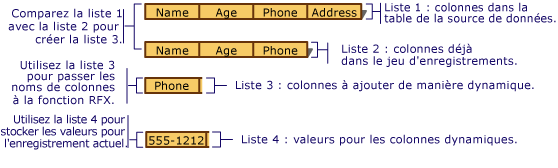

# Recordset&#160;: liaison dynamique de colonnes de donn&#233;es (ODBC)
[!INCLUDE[vs2017banner](../../assembler/inline/includes/vs2017banner.md)]

Cette rubrique s'applique aux classes ODBC MFC.  
  
 Les recordsets gèrent la liaison des colonnes de table que vous spécifiez au moment du design ; cependant, dans certains cas, il se peut que vous souhaitiez lier des colonnes dont vous n'aviez pas connaissance à ce moment\-là.  Cette rubrique explique :  
  
-   [dans quels cas vous pourriez vouloir lier dynamiquement des colonnes à un recordset](#_core_when_you_might_bind_columns_dynamically) ;  
  
-   [comment lier dynamiquement des colonnes lors de l'exécution](#_core_how_to_bind_columns_dynamically).  
  
> [!NOTE]
>  Cette rubrique s'applique aux objets dérivés de `CRecordset` dans lesquels l'extraction de lignes en bloc n'a pas été implémentée.  Les techniques présentées sont généralement déconseillées si vous utilisez l'extraction de lignes en bloc.  Pour plus d'informations sur l'extraction de lignes en bloc, consultez [Recordset : extraction globale d'enregistrements \(ODBC\)](../../data/odbc/recordset-fetching-records-in-bulk-odbc.md).  
  
##  <a name="_core_when_you_might_bind_columns_dynamically"></a> Cas de liaison dynamique de colonnes  
 Au moment du design, l'Assistant Création d'applications MFC ou l'[Assistant Consommateur ODBC MFC](../../mfc/reference/adding-an-mfc-odbc-consumer.md) \(depuis l'Assistant **Ajouter une classe**\) crée des classes de recordset à partir des tables et colonnes connues de votre source de données.  Les bases de données peuvent avoir été modifiées entre le moment où vous les avez conçues et celui où l'application utilise leurs tables et les colonnes au moment de l'exécution.  Il se peut que vous\-même ou un autre utilisateur ait ajouté ou supprimé la table ou les colonnes sur lesquelles le recordset de l'application s'appuie.  Ce problème ne concerne pas nécessairement toutes les applications accédant aux données, mais si tel est le cas, comment pouvez\-vous faire face à ces modifications du schéma de la base de données autrement qu'au moyen d'une nouvelle création et d'une nouvelle compilation ?  L'objectif de la présente rubrique est de répondre à cette question.  
  
 Elle décrit le cas le plus fréquent où vous pourriez lier des colonnes dynamiquement : après avoir commencé avec un recordset fondé sur un schéma de base de données connu, vous souhaitez gérer des colonnes supplémentaires à l'exécution.  La rubrique présume que les colonnes supplémentaires correspondent aux membres de données de type champ `CString` \(le cas le plus fréquent\), même si l'article contient des suggestions destinées à vous permettre de gérer d'autres types de données.  
  
 Avec quelques lignes de code supplémentaires, vous pouvez :  
  
-   [déterminer les colonnes disponibles à l'exécution](#_core_to_determine_the_columns_in_a_table_at_run_time) ;  
  
-   [lier dynamiquement de nouvelles colonnes au recordset lors de l'exécution](#_core_adding_the_columns).  
  
 Le recordset contient toujours les membres de données des colonnes dont vous connaissiez l'existence au moment du design.  Il contient aussi quelques lignes de code supplémentaires qui déterminent dynamiquement si de nouvelles colonnes ont été ajoutées à la base de données cible et, si tel est le cas, lie ces nouvelles colonnes au stockage alloué dynamiquement \(plutôt qu'aux membres de données du recordset\).  
  
 Cette rubrique ne traite aucun autre cas de liaison dynamique, comme les tables ou colonnes supprimées.  Pour gérer de tels cas, vous devez utiliser les appels d'API ODBC d'une façon plus directe.  Pour plus d'informations, consultez le guide ODBC SDK *Programmer's Reference* sur le CD\-ROM MSDN Library.  
  
##  <a name="_core_how_to_bind_columns_dynamically"></a> Liaison dynamique de colonnes  
 Pour lier des colonnes de manière dynamique, vous devez connaître \(ou être en mesure de déterminer\) les noms des colonnes supplémentaires.  Vous devez aussi allouer un espace de stockage pour les membres de données additionnels de type champ et indiquer le nombre de colonnes ajoutées.  
  
 La discussion ci\-après fait état de deux recordsets différents.  Le premier correspond au recordset principal qui sélectionne les enregistrements de la table cible.  Le second est un recordset particulier destiné à obtenir les informations sur les colonnes de la table cible.  
  
###  <a name="_core_the_general_process"></a> Processus général  
 Au niveau le plus général, utilisez la procédure suivante :  
  
1.  Construisez l'objet recordset principal.  
  
     Le cas échéant, passez un pointeur à l'objet ouvert `CDatabase` ou soyez à même de fournir des informations de connexion au recordset des colonnes d'une façon ou d'une autre.  
  
2.  Utilisez la procédure permettant d'ajouter dynamiquement des colonnes.  
  
     Consultez à cette fin la procédure décrite dans « Ajout de colonnes » \(voir plus bas\).  
  
3.  Ouvrez le recordset principal.  
  
     Le recordset sélectionne les enregistrements et utilise RFX pour lier à la fois les colonnes statiques \(celles qui sont mappées aux membres de données de type champ de recordset\) et les colonnes dynamiques \(mappées à l'espace de stockage supplémentaire que vous avez alloué\).  
  
###  <a name="_core_adding_the_columns"></a> Ajout de colonnes  
 La liaison dynamique des colonnes ajoutées à l'exécution nécessite les étapes suivantes :  
  
1.  Déterminez à l'exécution les colonnes qui figurent dans la table cible.  Extraire de ces informations la liste des colonnes ayant été ajoutées à la table depuis que la classe de recordset a été conçue.  
  
     Une bonne solution consiste à utiliser une classe de recordset de colonnes conçue pour interroger la source de données sur les informations de colonnes de la table cible \(nom de colonne et type de données, par exemple\).  
  
2.  Prévoyez le stockage destiné aux nouveaux membres de données de type champ.  Comme la classe de recordset principale ne possède pas de membres de données de type champ pour les colonnes inconnues, vous devez définir un emplacement pour stocker les noms, les résultats et, éventuellement, les informations sur les types de données \(si les colonnes ont des types de données différents\).  
  
     Une solution consiste à créer une ou plusieurs listes dynamiques, une première pour les nouveaux noms de colonnes, une deuxième pour les résultats et une troisième pour les types de données \(si nécessaire\).  Ces listes, particulièrement celle des valeurs des résultats, fournissent les informations et le stockage nécessaire à la liaison.  La figure ci\-après illustre la création de ces listes.  
  
       
Création des listes de colonnes pour la liaison dynamique  
  
3.  Ajoutez un appel de fonctions RFX dans la fonction `DoFieldExchange` du recordset principal pour chaque colonne ajoutée.  Ces appels RFX effectuent le travail d'extraction d'un enregistrement, colonnes supplémentaires incluses, et de liaison des colonnes aux membres de données du recordset ou à l'espace de stockage réservé dynamiquement à leur attention.  
  
     Une solution consiste à ajouter une boucle à la fonction `DoFieldExchange` du recordset principal : la boucle s'applique à la liste des nouvelles colonnes et appelle la fonction RFX appropriée pour chaque colonne de la liste.  À chaque appel de fonction RFX, passez un nom de colonne de la liste des noms de colonnes et un emplacement de stockage dans le membre correspondant de la liste des valeurs de résultats.  
  
###  <a name="_core_lists_of_columns"></a> Listes des colonnes  
 Les quatre listes que vous devez utiliser sont affichées dans le tableau suivant.  
  
 [Current\-Table\-Columns \(liste 1 de l'illustration\)](#_core_illustration_dynamic)  
 Liste des colonnes figurant dans la table de la source de données.  Cette liste peut correspondre à la liste des colonnes actuellement liées du recordset.  
  
 [Bound\-Recordset\-Columns \(liste 2 de l'illustration\)](#_core_illustration_dynamic)  
 Liste des colonnes liées du recordset.  Ces colonnes disposent déjà d'instructions RFX dans la fonction `DoFieldExchange`.  
  
 [Columns\-To\-Bind\-Dynamically \(liste 3 de l'illustration\)](#_core_illustration_dynamic)  
 Liste des colonnes figurant dans la table mais non dans le recordset.  Ces colonnes sont celles que vous devez lier dynamiquement.  
  
 [Dynamic\-Column\-Values \(liste 4 de l'illustration\)](#_core_illustration_dynamic)  
 Liste contenant le stockage pour les valeurs récupérées des colonnes que vous liez dynamiquement.  Les éléments de cette liste correspondent, un à un, à celles de la liste Columns\-to\-Bind\-Dynamically.  
  
###  <a name="_core_building_your_lists"></a> Création des listes  
 La stratégie générale définie, vous pouvez maintenant vous consacrer aux détails.  Les procédures décrites dans le reste de la rubrique vous expliquent comment créer les listes affichées dans [Listes des colonnes](#_core_lists_of_columns).  Les procédures vous aident à :  
  
-   [déterminer les noms de colonnes ne figurant pas dans le recordset](#_core_determining_which_table_columns_are_not_in_your_recordset) ;  
  
-   [réserver l'espace de stockage dynamique pour les colonnes nouvellement ajoutées à la table](#_core_providing_storage_for_the_new_columns) ;  
  
-   [ajouter dynamiquement les appels RFX pour les nouvelles colonnes](#_core_adding_rfx_calls_to_bind_the_columns).  
  
###  <a name="_core_determining_which_table_columns_are_not_in_your_recordset"></a> Détermination des colonnes de tables ne figurant pas dans le recordset  
 Construisez une liste \(Bound\-Recordset\-Columns, comme dans la liste 2 de l'[illustration](#_core_illustration_dynamic)\) qui contient la liste des colonnes déjà liées dans votre recordset principal.  Puis, construisez une liste \(Columns\-to\-Bind\-Dynamically, dérivée de Current\-Table\-Columns et de Bound\-Recordset\-Columns\) qui contient les noms de colonnes figurant dans la table de la source de données mais non dans votre recordset principal.  
  
##### Pour déterminer les noms des colonnes ne figurant pas dans le recordset \(Columns\-to\-Bind\-Dynamically\)  
  
1.  Construisez la liste \(Bound\-Recordset\-Columns\) des colonnes déjà liées dans votre recordset principal.  
  
     Une solution consiste à créer Bound\-Recordset\-Columns au moment du design.  Vous pouvez examiner visuellement les appels de fonction RFX dans la fonction `DoFieldExchange` du recordset pour obtenir ces noms.  Puis, configurez votre liste sous forme de tableau initialisé à l'aide des noms.  
  
     Par exemple, l'[illustration](#_core_illustration_dynamic) montre Bound\-Recordset\-Columns \(liste 2\) avec trois éléments.  Bound\-Recordset\-Columns ne contient pas la colonne Phone illustrée dans Current\-Table\-Columns \(liste 1\).  
  
2.  Comparez Current\-Table\-Columns et Bound\-Recordset\-Columns pour construire la liste \(Columns\-to\-Bind\-Dynamically\) des colonnes non déjà liées dans votre recordset principal.  
  
     Une solution consiste à définir une boucle sur la liste des colonnes de la table à l'exécution \(Current\-Table\-Columns\) et parallèlement sur celle des colonnes déjà liées dans le recordset \(Bound\-Recordset\-Columns\).  Dans la liste Columns\-to\-Bind\-Dynamically, placez les noms de Current\-Table\-Columns qui ne figurent pas dans Bound\-Recordset\-Columns.  
  
     Par exemple, l'[illustration](#_core_illustration_dynamic) montre Columns\-to\-Bind\-Dynamically \(liste 3\) avec un seul élément : la colonne Phone trouvée dans Current\-Table\-Columns \(liste 1\), mais non dans Bound\-Recordset\-Columns \(liste 2\).  
  
3.  Construisez la liste Dynamic\-Column\-Values \(comme dans la liste 4 de l'[illustration](#_core_illustration_dynamic)\) dans laquelle sont stockées les valeurs des données correspondant à chaque nom de colonne stocké dans la liste des colonnes à lier dynamiquement \(Columns\-to\-Bind\-Dynamically\).  
  
     Les éléments de cette liste jouent le rôle de nouveaux membres de données de type champ de recordset.  Il s'agit des emplacements de stockage auxquels les colonnes dynamiques sont liées.  Pour une description des listes, consultez [Listes des colonnes](#_core_lists_of_columns).  
  
###  <a name="_core_providing_storage_for_the_new_columns"></a> Stockage des nouvelles colonnes  
 Ensuite, définissez les emplacements de stockage des colonnes à lier dynamiquement.  L'idée est de fournir un élément de liste dans lequel stocker chaque valeur de colonne.  Ces emplacements de stockage sont parallèles aux variables membres du recordset, lesquelles stockent les colonnes liées normalement.  
  
##### Pour fournir un stockage dynamique aux nouvelles colonnes \(Dynamic\-Column\-Values\)  
  
1.  Construisez Dynamic\-Column\-Values en parallèle à Columns\-to\-Bind\-Dynamically, pour contenir la valeur des données de chaque colonne.  
  
     Par exemple, l'[illustration](#_core_illustration_dynamic) montre Dynamic\-Column\-Values \(liste 4\) avec un seul élément : un objet `CString` contenant le numéro de téléphone de l'enregistrement courant \(555\-1212\).  
  
     Dans le cas le plus courant, Dynamic\-Column\-Values possède des éléments du type `CString`.  Si vous gérez des colonnes ayant des types de données différents, vous aurez besoin d'une liste qui puisse contenir des éléments d'une grande diversité de types.  
  
 Le résultat des procédures précédentes se compose de deux listes : Columns\-to\-Bind\-Dynamically contient les noms des colonnes et Dynamic\-Column\-Values contient les valeurs des colonnes de l'enregistrement courant.  
  
> [!TIP]
>  Si les nouvelles colonnes n'ont pas toutes le même type de données, il se peut que vouliez disposer d'une liste parallèle supplémentaire, contenant les éléments qui définissent d'une façon ou une autre le type de chaque élément correspondant dans la liste des colonnes. \(À cette fin, vous pouvez utiliser les valeurs **AFX\_RFX\_BOOL**, **AFX\_RFX\_BYTE**, etc., si vous le souhaitez.  Ces constantes sont définies dans AFXDB.H.\) Choisissez un type de liste selon votre représentation des types de données de colonne.  
  
###  <a name="_core_adding_rfx_calls_to_bind_the_columns"></a> Ajout d'appels RFX pour lier les colonnes  
 Enfin, organisez le déroulement de la liaison dynamique en plaçant les appels RFX des nouvelles colonnes dans la fonction `DoFieldExchange`.  
  
##### Pour ajouter dynamiquement les appels RFX des nouvelles colonnes  
  
1.  Dans la fonction membre `DoFieldExchange` de votre recordset principal, ajoutez le code de la boucle sur la liste des nouvelles colonnes \(Columns\-to\-Bind\-Dynamically\).  Dans chaque boucle, extrayez un nom de colonne de Columns\-to\-Bind\-Dynamically et la valeur résultat de la colonne depuis Dynamic\-Column\-Values.  Passez ces éléments à l'appel de fonction RFX approprié au type de données de la colonne.  Pour une description des listes, consultez [Listes des colonnes](#_core_lists_of_columns).  
  
 Généralement, dans les appels de la fonction `RFX_Text` vous extrayez les objets `CString` à partir des listes, comme dans les lignes de code suivantes, où Columns\-to\-Bind\-Dynamically est une liste `CStringList` du nom de `m_listName` et Dynamic\-Column\-Values une liste `CStringList` du nom de `m_listValue` :  
  
```  
RFX_Text( pFX,   
            m_listName.GetNext( posName ),   
            m_listValue.GetNext( posValue ));  
```  
  
 Pour plus d'informations sur les fonctions RFX, consultez [Macros and Globals](../../mfc/reference/mfc-macros-and-globals.md) dans *Class Library Reference*.  
  
> [!TIP]
>  Si les nouvelles colonnes ont des types de données différents, utilisez une instruction switch dans la boucle afin d'appeler la fonction RFX appropriée pour chaque type.  
  
 Quand l'infrastructure appelle `DoFieldExchange` durant le processus **Open** pour lier les colonnes au recordset, les appels RFX des colonnes statiques lient ces colonnes.  Puis, la boucle appelle plusieurs fois les fonctions RFX pour les colonnes dynamiques.  
  
## Voir aussi  
 [Recordset \(ODBC\)](../../data/odbc/recordset-odbc.md)   
 [Recordset : utilisation d'éléments de données volumineux \(ODBC\)](../../data/odbc/recordset-working-with-large-data-items-odbc.md)