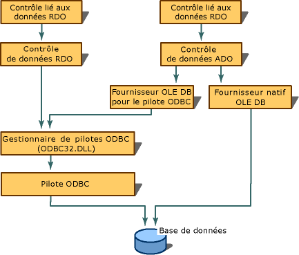

# Architecture des mod&#232;les du fournisseur OLE&#160;DB
[!INCLUDE[vs2017banner](../../assembler/inline/includes/vs2017banner.md)]

## Sources de données et sessions  
 L'architecture du fournisseur OLE DB inclut un objet data source et une ou plusieurs sessions.  L'objet data source est l'objet initial que chaque fournisseur doit instancier.  Quand une application consommateur a besoin de données, elle crée l'objet data source pour démarrer le fournisseur.  L'objet data source crée un objet session \(via l'interface **IDBCreateSession**\) qui permet au consommateur de se connecter à l'objet data source.  Les programmeurs ODBC peuvent considérer que l'objet data source équivaut à **HENV** et l'objet session à **HDBC**.  
  
   
  
 En combinaison avec les fichiers sources créés par l'Assistant Fournisseur OLE DB, les modèles OLE DB implémentent un objet data source.  Une session est un objet qui correspond à **TSession** OLE DB.  
  
## Interfaces obligatoires et facultatives  
 Les modèles du fournisseur OLE DB proposent des implémentations préconditionnées pour toutes les interfaces requises.  Les interfaces obligatoires et facultatives sont définies par OLE DB pour plusieurs types d'objets :  
  
-   [Source de données](../../data/oledb/data-source-object-interfaces.md)  
  
-   [Session](../../data/oledb/session-object-interfaces.md)  
  
-   [Rowset](../../data/oledb/rowset-object-interfaces.md)  
  
-   [Commande](../../data/oledb/command-object-interfaces.md)  
  
-   [Transaction](../../data/oledb/transaction-object-interfaces.md)  
  
 Notez que les modèles du fournisseur OLE DB n'implémentent pas les objets ligne et stockage.  
  
 Le tableau suivant répertorie les interfaces obligatoires et facultatives pour les objets recensés ci\-dessus, selon [Documentation du kit de développement OLE DB 2.6 SDK](https://msdn.microsoft.com/en-us/library/ms722784.aspx).  
  
|Composant|Interface|Commentaire|  
|---------------|---------------|-----------------|  
|[Data source](../../data/oledb/data-source-object-interfaces.md) \([CDataSource](../../data/oledb/cdatasource-class.md)\)|\[obligatoire\] **IDBCreateSession**   \[obligatoire\] **IDBInitialize**   \[obligatoire\] `IDBProperties`   \[obligatoire\] `IPersist`   \[facultative\] **IConnectionPointContainer**   \[facultative\] **IDBAsynchStatus**   \[facultative\] **IDBDataSourceAdmin**   \[facultative\] **IDBInfo**   \[facultative\] `IPersistFile`   \[facultative\] **ISupportErrorInfo**|Connexion entre le consommateur et le fournisseur.  L'objet est utilisé pour spécifier les propriétés de la connexion telles que l'ID utilisateur, le mot de passe et le nom de la source de données.  L'objet peut également être utilisé pour administrer une source de données \(créer, mettre à jour, supprimer, tables, etc.\).|  
|[Session](../../data/oledb/session-object-interfaces.md) \([CSession](../../data/oledb/cdataconnection-operator-csession-amp.md)\)|\[obligatoire\] **IGetDataSource**   \[obligatoire\] `IOpenRowset`   \[obligatoire\] **ISessionProperties**   \[facultative\] **IAlterIndex**   \[facultative\] **IAlterTable**   \[facultative\] **IBindResource**   \[facultative\] **ICreateRow**   \[facultative\] **IDBCreateCommand**   \[facultative\] **IDBSchemaRowset**   \[facultative\] **IIndexDefinition**   \[facultative\] **ISupportErrorInfo**   \[facultative\] **ITableCreation**   \[facultative\] **ITableDefinition**   \[facultative\] **ITableDefinitionWithConstraints**   \[facultative\] **ITransaction**   \[facultative\] **ITransactionJoin**   \[facultative\] **ITransactionLocal**   \[facultative\] **ITransactionObject**|L'objet session représente une simple conversation entre un consommateur et un fournisseur.  Il est en quelque sorte similaire à **HSTMT** ODBC dans la mesure où plusieurs sessions simultanées peuvent être actives.   L'objet session est le lien principal pour accéder à la fonctionnalité OLE DB.  Pour accéder à un objet commande, transaction ou rowset, vous devez passer par l'objet session.|  
|[Rowset](../../data/oledb/rowset-object-interfaces.md) \([CRowset](../../data/oledb/crowset-class.md)\)|\[obligatoire\] `IAccessor`   \[obligatoire\] `IColumnsInfo`   \[obligatoire\] **IConvertType**   \[obligatoire\] `IRowset`   \[obligatoire\] `IRowsetInfo`   \[facultative\] **IChapteredRowset**   \[facultative\] **IColumnsInfo2**   \[facultative\] **IColumnsRowset**   \[facultative\] **IConnectionPointContainer**   \[facultative\] **IDBAsynchStatus**   \[facultative\] **IGetRow**   \[facultative\] `IRowsetChange`   \[facultative\] **IRowsetChapterMember**   \[facultative\] **IRowsetCurrentIndex**   \[facultative\] **IRowsetFind**   \[facultative\] **IRowsetIdentity**   \[facultative\] **IRowsetIndex**   \[facultative\] `IRowsetLocate`   \[facultative\] **IRowsetRefresh**   \[facultative\] `IRowsetScroll`   \[facultative\] `IRowsetUpdate`   \[facultative\] **IRowsetView**   \[facultative\] **ISupportErrorInfo**   \[facultative\] **IRowsetBookmark**|L'objet rowset représente les données issues de la source de données.  Il est responsable des liaisons de ces données et des éventuelles opérations de base \(mise à jour, extraction, déplacement, etc.\) effectuées sur les données.  Vous avez toujours un objet rowset pour contenir et manipuler les données.|  
|[Command](../../data/oledb/command-object-interfaces.md) \([CCommand](http://msdn.microsoft.com/fr-fr/52bef5da-c1a0-4223-b4e6-9e464b6db409)\)|\[obligatoire\] `IAccessor`   \[obligatoire\] `IColumnsInfo`   \[obligatoire\] `ICommand`   \[obligatoire\] **ICommandProperties**   \[obligatoire\] `ICommandText`   \[obligatoire\] **IConvertType**   \[facultative\] **IColumnsRowset**   \[facultative\] **ICommandPersist**   \[facultative\] **ICommandPrepare**   \[facultative\] `ICommandWithParameters`   \[facultative\] **ISupportErrorInfo**   \[facultative\] **ICommandStream**|L'objet command gère les opérations portant sur les données telles que les requêtes.  Il peut gérer des instructions paramétrées ou non paramétrées.   L'objet command est également responsable de la gestion des liaisons pour les paramètres et les colonnes de sortie.  Une liaison est une structure qui contient des informations sur la façon dont une colonne, dans un jeu de lignes, doit être récupérée.  Elle contient des informations telles que l'ordinal, le type de données et l'état.|  
|[Transaction](../../data/oledb/transaction-object-interfaces.md) \(facultatif\)|\[obligatoire\] **IConnectionPointContainer**   \[obligatoire\] **ITransaction**   \[facultative\] **ISupportErrorInfo**|L'objet transaction définit une unité de travail atomique sur une source de données et détermine comment ces unités se rapportent les unes aux autres.  Cet objet n'est pas pris en charge directement par les modèles du fournisseur OLE DB \(autrement dit, vous créez votre propre objet\).|  
  
 Pour plus d'informations, consultez les rubriques suivantes :  
  
-   [Mappages des propriétés](../../data/oledb/property-maps.md)  
  
-   [Enregistrement utilisateur](../../data/oledb/user-record.md)  
  
## Voir aussi  
 [Modèles du fournisseur OLE DB](../../data/oledb/ole-db-provider-templates-cpp.md)   
 [OLE DB Interfaces](https://msdn.microsoft.com/en-us/library/ms709709.aspx)