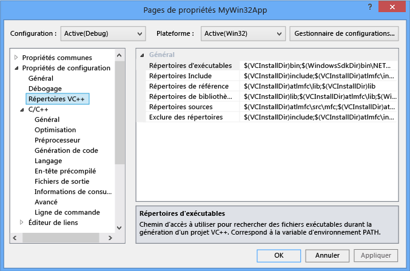
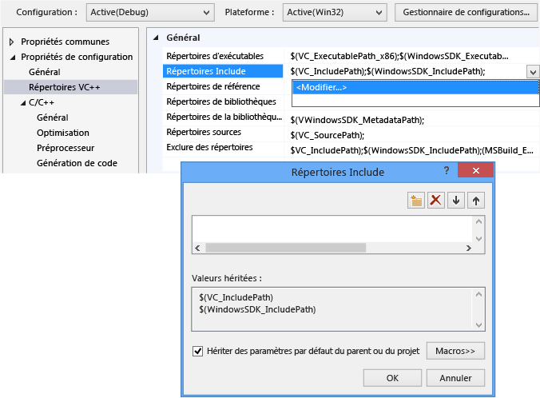
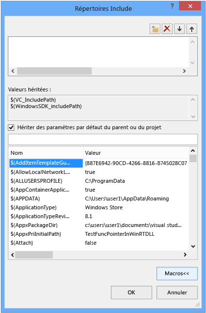
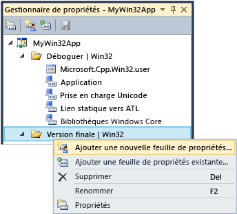

# Utilisation des propri&#233;t&#233;s de projet
[!INCLUDE[vs2017banner](../assembler/inline/includes/vs2017banner.md)]

Dans l’IDE, toutes les informations nécessaires pour générer un projet sont exposées en tant que              *propriétés*. Ces informations comprennent le nom de l’application, extension (par exemple, DLL, LIB, EXE), options du compilateur, options de l’éditeur de liens, paramètres du débogueur, étapes de génération personnalisée et beaucoup d’autres choses. Vous utilisez              *pages de propriétés* (             **projet &#124 ; Propriétés**) pour afficher et modifier ces propriétés.  
  
 Lorsque vous créez un projet, le système attribue des valeurs à différentes propriétés. Les valeurs par défaut varient légèrement en fonction du type de projet et les options que vous choisissez dans l’Assistant Application. Par exemple, un projet ATL possède des propriétés relatives aux fichiers MIDL, mais ces éléments sont absents dans une application console Visual basic.   Les propriétés par défaut sont affichées dans le volet Général dans les Pages de propriétés :  
  
   
  
 Certaines propriétés, telles que le nom de l’application, s’appliquent à toutes les variantes de build, quelle que soit la plateforme cible ou s’il s’agit d’une version debug ou release. Mais la plupart des propriétés sont dépendantes de la configuration.   Il s’agit, car le compilateur doit savoir quelle plate-forme spécifique, le programme s’exécutera sur et le compilateur spécifique des options à utiliser pour générer le code approprié. Par conséquent, lorsque vous définissez une propriété, il est important de faire attention à la configuration et la plateforme de la nouvelle valeur devant s’appliquer aux qui.  Doit s’appliquer qu’aux versions de débogage Win32, ou devez également appliquer à déboguer une BRANCHE et de débogage x64 ? Par exemple, le              **optimisation** par défaut, est définie sur              **augmenter la vitesse (/ O2)** dans une configuration Release, mais est désactivé dans la configuration Debug.  
  
 Les pages de propriétés sont conçus afin que vous pouvez toujours voir, et si nécessaire modifier, les configuration et plateforme une valeur de propriété s’appliquent. L’illustration suivante montre les pages de propriétés à la configuration et les informations de plate-forme dans les zones de liste en haut. Lorsque la propriété optimisation est définie ici, il s’applique uniquement aux versions de débogage Win32, qui se trouve être la configuration active, comme indiqué par les flèches rouges.  
  
   
  
 L’illustration suivante montre la même page de propriétés de projet, mais la configuration a été modifiée à la version. Notez la valeur différente pour la propriété optimisation. Notez également que la configuration active est toujours de débogage. Vous pouvez définir des propriétés d’une configuration ici. Il ne doit être actif.  
  
   
  
 Le système de projet lui-même est basé sur MSBuild, qui définit des formats de fichier et les règles de génération de projets de tout type. MSBuild gère la complexité de la création de plusieurs configurations et plateformes, mais vous devez comprendre un peu sur son fonctionnement. Ceci est particulièrement important si vous souhaitez définir des configurations personnalisées ou créer des ensembles réutilisables de propriétés que vous pouvez partager et l’importer dans plusieurs projets.  
  
 Propriétés de projet sont stockées directement dans le fichier de projet (*.vcxproj) ou dans d’autres fichiers .xml ou .props que les importations du fichier projet et qui fournissent des valeurs par défaut. Comme indiqué précédemment, la même propriété pour la même configuration peut avoir une valeur différente dans différents fichiers. Lorsque vous générez un projet, le moteur MSBuild évalue le fichier projet et tous les fichiers importés dans un ordre précis (décrit ci-dessous). Comme chaque fichier est évalué, toutes les valeurs de propriété définies dans ce fichier remplacent les valeurs existantes.  Toutes les valeurs qui ne sont pas spécifiés sont hérités des fichiers qui ont été évaluées précédemment.  Par conséquent, lorsque vous définissez une propriété avec des pages de propriétés, il est également important de prêter attention où vous le définir. Si vous définissez une propriété à « X » dans un fichier .props, mais la propriété est définie à « Y » dans le fichier projet, le projet est généré avec la propriété définie sur « Y ». Si la même propriété est définie à « Z » sur un élément de projet, tel qu’un fichier .cpp, le moteur MSBuild utilisera la valeur « Z ». Pour plus d’informations, consultez              [l’héritage de propriété](#bkmkPropertyInheritance) plus loin dans cet article.  
  
## Configurations de build  
 Une configuration est simplement un groupe arbitraire de propriétés qui portent un nom. Visual Studio fournit des configurations Debug et Release, et chacune définit différentes propriétés de manière appropriée pour une version de débogage ou la version Release. Vous pouvez utiliser la                  **Gestionnaire de Configuration** pour définir des configurations personnalisées constituent un moyen pratique pour les propriétés du groupe pour une version spécifique de build.  Le Gestionnaire de propriétés est utilisé pour les opérations avancées avec des propriétés, mais nous introduisez-le ici car elle permet de visualiser les configurations de propriétés. Vous y accédez depuis                  **vue &#124 ;  Gestionnaire de propriétés** ou                  **vue &#124 ; Autres fenêtres &#124 ; Gestionnaire de propriétés** en fonction de vos paramètres. Il possède des nœuds pour chaque paire plateforme/de configuration dans le projet. Sous chacun de ces nœuds sont des nœuds pour les feuilles de propriétés (fichiers .props) que définir des propriétés spécifiques pour cette configuration.  
  
   
  
 Si vous accédez au volet Général dans les Pages de propriétés (voir l’illustration ci-dessus) et définir la propriété du jeu de caractères sur « Non défini » au lieu de « Utiliser Unicode », puis cliquez sur                  **OK**,  Gestionnaire de propriétés affichera aucune                  **prise en charge Unicode** feuille de propriétés pour la configuration actuelle, mais seront toujours disponibles pour les autres configurations.  
  
 Pour plus d’informations sur le Gestionnaire de propriétés et les feuilles de propriétés, consultez                  [Création de configurations de propriétés réutilisables](#bkmkPropertySheets) plus loin dans cet article.  
  
> [!TIP]
>  Le fichier .user est une fonctionnalité héritée et nous vous recommandons de supprimer afin de conserver les propriétés correctement regroupées en fonction de la configuration/plateforme.  
  
## Plateformes cibles  
 *Plateforme cible* fait référence au type de système d’exploitation que l’exécutable s’exécutera sur et/ou de périphérique. Vous pouvez créer un projet pour plusieurs plates-formes. Les plateformes cibles disponibles pour les projets C++ varient selon le type de projet ; ils incluent, mais ne sont pas limités à Win32, x64, iOS, Android et ARM.     Le                   **x86** plateforme cible que vous pouvez consulter dans                  **Configuration Manager** est identique à                  **Win32** dans les projets C++ natifs. Win32 signifie que Windows 32 bits et                  **x64** signifie Windows 64 bits.  Pour plus d’informations sur ces deux plateformes, consultez                  [applications en cours d’exécution de 32 bits](https://msdn.microsoft.com/library/windows/desktop/aa384249\(v=vs.85\).aspx).  
  
 Le                  **Any CPU** cibler la valeur de la plateforme que vous pouvez consulter dans                  **Configuration Manager** n’a aucun effet sur les projets natifs C++ ; il ne s’applique à C + c++ / CLI et autres .NET des types de projets. Pour plus d’informations, consultez                  [/CLRIMAGETYPE (Specify Type of CLR Image)](../build/reference/clrimagetype-specify-type-of-clr-image.md).  
  
## pages de propriétés  
 Comme indiqué précédemment, le système de projet Visual C++ est basé sur                  [MSBuild](MSBuild%20Properties.md) et les valeurs sont stockées dans le fichier projet XML, par défaut .props et .targets que (pour Visual Studio 2015) se trouvent dans des fichiers                     **\< lecteur>\Program Files (x86)\MSBuild\Microsoft.Cpp\v4.0\V140** et dans les fichiers .props personnalisé que vous pouvez ajouter. Nous recommandons vivement que vous utilisez modifier ces fichiers manuellement et utilisez à la place les pages de propriétés dans l’IDE pour modifier toutes les propriétés, en particulier celles qui participent à l’héritage, à moins d’avoir une très bonne compréhension de MSBuild.  
  
 L’illustration suivante montre les pages de propriétés d’un projet Visual C++. Dans le volet gauche, le                  **répertoires VC ++***règle* est sélectionnée, et le volet de droite répertorie les propriétés qui sont associées à cette règle. Le                  `$(...)` valeurs sont appelées malheureusement                  *macros*. Il s’agit des                  *pas* macros C/C++, mais les constantes de compilation simplement. Les macros sont décrits dans le                  [macros page de propriété](#bkmkPropertiesVersusMacros) section plus loin dans cet article.)  
  
   
  
> [!WARNING]
>  Les configurations des                      **Propriétés communes** dans les versions antérieures de Visual Studio ont été supprimées. Pour ajouter une référence à un projet, vous utilisez maintenant la boîte de dialogue                      **Ajouter une référence** , de la même façon que pour les langages managés. Consultez                      [Gestion des références dans un projet](../Topic/Managing%20references%20in%20a%20project.md).  
  
#### Pour définir une propriété pour un projet  
  
1.  La plupart des scénarios, vous pouvez définir des propriétés au niveau du projet sans créer une feuille de propriétés personnalisées. Dans le menu principal, choisissez                                  **projet &#124 ; Propriétés**, ou avec le bouton droit sur le nœud du projet dans                                  **l’Explorateur de solutions** et choisissez                                  **propriétés**.  
  
2.  Utilisez le                                  **Configuration** et                                  **plate-forme** zones en haut de la boîte de dialogue pour spécifier les groupes de propriétés doivent appliquer vos modifications de liste. Dans de nombreux cas                                  **toutes les plates-formes** et                                  **toutes les Configurations** sont le bon choix. Pour définir des propriétés pour certaines configurations, sélectionnez-les dans le                                  **Gestionnaire de propriétés**, puis ouvrez le menu contextuel et sélectionnez                                  **Propriétés**.  
  
 La boîte de dialogue                  **Pages de propriétés** affiche uniquement les pages de propriétés qui s'appliquent au projet actuel. Par exemple, si le projet n'a pas de fichier .idl, la page de propriétés MIDL n'est pas affichée.  
  
 Lorsque vous sélectionnez une propriété dans une Page de propriétés, vous pouvez appuyer sur                  **F1** pour accéder à la rubrique de référence pour plus d’informations sur le commutateur de compilateur ou l’éditeur de liens correspondant.  
  
 Vous trouverez plus d’informations sur chaque Page de propriétés dans les rubriques suivantes :  
  
-   [Page de propriétés Général (projet)](../ide/general-property-page-project.md)  
  
-   [Page de propriétés Général (fichier)](../ide/general-property-page-file.md)  
  
-   [Pages de propriétés ligne de commande](../ide/command-line-property-pages.md)  
  
-   [Paramètres de projet pour une Configuration de débogage C++](../Topic/Project%20Settings%20for%20a%20C++%20Debug%20Configuration.md)  
  
-   [Page de propriétés NMake](../ide/nmake-property-page.md)  
  
-   [Pages de propriétés de l’éditeur de liens](../ide/linker-property-pages.md)  
  
-   [Pages de propriétés ressources](../ide/resources-property-pages.md)  
  
-   [Pages de propriétés MIDL](../ide/midl-property-pages.md)  
  
-   [Page de propriétés références Web](../ide/web-references-property-page.md)  
  
-   [Page de propriétés XML Data Generator Tool](../ide/xml-data-generator-tool-property-page.md)  
  
## Pour parcourir rapidement et de toutes les propriétés de recherche  
 Le                  **toutes les Options** page de propriétés (sous le                  **Propriétés de Configuration &#124 ; C/C++** nœud dans le                  **Pages de propriétés** boîte de dialogue) offre un moyen rapide pour parcourir et rechercher les propriétés qui sont disponibles dans le contexte actuel. Elle comporte une zone de recherche spéciale et possède une syntaxe simple pour aider à filtrer les résultats :  
  
 Aucun préfixe :  
 Effectuer une recherche dans les noms de propriétés uniquement (la sous-chaîne ne respecte pas la casse).  
  
 '/' ou '-' :  
 Effectuer une recherche uniquement dans les commutateurs de compilation (le préfixe ne respecte pas la casse)  
  
 v :  
 Effectuer une recherche uniquement dans les valeurs (la sous-chaîne ne respecte pas la casse).  
  
##   Macros de page de propriété  
 Un                  *macro* est une constante de compilation qui peut faire référence à une valeur définie par le système MSBuild ou de Visual Studio, ou une valeur définie par l’utilisateur. L'utilisation de macros au lieu de valeurs codées en dur telles que les chemins d'accès aux répertoires permet de partager facilement des paramètres de propriétés entre les ordinateurs et entre les versions de Visual Studio et de mieux s'assurer que les paramètres de projet participent correctement à l'héritage de propriété. Vous pouvez utiliser l’éditeur de propriétés pour afficher les valeurs de toutes les macros disponibles.  
  
### Macros prédéfinies  
 macros globales  
 S'applique à tous les éléments dans une configuration de projet. Possède la syntaxe                                  `$(name)`. Un exemple de macro globale est                                  `$(VCInstallDir)`, qui stocke le répertoire racine de votre installation de Visual Studio. Une macro globale correspond à                                  `PropertyGroup` dans MSBuild.  
  
 macros d'élément  
 Possède la syntaxe                                  `%(name)`. Pour un fichier, une macro d'élément s'applique uniquement à ce fichier ; par exemple, vous pouvez utiliser                                  `%(AdditionalIncludeDirectories)` pour spécifier les répertoires Include qui s'appliquent uniquement à un fichier particulier. Ce genre de macro d'élément correspond à des métadonnées                                  `ItemGroup` dans MSBuild. Lorsqu'elle est utilisée dans le contexte d'une configuration de projet, une macro d'élément s'applique à tous les fichiers d'un certain type. Par exemple, la propriété de configuration C/C++                                  **Définitions de préprocesseur** peut prendre une macro d'élément                                  `%(PreprocessorDefinitions)` qui s'applique à tous les fichiers .cpp dans le projet. Ce genre de macro d'élément correspond à des métadonnées                                  `ItemDefinitionGroup` dans MSBuild. Pour plus d’informations, consultez                                  [Item Definitions](../Topic/Item%20Definitions.md).  
  
### macros définies par l'utilisateur  
 Vous pouvez créer des                          *macros définies par l'utilisateur* à utiliser comme variables dans les générations de projet. Par exemple, vous pouvez créer une macro définie par l'utilisateur qui fournit une valeur pour une étape de génération personnalisée ou un outil de génération personnalisée. Une macro définie par l'utilisateur est une paire nom/valeur. Dans un fichier projet, utilisez la notation                          **$(***nom***)** pour accéder à la valeur.  
  
 Une macro définie par l’utilisateur est stockée dans une feuille de propriétés. Si votre projet ne contient pas déjà une feuille de propriétés, vous pouvez en créer un en suivant les étapes décrites sous                          [Création de configurations de propriétés réutilisables](#bkmkPropertySheets).  
  
##### Pour créer une macro définie par l’utilisateur  
  
1.  Dans la fenêtre                                          **Gestionnaire de propriétés** (dans la barre de menus, sélectionnez                                          **Affichage**,                                          **Gestionnaire de propriétés**), ouvrez le menu contextuel d'une feuille de propriétés (son nom se termine par .user), puis sélectionnez Propriétés. La boîte de dialogue                                          **Pages de propriétés** pour cette feuille de propriétés s'ouvre.  
  
2.  Dans le volet gauche de la boîte de dialogue, sélectionnez                                          **Macros utilisateur**. Dans le volet droit, cliquez sur                                          **Ajouter une macro** pour afficher la boîte de dialogue                                          **Ajouter une macro utilisateur** .  
  
3.  Dans la boîte de dialogue, spécifiez un nom et une valeur pour la macro. Si vous le souhaitez, activez la case à cocher                                          **Définir cette macro en tant que variable d'environnement dans l'environnement de génération** .  
  
## Éditeur de propriétés  
 Vous pouvez utiliser l'Éditeur de propriétés pour modifier certaines propriétés de type chaîne et sélectionner des macros comme valeurs. Pour accéder à l'Éditeur de propriétés, sélectionnez une propriété dans une page de propriétés, puis cliquez sur la flèche vers le bas située à droite. Si la liste déroulante contient                  **\< modifier>**, vous pouvez choisir pour afficher l’éditeur de propriétés pour cette propriété.  
  
   
  
 Dans l’Éditeur de propriétés, vous pouvez choisir le bouton                  **Macros** pour afficher les macros disponibles et leurs valeurs actuelles. L'illustration suivante montre l'Éditeur de propriétés pour la propriété                  **Autres répertoires Include** après la sélection du bouton                  **Macros** . Lorsque la case à cocher                  **Hériter des paramètres par défaut du parent ou du projet** est activée et que vous ajoutez une nouvelle valeur, celle-ci est ajoutée aux valeurs actuellement héritées. Si vous désactivez la case à cocher, votre nouvelle valeur remplace les valeurs héritées. Dans la plupart des cas, laissez la case à cocher activée.  
  
   
  
##   Création de configurations de propriétés réutilisables  
 Nous ne recommandons plus de définir les propriétés « globales » sur la base de chaque utilisateur et de chaque ordinateur. Au lieu de cela, nous vous recommandons d'utiliser le                  **Gestionnaire de propriétés** pour créer une                  *feuille de propriétés* afin de stocker les paramètres de chaque genre de projet que vous souhaitez pouvoir réutiliser ou partager avec d'autres personnes. Avec les feuilles de propriétés, il est également moins probable que les paramètres de propriétés pour d’autres types de projets soient modifiés par inadvertance. Feuilles de propriétés sont présentées plus en détail                  [Création de configurations de propriétés réutilisables](#bkmkPropertySheets).  
  
> [!IMPORTANT]
>  **les fichiers .user et pourquoi ils sont problématiques**  
>   
>  Versions précédentes de Visual Studio utilisaient des feuilles de propriétés globales qui avaient une extension de nom de fichier .user et se trouvaient dans le \< userprofile>dossier \AppData\Local\Microsoft\MSBuild\v4.0\. Nous ne recommandons plus l'utilisation de ces fichiers, car ils définissent des propriétés pour les configurations de projet sur la base de chaque utilisateur et de chaque ordinateur. Ces paramètres « globaux » peuvent perturber les builds, surtout lorsque vous ciblez plusieurs plateformes sur votre ordinateur de build. Par exemple, si vous avez un projet MFC et un projet Windows Phone, les propriétés .user seraient non valides pour l'un d'eux. Les feuilles de propriétés réutilisables sont plus flexibles et plus fiables.  
>   
>  Bien que les fichiers .user soient toujours installés par Visual Studio et participent à l'héritage des propriétés, ils sont vides par défaut. La meilleure pratique consiste à supprimer la référence correspondante dans le                      **Gestionnaire de propriétés** pour s'assurer que vos projets fonctionnent indépendamment des paramètres par utilisateur et par ordinateur. Cela est important pour garantir un comportement correct dans un environnement de contrôle de code source (SCC).  
  
 Pour afficher le                  **Gestionnaire de propriétés**, dans la barre de menus, sélectionnez                  **Affichage**,                  **Autres fenêtres**,                  **Gestionnaire de propriétés**.  
  
 Si vous avez un ensemble de propriétés commun fréquemment utilisé à appliquer à plusieurs projets, vous pouvez utiliser le                  **Gestionnaire de propriétés** pour les capturer dans un fichier de                  *feuilles de propriétés* réutilisable, qui par convention a une extension de nom de fichier .props. Vous pouvez appliquer la feuille (ou les feuilles) à de nouveaux projets afin de ne pas avoir à définir intégralement ses propriétés. Pour accéder au                  **Gestionnaire de propriétés**, dans la barre de menus, sélectionnez                  **Afficher**,                  **Gestionnaire de propriétés**.  
  
   
  
 Sous chaque nœud de configuration, vous consultez des nœuds pour chaque feuille de propriétés qui s’appliquent à cette configuration. Le système ajoute des feuilles de propriétés qui définissent les valeurs en fonction des options que vous choisissez dans l’Assistant application lorsque vous créez le projet. Cliquez sur n’importe quel nœud et choisissez Propriétés pour voir les propriétés qui s’appliquent à ce nœud.  Toutes les feuilles de propriétés sont importés automatiquement dans la feuille des propriétés « maître » du projet (ms.cpp.props) et sont évaluées dans l’ordre de qu'apparition dans le Gestionnaire de propriétés. Vous pouvez les déplacer pour modifier l’ordre d’évaluation. Feuilles de propriétés qui sont évaluées ultérieurement seront substituent aux valeurs dans les feuilles évaluée précédemment.  
  
 Si vous choisissez                  **Ajouter une nouvelle feuille de propriétés** , puis que vous sélectionnez, par exemple, la feuille de propriétés MyProps.props, une boîte de dialogue Page de propriétés apparaît. Remarquez qu'elle s'applique à la feuille de propriétés MyProps ; toutes les modifications que vous apportez sont écrites dans la feuille, et non dans le fichier projet (.vcxproj).  
  
 Les propriétés dans une feuille de propriétés sont remplacées si la même propriété est définie directement dans le fichier .vcxproj.  
  
 Vous pouvez importer une feuille de propriétés aussi souvent que nécessaire. Plusieurs projets d'une solution peuvent hériter des paramètres de la feuille de propriétés et un projet peut avoir plusieurs feuilles. Une feuille de propriétés peut hériter elle-même des paramètres d'une autre feuille de propriétés.  
  
 Vous pouvez également créer une feuille de propriétés pour plusieurs configurations. Pour cela, créez une feuille de propriétés pour chaque configuration, ouvrez le menu contextuel associé à l'une d'elles, sélectionnez                  **Ajouter une feuille de propriétés existante**, puis ajoutez les autres feuilles. Toutefois, si vous utilisez une feuille de propriétés commune, sachez que lorsque vous définissez une propriété, elle est définie pour toutes les configurations auxquelles la feuille s'applique et l'environnement IDE n'indique pas quels projets ou autres feuilles de propriétés héritent d'une feuille de propriétés donnée.  
  
 Dans les grandes solutions qui auront de nombreux projets, il peut être utile de créer une feuille de propriétés au niveau de la solution. Lorsque vous ajoutez un projet à la solution, utilisez le                  **Gestionnaire de propriétés** pour ajouter cette feuille de propriétés au projet. Si nécessaire au niveau du projet, vous pouvez ajouter une nouvelle feuille de propriétés pour définir des valeurs spécifiques au projet.  
  
> [!IMPORTANT]
>  Un fichier .props par défaut ne participe pas au contrôle de code source car il n'est pas créé en tant qu'élément de projet. Vous pouvez ajouter manuellement le fichier comme élément de solution si vous souhaitez l'inclure dans le contrôle de code source.  
  
#### Pour créer une feuille de propriétés  
  
1.  Dans la barre de menus, sélectionnez                                  **Affichage**,                                  **Gestionnaire de propriétés**. Le                                  **Gestionnaire de propriétés** s'ouvre.  
  
2.  Pour définir la portée de la feuille de propriétés, sélectionnez l'élément auquel elle s'applique. Il peut s'agir d'une configuration particulière ou d'une autre feuille de propriétés. Ouvrez le menu contextuel de cet élément, puis choisissez                                  **Ajouter une nouvelle feuille de propriétés de projet**. Spécifiez un nom et un emplacement.  
  
3.  Dans                                  **Gestionnaire de propriétés**, ouvrez la nouvelle feuille de propriétés et définissez les propriétés que vous souhaitez inclure.  
  
##   Héritage de propriété  
 Les propriétés de projet sont superposées. Chaque couche hérite des valeurs de la couche précédente, mais une valeur héritée peut être substituée en définissant la propriété explicitement. Voici l’arborescence d’héritage de base :  
  
1.  Paramètres par défaut de l’ensemble d’outils MSBuild CPP (..\Program Files\MSBuild\Microsoft.Cpp\v4.0\Microsoft.Cpp.Default.props, qui est importé par le fichier .vcxproj.)  
  
2.  Feuilles de propriétés  
  
3.  Fichier .vcxproj. (peut substituer les paramètres par défaut et les paramètres de feuille de propriétés.)  
  
4.  Métadonnées d'élément  
  
> [!TIP]
>  Sur une page de propriétés, une propriété dans                      `bold` est définie dans le contexte actuel. Une propriété en police normale est héritée.  
  
 Un fichier projet (.vcxproj) importe d'autres feuilles de propriétés au moment de la génération. Une fois toutes les feuilles de propriétés importées, le fichier projet est évalué et la dernière définition d'une valeur de propriété est celle qui est utilisée. Il est parfois utile d'afficher le fichier développé pour déterminer comment une valeur de propriété donnée est héritée. Pour afficher la version développée, entrez la commande suivante à une invite de commandes Visual Studio. (Remplacez les espaces réservés des noms de fichiers par ceux que vous voulez utiliser.)  
  
 **msbuild /pp:** *temp* **.txt** *mon_application* **.vcxproj**  
  
 Les fichiers projet développés peuvent être volumineux et difficiles à comprendre si MSBuild ne vous est pas familier. Voici la structure de base d'un fichier projet :  
  
1.  Propriétés de projet fondamentales, qui ne sont pas exposées dans l'environnement IDE.  
  
2.  Importation de Microsoft.cpp.default.props, qui définit des propriétés de base et indépendantes des ensembles d'outils.  
  
3.  Propriétés de configuration globales (exposées en tant que propriétés par défaut                          **PlatformToolset** et                          **Project** sur la page                          **Configuration générale** . Ces propriétés déterminent l'ensemble d'outils et les feuilles de propriétés intrinsèques importés dans Microsoft.cpp.props à l'étape suivante.  
  
4.  Importation de Microsoft.cpp.props, qui définit la plupart des paramètres par défaut du projet.  
  
5.  Importation de toutes les feuilles de propriétés, y compris les fichiers .user. Ces feuilles de propriétés peuvent tout remplacer, sauf les propriétés par défaut                          **PlatformToolset** et                          **Project** .  
  
6.  Les propriétés restantes de la configuration du projet. Ces valeurs peuvent remplacer celles définies dans les feuilles de propriétés.  
  
7.  Éléments (fichiers) avec leurs métadonnées. Il s’agit toujours du dernier mot dans les règles d’évaluation MSBuild, même s’ils se produisent avant d’autres propriétés et importations.  
  
 Pour plus d’informations, consultez                  [MSBuild Properties](MSBuild%20Properties.md).  
  
## Ajout d'un répertoire Include au jeu de répertoires par défaut  
 Lorsque vous ajoutez un répertoire Include à un projet, il est important de ne pas remplacer tous les répertoires par défaut. La méthode correcte pour ajouter un répertoire consiste à ajouter le nouveau chemin, par exemple « C:\MyNewIncludeDir\ », puis à ajouter la macro                  **$(IncludePath)** à la valeur de propriété.  
  
## Définition des variables d'environnement pour une génération  
 Le compilateur Visual C++ (cl.exe) reconnaît certaines variables d’environnement, plus spécifiquement LIB, LIBPATH, PATH et INCLUDE. Quand vous effectuez une génération avec l’environnement IDE, les propriétés définies dans la page de propriétés                  [VC++ Directories Property Page](../ide/vcpp-directories-property-page.md) sont utilisées pour définir ces variables d’environnement. Si les valeurs LIB, LIBPATH et INCLUDE ont déjà été définies, par exemple par une invite de commandes développeur, elles sont remplacées par les valeurs des propriétés MSBuild correspondantes. La génération ajoute ensuite la valeur de la propriété de répertoires d'exécutables Répertoires VC++ à PATH. Vous pouvez définir une variable d'environnement définie par l'utilisateur en créant une macro définie par l'utilisateur et en activant la case à cocher                  **Définir cette macro en tant que variable d'environnement dans l'environnement de génération**.  
  
## Définition des variables d'environnement pour une session de débogage  
 Dans le volet gauche de la boîte de dialogue                  **Pages de propriétés** du projet, développez le nœud                  **Propriétés de configuration** et sélectionnez                  **Débogage**.  
  
 Dans le volet droit, modifiez les paramètres du projet                  **Environnement** ou                  **Fusion de l'environnement** , puis choisissez le bouton                  **OK** .  
  
## Voir aussi  
 [Création et gestion de projets Visual C++](../ide/creating-and-managing-visual-cpp-projects.md)