# &#201;criture et refactorisation du code (C++)
[!INCLUDE[vs2017banner](../assembler/inline/includes/vs2017banner.md)]

L'IDE et l'éditeur de code Visual C\+\+ fournissent de nombreux outils de codage.  Certains sont propres à C\+\+, alors que d'autres sont quasiment identiques pour tous les langages Visual Studio.  Les options d'activation et de configuration de ces fonctionnalités se trouvent dans la boîte de dialogue des options avancées C\+\+ de l'éditeur de texte \(sélectionnez **Outils &#124; Options &#124; Éditeur de texte &#124; C\/C\+\+ &#124; Avancé** ou tapez « Options avancées C\+\+ » dans **Lancement rapide**\).  Après avoir choisi l'option que vous souhaitez définir, vous pouvez obtenir de l'aide supplémentaire en appuyant sur la touche **F1** quand la boîte de dialogue a le focus.  Pour les options générales de mise en forme du code, tapez `Éditeur C++` dans la barre d'outils **Lancement rapide**.  
  
## Ajout de code  
 Après avoir créé un projet, vous pouvez commencer à coder dans les fichiers qui ont été générés pour vous.  Pour ajouter de nouveaux fichiers, cliquez avec le bouton droit sur le nœud de projet dans l'Explorateur de solutions, puis choisissez **Ajouter &#124; Nouveau**.  
  
 Pour définir les options de mise en forme telles que les retraits, la saisie semi\-automatique des accolades et la colorisation, tapez `Mise en forme C++` dans la fenêtre **Lancement rapide**.  
  
### IntelliSense  
 IntelliSense est le nom d'un ensemble de fonctionnalités qui fournissent des informations inline sur les membres, les types et les surcharges de fonction.  L'illustration suivante montre la liste déroulante des membres qui s'affiche quand vous commencez à taper.  Vous pouvez appuyer sur la touche Tab pour entrer le texte de l'élément sélectionné dans votre fichier de code.  
  
   
  
 Pour plus d'informations, voir [Visual C\+\+ Intellisense](../Topic/Visual%20C++%20Intellisense.md).  
  
### Insérer des extraits de code  
 Un extrait de code est un bloc de code source prédéfini.  Cliquez avec le bouton droit sur un point précis ou sur le texte sélectionné pour insérer un extrait de code ou entourer le texte sélectionné de l'extrait de code.  L'illustration ci\-dessous montre les trois étapes à suivre pour entourer une instruction sélectionnée d'une boucle for.  Les éléments en jaune dans l'image finale sont des champs modifiables auxquels vous accédez avec la touche Tab.  Pour plus d'informations, voir [Extraits de code](../Topic/Code%20Snippets.md).  
  
 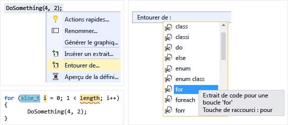  
  
### Ajouter une classe  
 Ajoutez une nouvelle classe à partir du menu **Projet** à l'aide de l'Assistant Classe.  
  
 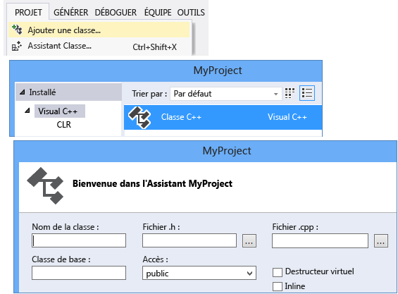  
  
### Assistant Classe  
 Modifiez ou examinez une classe existante, ou ajoutez une nouvelle classe, à l'aide de l'Assistant Classe.  Pour plus d'informations, voir [Ajout de fonctionnalités à l'aide des Assistants Code \(C\+\+\)](../ide/adding-functionality-with-code-wizards-cpp.md).  
  
 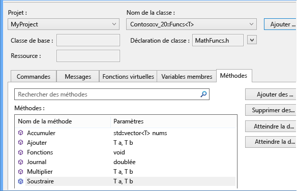  
  
## Refactorisation  
 Les refactorisations sont disponibles dans l'élément de menu contextuel Action rapide ou en cliquant sur une [ampoule](../Topic/Perform%20quick%20actions%20with%20light%20bulbs.md) dans l'éditeur.  
  
### Renommer  
 Renommez un type, une fonction ou une variable partout où il est utilisé dans la portée spécifiée.  Dans l'illustration suivante, la méthode `Eat` sera renommée en `Devour` dans la classe de base et la classe dérivée.  
  
 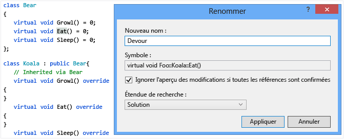  
  
### Action rapide : Déplacer l'emplacement de définition  
 Déplacez une ou plusieurs définitions de fonction dans le fichier d'en\-tête qui porte le même nom que le fichier de code.  Un nouvel en\-tête est créé s'il n'existe pas.  Chaque définition résultante est affichée inline dans une fenêtre d'aperçu.  
  
 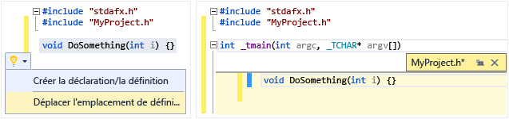  
  
### Action rapide : Créer la déclaration\/la définition  
 Créez une ou plusieurs définitions dans le fichier de code associé pour chaque déclaration d'en\-tête sélectionnée.  
  
 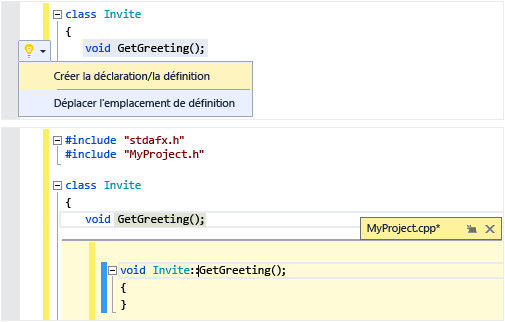  
  
### Action rapide : Implémenter les virtuels purs pour une classe  
 Générez rapidement des stubs d'implémentation vides pour toutes les fonctions virtuelles héritées dans une classe.  Pour implémenter uniquement les fonctions virtuelles dans une classe de base, mettez simplement en surbrillance cette classe de base dans la déclaration de classe dérivée.  
  
 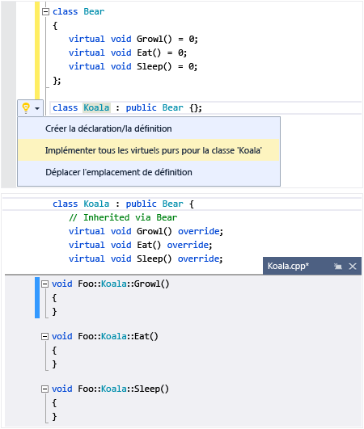  
  
### Convertir en littéral de chaîne brute  
 Quand vous placez le curseur sur un littéral de chaîne, vous pouvez cliquer avec le bouton droit et choisir **Actions rapides &#124; Convertir en littéral de chaîne brute** pour convertir une chaîne ordinaire en un littéral de chaîne brute C\+\+ 11.  
  
 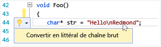  
  
### Extract, fonction \(extension de Visual Studio\)  
 Utilisez la fonctionnalité de la fonction extract \(disponible en tant qu'[extension sur la galerie Visual Studio](https://visualstudiogallery.msdn.microsoft.com/a081dc8c-c805-4589-9b8b-c2c309a05789)\) pour déplacer une section de code dans sa propre fonction et remplacer le code par un appel à cette fonction.  
  
 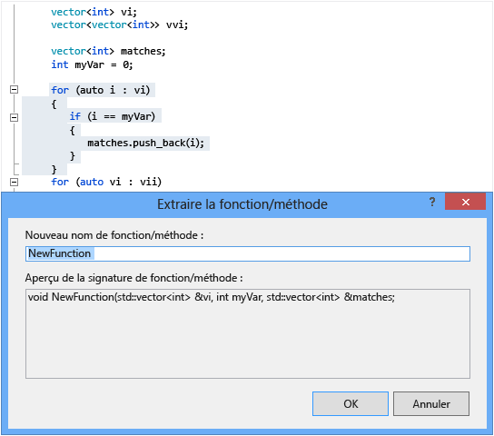  
  
## Naviguer et comprendre  
  
### Info express  
 Placez le curseur sur une variable pour afficher des informations sur son type.  Info express  
  
   
  
### Ouvrir le document \(accéder à l'en\-tête\)  
 Cliquez avec le bouton droit sur le nom d'en\-tête dans une directive `#include` et ouvrez le fichier d'en\-tête.  
  
 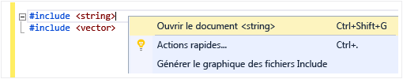  
  
### Aperçu de la définition  
 Placez le curseur sur une déclaration de variable ou de fonction, cliquez avec le bouton droit, puis choisissez **Aperçu de la définition** pour afficher sa définition inline.  Pour plus d'informations, voir [Aperçu de la définition \(Alt\+F12\)](../Topic/How%20to:%20View%20and%20Edit%20Code%20by%20Using%20Peek%20Definition%20\(Alt+F12\).md).  
  
 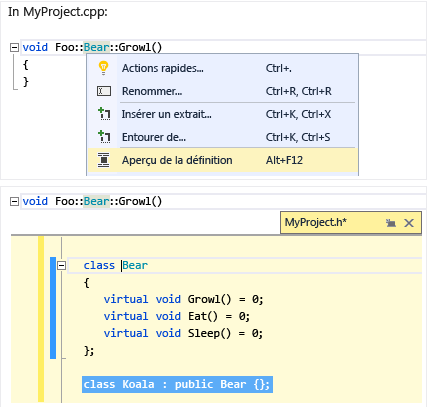  
  
### Atteindre la définition  
 Placez le curseur sur une déclaration de variable ou de fonction, cliquez avec le bouton droit, puis choisissez **Atteindre la définition** pour ouvrir le document dans lequel l'objet est défini.  
  
### Afficher la hiérarchie d'appels  
 Cliquez avec le bouton droit sur un appel de fonction et affichez une liste récursive de toutes les fonctions qui sont appelées et de toutes les fonctions qui l'appellent.  Chaque fonction de la liste peut être développée de la même façon.  Pour plus d'informations, voir [Hiérarchie d'appels](../Topic/Call%20Hierarchy.md).  
  
 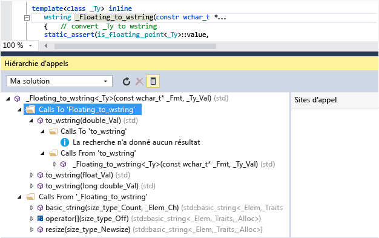  
  
### Afficher ou masquer l'en\-tête \/ le fichier de code  
 Cliquez avec le bouton droit et choisissez Afficher ou masquer l'en\-tête \/ le fichier de code pour basculer entre un fichier d'en\-tête et son fichier de code associé.  
  
### Mode Plan  
 Cliquez avec le bouton droit n'importe où dans un fichier de code source et choisissez **Mode Plan** pour réduire ou développer les définitions et\/ou les régions personnalisées. Cela vous permet de parcourir plus vite seulement les parties qui vous intéressent.  Pour plus d'informations, voir [Mode Plan](../Topic/Outlining.md).  
  
 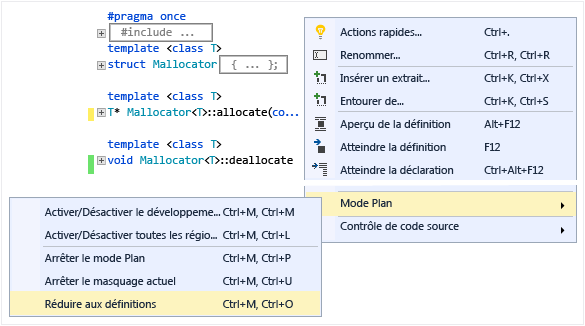  
  
### Mode mappage pour la barre de défilement  
 Le mode mappage pour la barre de défilement vous permet de faire défiler et parcourir un fichier de code rapidement, sans avoir à quitter votre emplacement actuel.  Ou cliquez n'importe où sur la carte du code pour accéder directement à cet emplacement.  
  
 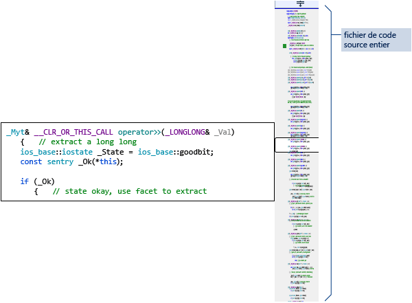  
  
### Générer le graphique des fichiers Include  
 Cliquez avec le bouton droit sur un fichier de code dans votre projet et choisissez **Générer le graphique des fichiers Include** pour afficher un graphique montrant les fichiers qui sont inclus par d'autres fichiers.  
  
   
  
### F1 Aide  
 Placez le curseur sur ou juste après un type, un mot clé ou une fonction et appuyez sur F1 pour accéder directement à la rubrique de référence MSDN associée.  F1 fonctionne également sur les éléments de la liste d'erreurs et dans de nombreuses boîtes de dialogue.  
  
### Lancement rapide  
 Pour accéder facilement à une fenêtre ou à un outil dans Visual Studio, tapez simplement son nom dans la fenêtre de lancement rapide dans le coin supérieur droit de l'interface utilisateur.  La liste de saisie semi\-automatique est filtrée à mesure que vous tapez.  
  
 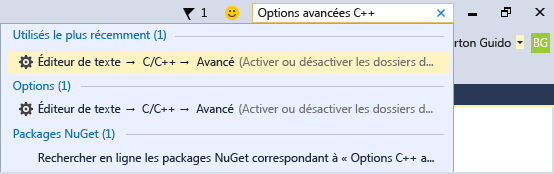