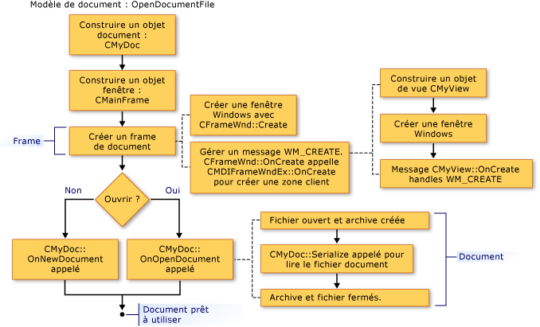

# Cr&#233;ation de documents, fen&#234;tres et vues
[!INCLUDE[vs2017banner](../assembler/inline/includes/vs2017banner.md)]

Les illustrations suivantes donnent une vue d'ensemble du processus de conception des documents, des vues, et d'autres cadres.  D'autres articles qui portent sur les objets participants fournissent de plus amples détails.  
  
 Après l'achèvement de ce processus, les objets de coopération existent et stockent les pointeurs vers chacun d'entre eux.  Les illustrations suivantes montrent l'ordre dans lequel les objets sont créés.  Vous pouvez suivre la séquence d'illustration à illustration.  
  
   
Séquence de la création d'un document  
  
   
Séquence de la création d'une fenêtre cadre  
  
   
Séquence de la création d'une vue  
  
 Pour plus d'informations sur la façon dont l'infrastructure initialise le document, la vue, et les objets de fenêtre de cadre, consultez les classes [CDocument](../mfc/reference/cdocument-class.md), [CView](../mfc/reference/cview-class.md), [CFrameWnd](../mfc/reference/cframewnd-class.md), [CMDIFrameWnd](../mfc/reference/cmdiframewnd-class.md), et [CMDIChildWnd](../mfc/reference/cmdichildwnd-class.md) dans la référence de la bibliothèque MFC.  Consultez également la [Note technique 22](../mfc/tn022-standard-commands-implementation.md), qui explique plus en détail la création et le processus d'initialisation avec son analyse des commandes standard de l'infrastructure pour les éléments `New` et  **Ouvrir** dans le menu **Fichier**.  
  
##   Initialiser vos propres ajouts à ces classes  
 Les illustrations ci\-dessus suggèrent également des points sur lesquels vous pouvez remplacer les méthodes pour initialiser les objets de votre application.  Une substitution de `OnInitialUpdate` dans la classe d'affichage est le meilleur emplacement pour initialiser la vue.  L'appel de `OnInitialUpdate` se produit immédiatement après que la fenêtre cadre ait été créée et que la vue dans la fenêtre cadre ait été jointe à son document.  Par exemple, si votre vue est une zone de défilement \(dérivée de `CScrollView` plutôt que de `CView`\), vous devez définir la taille de la vue en fonction du format de document dans votre fichier `OnInitialUpdate`. \(Ce processus est indiqué dans la description de la classe [CScrollView](../mfc/reference/cscrollview-class.md).\) Vous pouvez remplacer les fonctions membres `OnNewDocument` et `OnOpenDocument` de **CDocument** pour fournir l'initialisation spécifique à l'application du document.  En général, vous devez substituer les deux puisqu'un document peut être créé de deux manières.  
  
 Dans la plupart des cas, la substitution doit appeler la version de base de la classe.  Pour plus d'informations, consultez les méthodes nommées des classes [CDocument](../mfc/reference/cdocument-class.md), [CView](../mfc/reference/cview-class.md), [CFrameWnd](../mfc/reference/cframewnd-class.md), et [CWinApp](../mfc/reference/cwinapp-class.md) dans la référence de la bibliothèque MFC.  
  
## Voir aussi  
 [Modèles de document et processus de création de document\/vue](../mfc/document-templates-and-the-document-view-creation-process.md)   
 [Création de modèle de document](../mfc/document-template-creation.md)   
 [Création d'un document\/d'une vue](../mfc/document-view-creation.md)   
 [Relations entre les objets MFC](../mfc/relationships-among-mfc-objects.md)