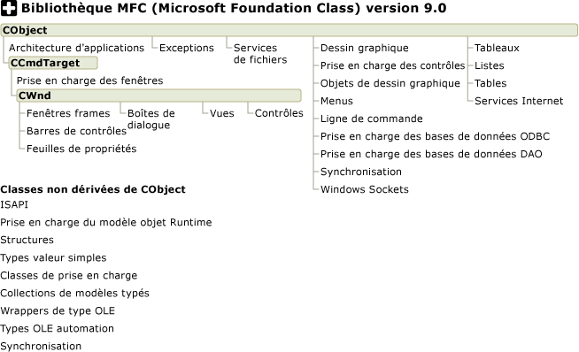

# Cat&#233;gories du graphique hi&#233;rarchique
[!INCLUDE[vs2017banner](../assembler/inline/includes/vs2017banner.md)]

  
  
## Voir aussi  
 [Graphique hiérarchique](../mfc/hierarchy-chart.md)   
 [MFC, applications de bureau](../mfc/mfc-desktop-applications.md)