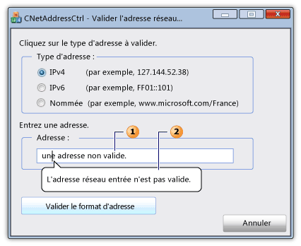

# Classe CNetAddressCtrl
[!INCLUDE[vs2017banner](../../assembler/inline/includes/vs2017banner.md)]

La classe d' `CNetAddressCtrl` représente le contrôle d'adresse réseau, que vous pouvez utiliser pour entrer et valider le format de l'IPv4, de IPv6 l', et les adresses nommées DNS.  
  
## Syntaxe  
  
```  
class CNetAddressCtrl : public CEdit  
```  
  
## Membres  
  
### Constructeurs publics  
  
|Nom|Description|  
|---------|-----------------|  
|[CNetAddressCtrl::CNetAddressCtrl](../Topic/CNetAddressCtrl::CNetAddressCtrl.md)|Construit un objet `CNetAddressCtrl`.|  
  
### Méthodes publiques  
  
|Nom|Description|  
|---------|-----------------|  
|[CNetAddressCtrl::Create](../Topic/CNetAddressCtrl::Create.md)|Crée un contrôle d'adresse réseau avec les styles spécifiés et l'attache à l'objet actuel d' `CNetAddressCtrl` .|  
|[CNetAddressCtrl::CreateEx](../Topic/CNetAddressCtrl::CreateEx.md)|Crée un contrôle d'adresse réseau avec les styles étendus spécifiés et l'attache à l'objet actuel d' `CNetAddressCtrl` .|  
|[CNetAddressCtrl::DisplayErrorTip](../Topic/CNetAddressCtrl::DisplayErrorTip.md)|Affiche une info\-bulle d'erreur lorsque l'utilisateur entre une adresse réseau non pris en charge dans le contrôle actuel d'adresse réseau.|  
|[CNetAddressCtrl::GetAddress](../Topic/CNetAddressCtrl::GetAddress.md)|Extrait une représentation validée et analysée de l'adresse réseau associée au contrôle actuel d'adresse réseau.|  
|[CNetAddressCtrl::GetAllowType](../Topic/CNetAddressCtrl::GetAllowType.md)|Récupère le type d'adresse réseau que le contrôle actuel d'adresse réseau peut prendre en charge.|  
|[CNetAddressCtrl::SetAllowType](../Topic/CNetAddressCtrl::SetAllowType.md)|Définit le type d'adresse réseau que le contrôle actuel d'adresse réseau peut prendre en charge.|  
  
## Notes  
 Le contrôle d'adresse réseau vérifie que le format de l'adresse que l'utilisateur entre est correct.  Le contrôle ne se connecte pas réellement à l'adresse réseau.  La méthode de [CNetAddressCtrl::SetAllowType](../Topic/CNetAddressCtrl::SetAllowType.md) spécifie un ou plusieurs types d'adresse que la méthode de [CNetAddressCtrl::GetAddress](../Topic/CNetAddressCtrl::GetAddress.md) peut analyser et vérifier.  Une adresse peut être sous la forme d'IPv4, de IPv6, ou d'adresse nommée pour un serveur, un réseau, un hôte, ou une destination des messages de distribution.  Si le format de l'adresse est incorrect, vous pouvez utiliser la méthode de [CNetAddressCtrl::DisplayErrorTip](../Topic/CNetAddressCtrl::DisplayErrorTip.md) pour afficher un message d'infotip qui indique graphiquement la zone de texte du contrôle d'adresse réseau et affiche un message d'erreur intégré.  
  
 La classe d' `CNetAddressCtrl` est dérivée de la classe de [CEdit](../../mfc/reference/cedit-class.md) .  En conséquence, le contrôle d'adresse réseau fournit l'accès à tous les messages de contrôle d'édition windows.  
  
 L'illustration suivante représente une boîte de dialogue qui contient un contrôle d'adresse réseau.  La zone de texte \(1\) pour le contrôle d'adresse réseau contient une adresse réseau non valide.  Le message d'infotip \(2\) s'affiche si l'adresse réseau n'est pas valide.  
  
   
  
## Exemple  
 L'exemple de code suivant fait partie d'une boîte de dialogue qui valide une adresse réseau.  Les gestionnaires d'événements pour trois cases d'option spécifient que l'adresse réseau peut être l'un des trois types d'adresse.  L'utilisateur entre une adresse dans la zone de texte du contrôle de réseau, puis appuie sur un bouton pour valider l'adresse.  Si l'adresse est valide, un message de réussite est restitué ; sinon, le message d'erreur intégré d'infotip s'affiche.  
  
 [!code-cpp[NVC_MFC_CNetAddressCtrl_s1#1](../../mfc/reference/codesnippet/CPP/cnetaddressctrl-class_1.cpp)]  
  
## Exemple  
 L'exemple de code suivant du fichier d'en\-tête de dialogue définit les variables de [NC\_ADDRESS](http://msdn.microsoft.com/library/windows/desktop/bb773345) et de [NET\_ADDRESS\_INFORMATION](http://msdn.microsoft.com/library/windows/desktop/bb773346) requises par la méthode de [CNetAddressCtrl::GetAddress](../Topic/CNetAddressCtrl::GetAddress.md) .  
  
 [!code-cpp[NVC_MFC_CNetAddressCtrl_s1#2](../../mfc/reference/codesnippet/CPP/cnetaddressctrl-class_2.h)]  
  
## Hiérarchie d'héritage  
 [CObject](../../mfc/reference/cobject-class.md)  
  
 [CCmdTarget](../../mfc/reference/ccmdtarget-class.md)  
  
 [CWnd](../../mfc/reference/cwnd-class.md)  
  
 [CEdit](../../mfc/reference/cedit-class.md)  
  
 `CNetAddressCtrl`  
  
## Configuration requise  
 **en\-tête :** afxcmn.h  
  
 Cette classe est prise en [!INCLUDE[windowsver](../../build/reference/includes/windowsver_md.md)] et versions ultérieures.  
  
 Les spécifications supplémentaires pour cette classe sont décrites dans [Configuration requise pour les contrôles communs Windows Vista](../../mfc/build-requirements-for-windows-vista-common-controls.md).  
  
## Voir aussi  
 [CNetAddressCtrl Class](../../mfc/reference/cnetaddressctrl-class.md)   
 [Graphique hiérarchique](../../mfc/hierarchy-chart.md)   
 [CEdit Class](../../mfc/reference/cedit-class.md)