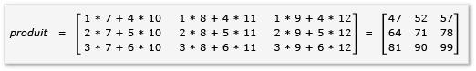
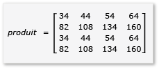

# Proc&#233;dure pas &#224; pas&#160;: Multiplication des matrices
[!INCLUDE[vs2017banner](../../assembler/inline/includes/vs2017banner.md)]

Cette procédure pas\-à\-pas explique comment utiliser C\+\+ AMP pour accélérer l'exécution de la multiplication matricielle.  Deux algorithmes sont présentés, l'un sans disposition en mosaïque \(tiling\) et l'autre avec disposition en mosaïque.  
  
## Composants requis  
 Avant de commencer :  
  
-   Lire [Présentation de C\+\+ AMP](../../parallel/amp/cpp-amp-overview.md).  
  
-   Lire [Utilisation des mosaïques](../../parallel/amp/using-tiles.md).  
  
-   Assurez\-vous que [!INCLUDE[win7](../../build/includes/win7_md.md)], [!INCLUDE[win8](../../build/includes/win8_md.md)], [!INCLUDE[winsvr08_r2](../../parallel/amp/includes/winsvr08_r2_md.md)], ou [!INCLUDE[winserver8](../../build/includes/winserver8_md.md)] est installé sur votre ordinateur.  
  
### Pour créer le projet  
  
1.  Dans la barre de menus de Visual Studio, choisissez **Fichier**, **Nouveau**, **Projet**.  
  
2.  Dans l'onglet **Installé** du volet Modèles, sélectionnez **Visual C\+\+**.  
  
3.  Sélectionnez **Projet vide**, entrez `MatrixMultiply` dans la zone **Nom**, puis cliquez sur le bouton **OK**.  
  
4.  Choisissez le bouton **Suivant**.  
  
5.  Dans **Explorateur de solutions**, ouvrez le menu contextuel pour les **Fichiers sources**, puis choisissez **Ajouter**, **Nouvel élément**.  
  
6.  Dans la boîte de dialogue **Ajouter un nouvel élément**, sélectionnez **Fichier C\+\+ \(.cpp\)**, entrez `MatrixMultiply.cpp` dans la case **Nom**, puis sélectionnez le bouton **Ajouter**.  
  
## Multiplication sans disposition en mosaïque  
 Dans cette section, on considère la multiplication de deux matrices, A et B, qui sont définies comme suit :  
  
   
  
   
  
 A est une matrice 3\-par\-2 et B est une matrice 2\-par\-3.  Le produit de la multiplication de A par B est la matrice 3\-par\-3 suivante.  Le produit est calculé en multipliant les lignes de A par les colonnes de B, élément par élément.  
  
   
  
### Multiplier sans utiliser C\+\+ AMP  
  
1.  Ouvrez MatrixMultiply.cpp remplacez le code existant par le code ci\-après.  
  
    ```cpp  
  
    #include <iostream>  
  
    void MultiplyWithOutAMP() {  
  
        int aMatrix[3][2] = {{1, 4}, {2, 5}, {3, 6}};  
        int bMatrix[2][3] = {{7, 8, 9}, {10, 11, 12}};  
        int product[3][3] = {{0, 0, 0}, {0, 0, 0}, {0, 0, 0}};  
  
        for (int row = 0; row < 3; row++) {  
            for (int col = 0; col < 3; col++) {  
                // Multiply the row of A by the column of B to get the row, column of product.  
                for (int inner = 0; inner < 2; inner++) {  
                    product[row][col] += aMatrix[row][inner] * bMatrix[inner][col];  
                }  
                std::cout << product[row][col] << "  ";  
            }  
            std::cout << "\n";  
        }  
    }  
  
    void main() {  
        MultiplyWithOutAMP();  
        getchar();  
    }  
  
    ```  
  
     L'algorithme est une implémentation simple de la définition de la multiplication matricielle.  Il n'utilise aucun algorithme parallèle ou à thread pour réduire le temps de calcul.  
  
2.  Dans la barre de menus, sélectionnez **Fichier**, **Enregistrer tout**.  
  
3.  Choisissez le raccourci clavier F5 pour démarrer le débogage et vérifier que la sortie est correcte.  
  
4.  Choisissez Entrée pour quitter l'application.  
  
### Multiplier à l'aide de C\+\+ AMP  
  
1.  Dans MatrixMultiply.cpp, ajoutez le code suivant avant la méthode `main`.  
  
    ```cpp  
  
    void MultiplyWithAMP() {  
        int aMatrix[] = { 1, 4, 2, 5, 3, 6 };  
        int bMatrix[] = { 7, 8, 9, 10, 11, 12 };  
        int productMatrix[] = { 0, 0, 0, 0, 0, 0, 0, 0, 0 };  
  
        array_view<int, 2> a(3, 2, aMatrix);  
        array_view<int, 2> b(2, 3, bMatrix);  
        array_view<int, 2> product(3, 3, productMatrix);  
  
        parallel_for_each(  
            product.extent,   
             [=](index<2> idx) restrict(amp) {  
                int row = idx[0];  
                int col = idx[1];  
                for (int inner = 0; inner < 2; inner++) {  
                    product[idx] += a(row, inner) * b(inner, col);  
                }  
            }  
        );  
  
        product.synchronize();  
  
        for (int row = 0; row < 3; row++) {  
            for (int col = 0; col < 3; col++) {  
                //std::cout << productMatrix[row*3 + col] << "  ";  
                std::cout << product(row, col) << "  ";  
            }  
            std::cout << "\n";  
        }  
    }  
  
    ```  
  
     Le code AMP ressemble beaucoup au code sans AMP.  L'appel à `parallel_for_each` démarre un thread pour chaque élément de `product.extent`, et remplace les boucles `for` pour la ligne et la colonne.  La valeur de la cellule à la ligne et colonne est disponible dans `idx`.  Vous pouvez accéder aux éléments d'un objet `array_view` à l'aide de l'opérateur `[]` et d'une variable d'index, ou de l'opérateur `()` et des variables de ligne et de colonne.  L'exemple illustre les deux méthodes.  La méthode `array_view::synchronize` copie les valeurs de la variable `product` dans la variable `productMatrix`.  
  
2.  Ajoutez les instructions `include` et `using` suivantes en haut de MatrixMultiply.cpp.  
  
    ```cpp  
  
    #include <amp.h>  
    using namespace concurrency;  
  
    ```  
  
3.  Modifiez la méthode `main` pour appeler la méthode `MultiplyWithAMP`.  
  
    ```cpp  
  
    void main() {  
        MultiplyWithOutAMP();  
        MultiplyWithAMP();  
        getchar();  
    }  
  
    ```  
  
4.  Sélectionnez le raccourci clavier Ctrl\+F5 pour commencer le débogage et vérifier que la sortie est correcte.  
  
5.  Choisissez la barre espace pour quitter l'application.  
  
## Multiplication avec disposition en mosaïque  
 La disposition en mosaïque est une technique dans laquelle vous partitionnez des données dans des sous\-ensembles de taille égale, appelés tiles.  Trois choses changent lorsque vous utilisez la disposition en mosaïque.  
  
-   Vous pouvez créer des variables `tile_static`.  L'accès aux données dans l'espace `tile_static` peut être beaucoup plus rapide que l'accès aux données dans l'espace global.  Une instance d'une variable `tile_static` est créée pour chaque mosaïque et tous les threads de la mosaïque ont accès à la variable.  Le principal avantage de la disposition en mosaïque est le gain de performances en raison de l'accès à l'espace `tile_static`.  
  
-   Appelez la méthode [tile\_barrier::wait](../Topic/tile_barrier::wait%20Method.md) pour arrêter tous les threads d'une mosaïque sur une ligne de code spécifiée.  Vous ne pouvez pas garantir l'ordre d'exécution des threads, mais seulement que tous les threads dans une mosaïque s'arrêteront à l'appel de `tile_barrier::wait` avant de continuer l'exécution.  
  
-   Vous avez accès à l'index du thread par rapport à l'objet `array_view` et à l'index relatif à la mosaïque.  En utilisant l'index local, vous pouvez simplifier la lecture et le débogage de votre code.  
  
 Pour tirer parti de la disposition en mosaïque dans la multiplication de matrices, l'algorithme doit partitionner la matrice dans des mosaïques puis copier les données de la mosaïque dans les variables `tile_static` pour un accès plus rapide.  Dans cet exemple, la matrice est partitionnée dans des sous\-matrices de taille égale.  Le produit est trouvé en multipliant les sous\-matrices.  Les deux matrices et leur produit dans cet exemple sont :  
  
   
  
   
  
   
  
 Les tableaux sont partitionnées en quatre matrices 2x2, qui sont définies comme suit :  
  
   
  
   
  
 Le produit de A et de B peut maintenant être écrit et calculé comme suit :  
  
   
  
 Étant donné que les matrices `a` à `h` sont des matrices 2x2, tous les produits et sommes sont également des matrices 2x2.  Il s'ensuit également que A\*B est une matrice 4x4, comme prévu.  Pour vérifier rapidement l'algorithme, calculez la valeur de l'élément de la première ligne, première colonne du produit.  Dans l'exemple, il s'agirait de la valeur de l'élément dans la première ligne et première colonne de `ae + bg`.  Vous devez seulement calculer la première colonne et première ligne de `ae` et de `bg` pour chaque terme.  Cette valeur pour `ae` est `1*1 + 2*5 = 11`.  La valeur de `bg` est `3*1 + 4*5 = 23`.  La valeur finale est `11 + 23 = 34`, qui est correcte.  
  
 Pour implémenter cet algorithme, le code :  
  
-   Utilise un objet `tiled_extent` au lieu d'un objet `extent` dans l'appel de `parallel_for_each`.  
  
-   Utilise un objet `tiled_index` au lieu d'un objet `index` dans l'appel de `parallel_for_each`.  
  
-   Crée des variables `tile_static` pour stocker les sous\-matrices.  
  
-   Utilise la méthode `tile_barrier::wait` pour arrêter des threads pour le calcul des produits des sous\-matrices.  
  
### Multiplier à l'aide de AMP et de la disposition en mosaïque \(tiling\)  
  
1.  Dans MatrixMultiply.cpp, ajoutez le code suivant avant la méthode `main`.  
  
    ```cpp  
  
    void MultiplyWithTiling()  
    {  
        // The tile size is 2.  
        static const int TS = 2;  
  
        // The raw data.  
        int aMatrix[] =       { 1, 2, 3, 4, 5, 6, 7, 8, 1, 2, 3, 4, 5, 6, 7, 8 };  
        int bMatrix[] =       { 1, 2, 3, 4, 5, 6, 7, 8, 1, 2, 3, 4, 5, 6, 7, 8 };  
        int productMatrix[] = { 0, 0, 0, 0, 0, 0, 0, 0, 0, 0, 0, 0, 0, 0, 0, 0 };  
  
        // Create the array_view objects.  
        array_view<int, 2> a(4, 4, aMatrix);  
        array_view<int, 2> b(4, 4, bMatrix);  
        array_view<int, 2> product(4, 4, productMatrix);  
  
        // Call parallel_for_each by using  2x2 tiles.  
        parallel_for_each(product.extent.tile< TS, TS >(),  
            [=] (tiled_index< TS, TS> t_idx) restrict(amp)   
            {  
                // Get the location of the thread relative to the tile (row, col) and the entire array_view (rowGlobal, colGlobal).  
                int row = t_idx.local[0];   
                int col = t_idx.local[1];  
                int rowGlobal = t_idx.global[0];  
                int colGlobal = t_idx.global[1];  
                int sum = 0;  
  
                // Given a 4x4 matrix and a 2x2 tile size, this loop executes twice for each thread.  
                // For the first tile and the first loop, it copies a into locA and e into locB.  
                // For the first tile and the second loop, it copies b into locA and g into locB.  
                for (int i = 0; i < 4; i += TS) {  
                    tile_static int locA[TS][TS];  
                    tile_static int locB[TS][TS];  
                    locA[row][col] = a(rowGlobal, col + i);  
                    locB[row][col] = b(row + i, colGlobal);  
                    // The threads in the tile all wait here until locA and locB are filled.  
                    t_idx.barrier.wait();  
  
                    // Return the product for the thread. The sum is retained across  
                    // both iterations of the loop, in effect adding the two products  
                    // together, for example, a*e.  
                    for (int k = 0; k < TS; k++) {  
                        sum += locA[row][k] * locB[k][col];  
                    }  
  
                    // All threads must wait until the sums are calculated. If any threads  
                    // moved ahead, the values in locA and locB would change.        
                    t_idx.barrier.wait();  
                    // Now go on to the next iteration of the loop.            
                }  
  
                // After both iterations of the loop, copy the sum to the product variable by using the global location.  
                product[t_idx.global] = sum;  
        });  
  
            // Copy the contents of product back to the productMatrix variable.  
            product.synchronize();  
  
            for (int row = 0; row < 4; row++) {  
            for (int col = 0; col < 4; col++) {  
                // The results are available from both the product and productMatrix variables.  
                //std::cout << productMatrix[row*3 + col] << "  ";  
                std::cout << product(row, col) << "  ";  
            }  
            std::cout << "\n";  
        }  
  
    }  
  
    ```  
  
     Cet exemple est considérablement différent de l'exemple sans disposition en mosaïque.  Le code utilise ces étapes conceptuelles :  
  
    1.  Copie des éléments de la mosaïque \[0,0\] de `a` dans `locA`.  Copie des éléments de la mosaïque \[0,0\] de `b` dans `locB`.  Notez que `product` est disposé en mosaïque, pas `a` et `b`.  Par conséquent, il faut utiliser les index globaux pour accéder à `a, b`, et à `product`.  l'appel à `tile_barrier::wait` est essentiel.  Il arrête tous les threads de la mosaïque jusqu'à ce que `locA` et `locB` soient remplis.  
  
    2.  Multiplication de `locA` et `locB` et stockage de vos résultats dans `product`.  
  
    3.  Copie des éléments de la mosaïque \[0,1\] de `a` dans `locA`.  Copie des éléments de la mosaïque \[1,0\] de `b` dans `locB`.  
  
    4.  Multiplication de `locA` et `locB` et ajout aux résultats qui sont déjà dans `product`.  
  
    5.  La multiplication de la mosaïque \[0,0\] est terminée.  
  
    6.  Répéter cette procédure pour les quatre autres mosaïques.  Il n'existe pas d'indexation spécifique aux mosaïques et les threads peuvent s'exécuter dans n'importe quel ordre.  À mesure que chaque thread s'exécute, les variables `tile_static` sont créées pour chaque mosaïque correctement et l'appel à `tile_barrier::wait` contrôle le déroulement du programme.  
  
    7.  Lorsque vous examinez l'algorithme de manière plus approfondie, remarquez que chaque sous\-matrice est chargée dans une mémoire `tile_static` deux fois.  Ce transfert de données prend du temps.  Toutefois, une fois que les données sont dans la mémoire `tile_static`, l'accès aux données est beaucoup plus rapide.  Étant donné que le calcul des produits requiert l'accès répété aux valeurs des sous\-matrices, il existe un gain de performances.  Pour chaque algorithme, des essais sont requis pour rechercher l'algorithme optimal et la bonne taille de mosaïque.  
  
         Dans les exemples sans AMP ni disposition en mosaïque, on accède à chaque élément de A et B dans la mémoire globale à quatre reprises pour calculer le produit.  Dans l'exemple avec disposition en mosaïque, on accède à chaque élément deux fois dans la mémoire globale, et quatre fois dans la mémoire `tile_static`.  Ce n'est pas un gain de performance considérable.  Toutefois, si A et B étaient des matrices 1024x1024 et si la taille de la mosaïque était 16, il y aurait un gain de performance considérable.  Dans ce cas, chaque élément serait copié dans la mémoire `tile_static` seulement 16 fois et on y accéderait dans la mémoire `tile_static` 1024 fois.  
  
2.  Modifiez la méthode principale pour appeler la méthode `MultiplyWithTiling`, comme indiqué.  
  
    ```cpp  
  
    void main() {  
        MultiplyWithOutAMP();  
        MultiplyWithAMP();  
        MultiplyWithTiling();  
        getchar();  
    }  
  
    ```  
  
3.  Sélectionnez le raccourci clavier Ctrl\+F5 pour commencer le débogage et vérifier que la sortie est correcte.  
  
4.  Choisissez la barre d'espace pour quitter l'application.  
  
## Voir aussi  
 [C\+\+ AMP \(C\+\+ Accelerated Massive Parallelism\)](../../parallel/amp/cpp-amp-cpp-accelerated-massive-parallelism.md)   
 [Procédure pas\-à\-pas : débogage d’une application C\+\+ AMP](../../parallel/amp/walkthrough-debugging-a-cpp-amp-application.md)