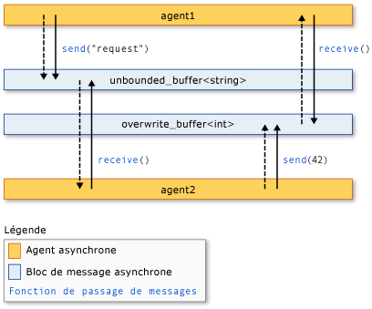

# biblioth&#232;que d’agents asynchrones
[!INCLUDE[vs2017banner](../../assembler/inline/includes/vs2017banner.md)]

La bibliothèque d’Agents asynchrones (ou simplement *bibliothèque d’Agents*) fournit un modèle de programmation qui vous permet d’augmenter la robustesse du développement d’applications à accès concurrentiel. La bibliothèque d’Agents est une bibliothèque de modèles C++ qui encourage un modèle de programmation basé sur acteur et les messages in-process en passant de granularité grossière de flux de données et les tâches de traitement « pipeline ». La bibliothèque d’Agents repose sur les composants de gestion des ressources et de planification du Runtime d’accès concurrentiel.  
  
## <a name="programming-model"></a>Modèle de programmation  
 La bibliothèque d’Agents fournit des alternatives à l’état partagé en vous permettant de connecter des composants isolés via un modèle de communication asynchrone basé sur les flux de données au lieu de flux de contrôle. *Flux de données* fait référence à une programmation modèle où les calculs sont effectués lorsque toutes les données obligatoires est disponible ; *flux de contrôle* fait référence à un modèle de programmation où les calculs sont effectués dans un ordre prédéterminé.  
  
 Le modèle de programmation de flux de données est lié au concept de *passage de messages*, où les composants indépendants d’un programme communiquent entre eux en envoyant des messages.  
  
 La bibliothèque d’Agents est composée de trois composants : *agents asynchrones*, *blocs de messages asynchrones*, et *des fonctions de passage de messages*. Agents de maintiennent l’état et utilisent des blocs de messages et des fonctions de passage de messages pour communiquer entre eux et avec les composants externes. Fonctions de passage de messages permettent aux agents d’envoyer et recevoir des messages vers et depuis les composants externes. Blocs de messages asynchrones stockent des messages et activer les agents de communiquer de manière synchronisée.  
  
 L’illustration suivante montre comment deux agents d’utiliser des blocs de messages et des fonctions de passage de messages pour communiquer. Dans cette illustration, `agent1` envoie un message à `agent2` à l’aide de la [concurrency::send](../Topic/send%20Function.md) fonction et un [concurrency::unbounded_buffer](../Topic/unbounded_buffer%20Class.md) objet. `agent2` utilise le [concurrency::receive](../Topic/receive%20Function.md) fonction permettant de lire le message. `agent2` utilise la même méthode pour envoyer un message à `agent1`. Flèches en pointillés représentent le flux de données entre les agents. Les flèches solides connectent les agents aux blocs de messages qu’ils écrivant ou lire.  
  
   
  
 Un exemple de code qui implémente cette illustration est illustré plus loin dans cette rubrique.  
  
 Le modèle de programmation de l’agent a plusieurs avantages par rapport à d’autres mécanismes d’accès concurrentiel et de synchronisation, par exemple des événements. L’avantage est qu’en utilisant le passage de message pour transmettre des modifications d’état entre des objets, vous pouvez isoler l’accès aux ressources partagées et ainsi améliorer l’évolutivité. L’avantage de passage de messages est la synchronisation de données au lieu de lier le contenu d’un objet de synchronisation externe. Cela simplifie la transmission des données entre les composants et peut éliminer les erreurs de programmation dans vos applications.  
  
## <a name="when-to-use-the-agents-library"></a>Quand utiliser la bibliothèque d’Agents  
 Utilisez la bibliothèque d’Agents lorsque vous avez plusieurs opérations qui doivent communiquer entre eux de façon asynchrone. Blocs de messages et des fonctions de passage de messages vous permettent d’écrire des applications parallèles sans nécessiter de mécanismes de synchronisation tels que les verrous. Ainsi vous concentrer sur la logique d’application.  
  
 Le modèle de programmation de l’agent est souvent utilisé pour créer *des pipelines de données* ou *réseaux*. Un pipeline de données est une série de composants qui effectuent chacun une tâche spécifique qui contribue à un plus grand objectif. Tous les composants d’un pipeline de flux de données effectue un travail lorsqu’il reçoit un message à partir d’un autre composant. Le résultat de ce travail est passé à d’autres composants dans le pipeline ou réseau. Les composants peuvent utiliser des fonctionnalités d’accès concurrentiel affinées d’autres bibliothèques, par exemple, le [bibliothèque de modèles parallèles (PPL)](../../parallel/concrt/parallel-patterns-library-ppl.md).  
  
## <a name="example"></a>Exemple  
 L’exemple suivant implémente l’illustration fournie plus haut dans cette rubrique.  
  
 [!code-cpp[concrt-basic-agents#1](../../parallel/concrt/codesnippet/CPP/asynchronous-agents-library_1.cpp)]  
  
 Cet exemple génère la sortie suivante :  
  
```Output  
agent1: sending request...  
agent2: received 'request'.  
agent2: sending response...  
agent1: received '42'.  
```  
  
 Les rubriques suivantes décrivent les fonctionnalités utilisées dans cet exemple.  
  
## <a name="related-topics"></a>Rubriques connexes  
 [Agents asynchrones](../../parallel/concrt/asynchronous-agents.md)  
 Décrit le rôle des agents asynchrones dans la résolution des plus grandes tâches de calcul.  
  
 [Blocs de messages asynchrones](../../parallel/concrt/asynchronous-message-blocks.md)  
 Décrit les différents types de blocs de messages fournis par la bibliothèque d’Agents.  
  
 [Fonctions de passage de message](../../parallel/concrt/message-passing-functions.md)  
 Décrit les différentes routines de passage de messages fournis par la bibliothèque d’Agents.  
  
 [Comment : implémenter divers modèles de producteur-consommateur](../../parallel/concrt/how-to-implement-various-producer-consumer-patterns.md)  
 Décrit comment implémenter le modèle de producteur-consommateur dans votre application.  
  
 [Comment : fournir des fonctions de travail aux Classes call et transformer](../../parallel/concrt/how-to-provide-work-functions-to-the-call-and-transformer-classes.md)  
 Illustre plusieurs méthodes permettant de fournir des fonctions de travail à le [concurrency::call](../../parallel/concrt/reference/call-class.md) et [concurrency::transformer](../../parallel/concrt/reference/transformer-class.md) classes.  
  
 [Comment : utiliser la classe transformer dans un Pipeline de données](../../parallel/concrt/how-to-use-transformer-in-a-data-pipeline.md)  
 Montre comment utiliser le [concurrency::transformer](../../parallel/concrt/reference/transformer-class.md) classe dans un pipeline de données.  
  
 [Comment : sélectionner parmi les tâches terminées](../../parallel/concrt/how-to-select-among-completed-tasks.md)  
 Montre comment utiliser le [classes concurrency::choice](../../parallel/concrt/reference/choice-class.md) et [concurrency::join](../../parallel/concrt/reference/join-class.md) des classes pour sélectionner la première tâche afin de terminer un algorithme de recherche.  
  
 [Comment : envoyer un Message à intervalles réguliers](../../parallel/concrt/how-to-send-a-message-at-a-regular-interval.md)  
 Montre comment utiliser le [concurrency::timer](../../parallel/concrt/reference/timer-class.md) pour envoyer un message à intervalles réguliers.  
  
 [Comment : utiliser un filtre de bloc de Message](../../parallel/concrt/how-to-use-a-message-block-filter.md)  
 Montre comment utiliser un filtre pour permettre à un bloc de message asynchrone accepter ou rejeter les messages.  
  
 [Bibliothèque de modèles parallèles (PPL)](../../parallel/concrt/parallel-patterns-library-ppl.md)  
 Décrit comment utiliser différents modèles parallèles, tels que les algorithmes parallèles, dans vos applications.  
  
 [Runtime d’accès concurrentiel](../../parallel/concrt/concurrency-runtime.md)  
 Décrit le runtime d'accès concurrentiel, qui simplifie la programmation parallèle, et contient des liens vers les rubriques connexes.

