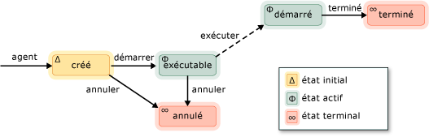

# Agents asynchrones
Un *agent asynchrone* (ou simplement *agent*) est un composant d’application qui fonctionne de façon asynchrone avec d’autres agents pour effectuer des tâches de calcul supérieure. Considérer un agent comme une tâche qui a un cycle de vie défini. Par exemple, un agent peut lire les données à partir d’un périphérique d’entrée/sortie (par exemple, le clavier, un fichier sur disque ou une connexion réseau) et un autre agent peuvent exécuter une action sur ces données qu’il est disponible. Le premier agent utilise le passage de message pour informer le second agent que davantage de données est disponible. Le Planificateur de tâches du Runtime d’accès concurrentiel fournit un mécanisme efficace pour permettre aux agents de bloquer et de céder de manière coopérative sans nécessiter de préemption moins efficace.  
  

 La bibliothèque d’Agents définit le [concurrency::agent](../../parallel/concrt/reference/agent-class.md) classe pour représenter un agent asynchrone. `agent` est une classe abstraite qui déclare la méthode virtuelle [Concurrency::agent :: Run](reference/agent-class.md#run). Le `run` méthode exécute la tâche effectuée par l’agent. Étant donné que `run` est abstraite, vous devez implémenter cette méthode dans chaque classe que vous dérivez de `agent`.  
  
## Cycle de vie de l’agent  
 Agents ont un cycle de vie défini. Le [concurrency::agent_status](reference/concurrency-namespace-enums.md#agent_status) énumération définit les différents États d’un agent. L’illustration suivante est un diagramme d’état qui montre l’avancement des agents d’un état à un autre. Dans cette illustration, les lignes pleines représentent les méthodes que vous appelez à partir de votre application ; traits pointillés représentent des méthodes qui sont appelées à partir de l’exécution.  
  
   
  
 Le tableau suivant décrit chaque état dans le `agent_status` énumération.  
  
|État de l’agent|Description|  
|-----------------|-----------------|  
|`agent_created`|L’agent n’a pas été planifié pour l’exécution.|  
|`agent_runnable`|Le runtime planifie l’exécution de l’agent.|  
|`agent_started`|L’agent a démarré et est en cours d’exécution.|  
|`agent_done`|L’agent terminé.|  
|`agent_canceled`|L’agent a été annulé avant de passer le `started` état.|  
  
 `agent_created` est l’état initial d’un agent, `agent_runnable` et `agent_started` sont les états actifs, et `agent_done` et `agent_canceled` sont les états terminaux.  
  
 Utilisez le [concurrency::agent::status](reference/agent-class.md#status) méthode pour récupérer l’état actuel d’un `agent` objet. Bien que le `status` méthode d’accès concurrentiel sécurisé, l’état de l’agent peut modifier au moment où la `status` retourne de la méthode. Par exemple, un agent peut être dans le `agent_started` état lorsque vous appelez le `status` (méthode), mais a été déplacée vers le `agent_done` état juste après le `status` méthode retourne.  

  
## Méthodes et fonctionnalités  
 Le tableau suivant répertorie quelques-unes des méthodes importantes qui appartiennent à la `agent` classe. Pour plus d’informations sur l’ensemble de la `agent` méthodes de la classe, consultez [agent, classe](../../parallel/concrt/reference/agent-class.md).  
  
|Méthode|Description|  
|------------|-----------------|  
|[start](reference/agent-class.md#start)|Planifications le `agent` objet pour l’exécution et lui affecte la `agent_runnable` état.|  
|[run](reference/agent-class.md#run)|Exécute la tâche doit être effectuée par le `agent` objet.|  
|[Terminé](reference/agent-class.md#done)|Déplace un agent à le `agent_done` état.|  
|[cancel](../../parallel/concrt/cancellation-in-the-ppl.md#cancel)|Si l’agent n’a pas démarré, cette méthode annule l’exécution de l’agent et lui affecte la `agent_canceled` état.|  
|[status](reference/agent-class.md#status)|Récupère l’état actuel de la `agent` objet.|  
|[attente](reference/agent-class.md#wait)|Attend que le `agent` objet pour entrer le `agent_done` ou `agent_canceled` état.|  
|[wait_for_all](reference/agent-class.md#wait_for_all)|Attend que tous fourni `agent` objets à la `agent_done` ou `agent_canceled` état.|  
|[wait_for_one](reference/agent-class.md#wait_for_one)|Attend au moins un des fourni `agent` objets à la `agent_done` ou `agent_canceled` état.|  
  
 Après avoir créé un objet d’agent, appelez le [Concurrency::agent :: Start](reference/agent-class.md#start) méthode à planifier son exécution. Le runtime appelle le `run` méthode après avoir planifié l’agent et lui affecte la valeur du `agent_runnable` état.  
  
 Le runtime ne gère pas les exceptions levées par les agents asynchrones. Pour plus d’informations sur la gestion des exceptions et les agents, consultez [la gestion des exceptions](../../parallel/concrt/exception-handling-in-the-concurrency-runtime.md).  
  
## Exemple  
 Pour obtenir un exemple qui montre comment créer une application basée sur l’agent de base, consultez [procédure pas à pas : création d’une Application basée sur l’Agent](../../parallel/concrt/walkthrough-creating-an-agent-based-application.md).  
  
## Voir aussi  
 [Bibliothèque d’agents asynchrones](../../parallel/concrt/asynchronous-agents-library.md)

