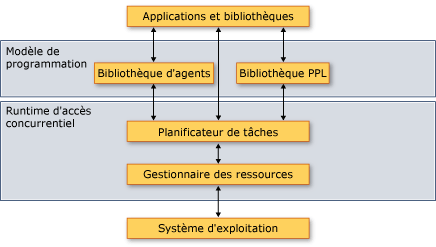

# <a name="overview-of-the-concurrency-runtime"></a>Vue d'ensemble du runtime d'accès concurrentiel
Ce document fournit une vue d'ensemble du runtime d'accès concurrentiel. Il décrit les avantages du runtime d'accès concurrentiel, quand l'utiliser et la façon dont ses composants interagissent entre eux et avec le système d'exploitation et les applications.  
  
> [!IMPORTANT]
>  Dans Visual Studio 2015 et versions ultérieures, le planificateur de tâches du runtime d'accès concurrentiel n'est plus le planificateur de la classe de tâche et des types associés dans ppltasks.h. Ces types utilisent désormais le pool de threads Windows pour de meilleures performances et une meilleure interopérabilité avec les primitives de synchronisation Windows. Les algorithmes parallèles comme parallel_for continuent à utiliser le planificateur de tâches du runtime d’accès concurrentiel.  
  
##  <a name="top"></a> Sections  
 Ce document contient les sections suivantes :  
  
-   [Pourquoi un Runtime d’accès concurrentiel est-il important ?](#runtime)  
  
-   [Architecture](#architecture)  
  
-   [Expressions Lambda C++](#lambda)  
  
-   [Requirements](#requirements)  
  
##  <a name="runtime">Pourquoi un Runtime d’accès concurrentiel est-il important ?</a>  
 Un runtime d'accès concurrentiel fournit l'uniformité et la prévisibilité aux applications et à leurs composants qui s'exécutent simultanément. Voici deux exemples des avantages du Runtime d’accès concurrentiel : *planification de tâches coopérative* et *le blocage coopératif*.  
  
 Le runtime d’accès concurrentiel utilise un planificateur de tâches coopératif qui implémente un algorithme de vol de travail pour distribuer efficacement le travail entre les ressources informatiques. Par exemple, considérez une application qui a deux threads gérés par le même runtime. Si un thread termine sa tâche planifiée, il peut décharger du travail de l’autre thread. Ce mécanisme équilibre la charge de travail globale de l'application.  
  
 Le runtime d'accès concurrentiel fournit également des primitives de synchronisation qui utilisent le blocage coopératif pour synchroniser l'accès aux ressources. Par exemple, considérez une tâche qui doit avoir un accès exclusif à une ressource partagée. Par un blocage coopératif, le runtime peut utiliser le quantum restant pour effectuer une autre tâche, pendant que la première tâche attend la ressource. Ce mécanisme favorise l'utilisation maximale des ressources informatiques.  
  
 [[Haut](#top)]  
  
##  <a name="architecture"></a> Architecture  
 Le runtime d’accès concurrentiel se divise en quatre composants : la bibliothèque de modèles parallèles (PPL), la bibliothèque d’agents asynchrones, le planificateur de tâches et le gestionnaire des ressources. Ces composants résident entre le système d'exploitation et les applications. L'illustration suivante montre comment les composants du runtime d'accès concurrentiel interagit entre le système d'exploitation et les applications :  
  
 **Architecture de Runtime d’accès concurrentiel**  
  
   
  
> [!IMPORTANT]
>  Les composants du Planificateur de tâches et le Gestionnaire de ressources ne sont pas disponibles à partir d’une application de plateforme Windows universelle (UWP) ou lorsque vous utilisez la classe de tâche ou d’autres types dans ppltasks.h.  
  
 Le Runtime d’accès concurrentiel est hautement *composable*, autrement dit, vous pouvez combiner les fonctionnalités existantes pour plus d’informations. Le runtime d’accès concurrentiel compose de nombreuses fonctionnalités, telles que des algorithmes parallèles, à partir de composants de niveau inférieur.  
  
 Le runtime d’accès concurrentiel fournit également des primitives de synchronisation qui utilisent le blocage coopératif pour synchroniser l’accès aux ressources. Pour plus d’informations sur ces primitives de synchronisation, consultez [des Structures de données de synchronisation](../../parallel/concrt/synchronization-data-structures.md).  
  
 Les sections suivantes fournissent un bref aperçu de ce que fournit chaque composant et quand les utiliser.  
  
### <a name="parallel-patterns-library"></a>bibliothèque de modèles parallèles  
 La bibliothèque de modèles parallèles (PPL) fournit des algorithmes et des conteneurs à usage général pour effectuer un parallélisme affiné. La bibliothèque PPL permet *parallélisme des données impératif* en fournissant des algorithmes parallèles qui distribuent des calculs sur des collections ou ensembles de données entre les ressources informatiques. Il permet également de *parallélisme des tâches* en fournissant des objets de tâche qui distribuent plusieurs opérations indépendantes entre les ressources informatiques.  
  
 Utilisez la bibliothèque de modèles parallèles quand vous avez un calcul local qui peut tirer parti d’une exécution en parallèle. Par exemple, vous pouvez utiliser la [concurrency::parallel_for](reference/concurrency-namespace-functions.md#parallel_for) algorithme pour transformer un existant `for` boucle d’agir en parallèle.  
  
 Pour plus d’informations sur la bibliothèque de modèles parallèles, consultez [bibliothèque de modèles parallèles (PPL)](../../parallel/concrt/parallel-patterns-library-ppl.md).  
  
### <a name="asynchronous-agents-library"></a>bibliothèque d’agents asynchrones  
 La bibliothèque d’Agents asynchrones (ou simplement *bibliothèque d’Agents*) fournit un modèle de programmation basé sur acteur et la transmission de messages des interfaces pour les flux de données à granularité grossière et les tâches de traitement « pipeline ». Les agents asynchrones vous permettent d'utiliser de façon productive la latence, en effectuant le travail pendant que d'autres composants attendent des données.  
  
 Utilisez la bibliothèque d'agents quand vous avez plusieurs entités qui communiquent entre elles de façon asynchrone. Par exemple, vous pouvez créer un agent qui lit des données à partir d'un fichier ou d'une connexion réseau, puis utilise les interfaces de passage de messages pour envoyer ces données à un autre agent.  
  
 Pour plus d’informations sur la bibliothèque d’Agents, consultez [bibliothèque d’Agents asynchrones](../../parallel/concrt/asynchronous-agents-library.md).  
  
### <a name="task-scheduler"></a>Planificateur de tâches  
 Le planificateur de tâches planifie et coordonne les tâches au moment de l'exécution. Il est coopératif et utilise un algorithme de vol de travail pour optimiser l'utilisation des ressources de traitement.  
  
 Le runtime d'accès concurrentiel fournit un planificateur par défaut pour que vous n'ayez pas à gérer les détails de l'infrastructure. Toutefois, pour répondre aux besoins de qualité de votre application, vous pouvez également fournir votre propre stratégie de planification ou associer des planificateurs spécifiques à des tâches spécifiques.  
  
 Pour plus d’informations sur le Planificateur de tâches, consultez [du Planificateur de tâches](../../parallel/concrt/task-scheduler-concurrency-runtime.md).  
  
### <a name="resource-manager"></a>Gestionnaire des ressources  
 Le rôle du gestionnaire des ressources est de gérer les ressources informatiques, comme les processeurs et la mémoire. Le gestionnaire des ressources répond aux charges de travail à mesure qu'elles changent au moment de l'exécution en affectant des ressources là où elles peuvent être les plus efficaces.  
  
 Le gestionnaire des ressources sert d'abstraction sur les ressources informatiques et interagit principalement avec le planificateur de tâches. Bien que vous puissiez utiliser le gestionnaire des ressources pour ajuster les performances de vos bibliothèques et applications, vous utilisez généralement la fonctionnalité fournie par la bibliothèque de modèles parallèles, la bibliothèque d'agents et le planificateur de tâches. Ces bibliothèques utilisent le gestionnaire des ressources pour rééquilibrer de manière dynamique les ressources à mesure que les charges de travail évoluent.  
  
 [[Haut](#top)]  
  
##  <a name="lambda">Expressions Lambda C++</a>  
 La plupart des types et algorithmes définis par le runtime d'accès concurrentiel sont implémentés en tant que modèles C++. Certains de ces types et algorithmes prennent comme paramètre une routine qui effectue le travail. Ce paramètre peut être une fonction lambda, un objet de fonction ou un pointeur de fonction. Ces entités sont également appelées *des fonctions de travail* ou *routines de travail*.  
  
 Les expressions lambda sont une nouvelle fonctionnalité importante du langage Visual C++, car elles offrent un moyen concis de définir des fonctions de travail pour un traitement parallèle. Les objets de fonction et les pointeurs de fonction vous permettent d'utiliser le runtime d'accès concurrentiel avec votre code existant. Toutefois, nous vous recommandons d’utiliser des expressions lambda quand vous écrivez un nouveau code en raison des avantages en matière de sécurité et de productivité qu’elles apportent.  
  
 L’exemple suivant compare la syntaxe des fonctions lambda, des objets de fonction et des pointeurs de fonction dans plusieurs appels à la [concurrency::parallel_for_each](reference/concurrency-namespace-functions.md#parallel_for_each) algorithme. Chaque appel à `parallel_for_each` utilise une technique différente pour calculer le carré de chaque élément dans un [std::array](../../standard-library/array-class-stl.md) objet.  
  
 [!code-cpp[concrt-comparing-work-functions#1](../../parallel/concrt/codesnippet/cpp/overview-of-the-concurrency-runtime_1.cpp)]  
  
 **Sortie**  
  
```Output  
1  
256  
6561  
65536  
390625  
```  
  
 Pour plus d’informations sur les fonctions lambda en C++, consultez [Expressions Lambda](../../cpp/lambda-expressions-in-cpp.md).  
  
 [[Haut](#top)]  
  
##  <a name="requirements"></a> Spécifications  
 Le tableau suivant présente les fichiers d'en-tête associés à chaque composant du runtime d'accès concurrentiel :  
  
|Composant|Fichiers d'en-tête|  
|---------------|------------------|  
|Bibliothèque de modèles parallèles|ppl.h<br /><br /> concurrent_queue.h<br /><br /> concurrent_vector.h|  
|bibliothèque d’agents asynchrones|agents.h|  
|Planificateur de tâches|concrt.h|  
|Gestionnaire des ressources|concrtrm.h|  
  
 Le Runtime d’accès concurrentiel est déclaré dans le [Concurrency](../../parallel/concrt/reference/concurrency-namespace.md) espace de noms. (Vous pouvez également utiliser [concurrency](../../parallel/concrt/reference/concurrency-namespace.md), qui est un alias pour cet espace de noms.) L'espace de noms `concurrency::details` prend en charge l'infrastructure du runtime d'accès concurrentiel et n'a pas vocation à être utilisé directement à partir de votre code.  
  
 Le runtime d'accès concurrentiel est fourni dans le cadre de la bibliothèque Runtime C (CRT). Pour plus d’informations sur la création d’une application qui utilise la bibliothèque CRT, consultez [fonctionnalités de la bibliothèque CRT](../../c-runtime-library/crt-library-features.md).  
  
 [[Haut](#top)]


