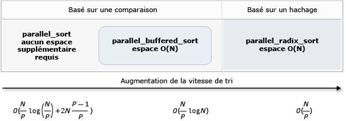

# Algorithmes parall&#232;les
[!INCLUDE[vs2017banner](../../assembler/inline/includes/vs2017banner.md)]

La bibliothèque de modèles parallèles (PPL) fournit des algorithmes qui exécutent simultanément du travail sur des collections de données. Ces algorithmes ressemblent à ceux fournis par la bibliothèque STL (Standard Template).  
  
 Les algorithmes parallèles sont composés de fonctionnalités existantes du runtime d’accès concurrentiel. Par exemple, le [concurrency::parallel_for](../Topic/parallel_for%20Function.md) algorithme utilise un [concurrency::structured_task_group](../../parallel/concrt/reference/structured-task-group-class.md) objet pour exécuter les itérations de boucle parallèle. Le `parallel_for` algorithme partitionne le travail de façon optimale en fonction du nombre de ressources informatiques disponibles.  
  
##  <a name="a-nametopa-sections"></a><a name="top"></a> Sections  
  
- [Algorithme parallel_for](#parallel_for)  
  
- [Algorithme parallel_for_each](#parallel_for_each)  
  
- [Algorithme parallel_invoke](#parallel_invoke)  
  
- [Algorithmes parallel_transform et parallel_reduce](#parallel_transform_reduce)  
  
    - [Algorithme parallel_transform](#parallel_transform)  
  
    - [Algorithme parallel_reduce](#parallel_reduce)  
  
    - [Exemple : Exécution du mappage et réduction en parallèle](#map_reduce_example)  
  
- [Partitionnement du travail](#partitions)  
  
- [Tri parallèle](#parallel_sorting)  
  
    - [Choisir un algorithme de tri](#choose_sort)  
  
##  <a name="a-nameparallelfora-the-parallelfor-algorithm"></a><a name="parallel_for"></a> Algorithme parallel_for  
 Le [concurrency::parallel_for](../Topic/parallel_for%20Function.md) algorithme effectue plusieurs fois la même tâche en parallèle. Chacune de ces tâches est paramétrée par une valeur de l’itération. Cet algorithme est utile lorsque vous disposez d’un corps de boucle qui ne partage pas de ressources parmi les itérations de cette boucle.  
  
 Le `parallel_for` algorithme partitionne les tâches de façon optimale pour l’exécution en parallèle. Il utilise un algorithme de vol de travail et de plage vol pour équilibrer ces partitions lorsque les charges de travail sont déséquilibrées. Lorsqu’une itération de boucle blocage coopératif, le runtime redistribue la plage d’itérations qui est assignée au thread actuel à d’autres threads ou processeurs. De même, lorsqu’un thread termine une plage d’itérations, le runtime redistribue fonctionne à partir d’autres threads de ce thread. Le `parallel_for` algorithme prend également en charge *imbriquées parallélisme*. Lorsqu’une boucle parallèle contienne une autre boucle parallèle, le runtime coordonne les ressources de traitement entre les instances de boucle dans une méthode efficace pour l’exécution parallèle.  
  
 Le `parallel_for` algorithme a plusieurs versions surchargées. La première version prend une valeur de départ, une valeur de fin et une fonction de travail (expression lambda, objet de fonction ou pointeur fonction). La deuxième version prend une valeur de départ, une valeur de fin, une valeur par laquelle étape et une fonction de travail. La première version de cette fonction utilise 1 comme valeur d’étape. Les autres versions prennent des objets partitionneur qui vous permettent de spécifier comment `parallel_for` devez partitionner des plages entre threads. Partitionneurs sont expliquées en détail dans la section [travail de partitionnement](#partitions) dans ce document.  
  
 Vous pouvez convertir de nombreuses `for` boucles à utiliser `parallel_for`. Toutefois, le `parallel_for` algorithme diffère de la `for` instruction comme suit :  
  
-   Le `parallel_for` algorithme `parallel_for` n’exécute pas les tâches dans un ordre prédéterminé.  
  
-   Le `parallel_for` algorithme ne prend pas en charge les conditions d’arrêt arbitraires. Le `parallel_for` algorithme s’arrête lorsque la valeur actuelle de la variable d’itération est une inférieure à `last`.  
  
-   Le `_Index_type` paramètre de type doit être un type intégral. Ce type intégral peut être signé ou non signé.  
  
-   L’itération de boucle doit être vers l’avant. Le `parallel_for` algorithme lève une exception de type [std::invalid_argument](../../standard-library/invalid-argument-class.md) Si le `_Step` paramètre est inférieur à 1.  
  
-   Le mécanisme de gestion des exceptions pour le `parallel_for` algorithme diffère de celui d’un `for` boucle. Si plusieurs exceptions se produisent simultanément dans un corps de boucle parallèle, le runtime propage une seule des exceptions sur le thread qui a appelé `parallel_for`. En outre, lorsqu’une itération de boucle lève une exception, le runtime n’interrompt pas immédiatement la boucle globale. Au lieu de cela, la boucle est placée dans l’état annulé et le runtime ignore les tâches qui n’ont pas encore démarré. Pour plus d’informations sur la gestion des exceptions et les algorithmes parallèles, consultez la page [la gestion des exceptions](../../parallel/concrt/exception-handling-in-the-concurrency-runtime.md).  
  
 Bien que le `parallel_for` algorithme ne prend pas en charge les conditions d’arrêt arbitraires, vous pouvez utiliser l’annulation pour arrêter toutes les tâches. Pour plus d’informations sur l’annulation, consultez [annulation](../../parallel/concrt/exception-handling-in-the-concurrency-runtime.md#cancellation_in_the_ppl).  
  
> [!NOTE]
>  Le coût de planification que résultats de l’équilibrage de charge et la prise en charge des fonctionnalités telles que l’annulation ne peuvent pas surmonter les avantages de l’exécution du corps de la boucle en parallèle, en particulier lorsque le corps de la boucle est relativement petit. Vous pouvez réduire cette surcharge en utilisant un partitionneur dans la boucle parallèle. Pour plus d’informations, consultez [travail de partitionnement](#partitions) plus loin dans ce document.  
  
### <a name="example"></a>Exemple  
 L’exemple suivant montre la structure de base de la `parallel_for` algorithme. Cet exemple imprime sur la console chaque valeur dans la plage [1, 5] en parallèle.  
  
 [!code-cpp[concrt-parallel-for-structure#1](../../parallel/concrt/codesnippet/CPP/parallel-algorithms_1.cpp)]  
  
 Cet exemple génère la sortie suivante :  
  
```Output  
1 2 4 3 5  
```  
  
 Étant donné que le `parallel_for` algorithme agit sur chaque élément en parallèle, l’ordre dans lequel les valeurs sont imprimées sur la console varie.  
  
 Pour un exemple complet qui utilise le `parallel_for` algorithme, consultez [Comment : écrire une boucle parallel_for](../../parallel/concrt/how-to-write-a-parallel-for-loop.md).  
  
 [[Haut](#top)]  
  
##  <a name="a-nameparallelforeacha-the-parallelforeach-algorithm"></a><a name="parallel_for_each"></a> Algorithme parallel_for_each  
 Le [concurrency::parallel_for_each](../Topic/parallel_for_each%20Function.md) algorithme effectue les tâches sur un conteneur itératif, telles que celles fournies par la bibliothèque STL, en parallèle. Il utilise la même logique de partitionnement que la `parallel_for` algorithme utilise.  
  
 Le `parallel_for_each` algorithme ressemble à la bibliothèque STL [std::for_each](../Topic/for_each.md) algorithme, à ceci près que le `parallel_for_each` algorithme exécute les tâches simultanément. Comme d’autres algorithmes parallèles, `parallel_for_each` ne s’exécute pas les tâches dans un ordre spécifique.  
  
 Bien que le `parallel_for_each` qui fonctionne sur les itérateurs et les itérateurs d’accès aléatoire, ses performances sont supérieures avec les itérateurs d’accès aléatoire.  
  
### <a name="example"></a>Exemple  
 L’exemple suivant montre la structure de base de la `parallel_for_each` algorithme. Cet exemple imprime sur la console chaque valeur dans un [std::array](../../standard-library/array-class-stl.md) objet en parallèle.  
  
 [!code-cpp[concrt-parallel-for-each-structure#1](../../parallel/concrt/codesnippet/CPP/parallel-algorithms_2.cpp)]  
  
 Cet exemple génère la sortie suivante :  
  
```Output  
4 5 1 2 3  
```  
  
 Étant donné que le `parallel_for_each` algorithme agit sur chaque élément en parallèle, l’ordre dans lequel les valeurs sont imprimées sur la console varie.  
  
 Pour un exemple complet qui utilise le `parallel_for_each` algorithme, consultez [Comment : écrire une boucle parallel_for_each](../../parallel/concrt/how-to-write-a-parallel-for-each-loop.md).  
  
 [[Haut](#top)]  
  
##  <a name="a-nameparallelinvokea-the-parallelinvoke-algorithm"></a><a name="parallel_invoke"></a> Algorithme parallel_invoke  
 Le [concurrency::parallel_invoke](../Topic/parallel_invoke%20Function.md) algorithme exécute un ensemble de tâches en parallèle. Elle ne retourne pas avant la fin de chaque tâche. Cet algorithme est utile lorsque vous disposez de plusieurs tâches indépendantes que vous souhaitez exécuter en même temps.  
  
 Le `parallel_invoke` algorithme prend comme paramètres une série de fonctions de travail (fonctions lambda, objets de fonction ou pointeurs fonction). Le `parallel_invoke` algorithme est surchargé pour prendre entre deux et dix paramètres. Chaque fonction que vous passez à `parallel_invoke` doit prendre les paramètres nuls.  
  
 Comme d’autres algorithmes parallèles, `parallel_invoke` ne s’exécute pas les tâches dans un ordre spécifique. La rubrique [parallélisme des tâches](../../parallel/concrt/task-parallelism-concurrency-runtime.md) explique comment la `parallel_invoke` algorithme liées aux tâches et les groupes de tâches.  
  
### <a name="example"></a>Exemple  
 L’exemple suivant montre la structure de base de la `parallel_invoke` algorithme. Cet exemple appelle simultanément la `twice` fonction sur trois variables locales et affiche le résultat sur la console.  
  
 [!code-cpp[concrt-parallel-invoke-structure#1](../../parallel/concrt/codesnippet/CPP/parallel-algorithms_3.cpp)]  
  
 Cet exemple génère la sortie suivante :  
  
```Output  
108 11.2 HelloHello  
```  
  
 Pour obtenir des exemples complets qui utilisent la `parallel_invoke` algorithme, consultez [Comment : utiliser parallel_invoke pour écrire une Routine de tri parallèle](../../parallel/concrt/how-to-use-parallel-invoke-to-write-a-parallel-sort-routine.md) et [Comment : utiliser parallel_invoke pour exécuter des opérations parallèles](../../parallel/concrt/how-to-use-parallel-invoke-to-execute-parallel-operations.md).  
  
 [[Haut](#top)]  
  
##  <a name="a-nameparalleltransformreducea-the-paralleltransform-and-parallelreduce-algorithms"></a><a name="parallel_transform_reduce"></a> Algorithmes parallel_transform et parallel_reduce  
 Le [concurrency::parallel_transform](../Topic/parallel_transform%20Function.md) et [concurrency::parallel_reduce](../Topic/parallel_reduce%20Function.md) algorithmes sont des versions parallèles des algorithmes STL [std::transform](../Topic/transform.md) et [std::accumulate](../Topic/accumulate.md), respectivement. Les versions du Runtime d’accès concurrentiel se comportent comme les versions STL, à ceci près que l’ordre des opérations n’est pas déterminé, car ils s’exécutent en parallèle. Utilisez ces algorithmes lorsque vous travaillez avec un jeu est assez grand pour bénéficier des avantages de performances et l’évolutivité en cours de traitement en parallèle.  
  
> [!IMPORTANT]
>  Le `parallel_transform` et `parallel_reduce` algorithmes prennent en charge uniquement, bidirectionnel et transmettre itérateurs d’accès aléatoire, car ces itérateurs produisent adresses mémoire stable. En outre, ces itérateurs doivent produire non -`const` l-values.  
  
###  <a name="a-nameparalleltransforma-the-paralleltransform-algorithm"></a><a name="parallel_transform"></a> Algorithme parallel_transform  
 Vous pouvez utiliser la `parallel transform` algorithme pour effectuer de nombreuses opérations de parallélisation de données. Par exemple, vous pouvez :  
  
-   Ajuster la luminosité d’une image et effectuer d’autres opérations de traitement d’image.  
  
-   Additionner ou prendre le produit scalaire entre deux vecteurs et effectuer d’autres calculs numériques sur les vecteurs.  
  
-   Effectuer un rayon 3D, où chaque itération fait référence à un pixel doit être restitué.  
  
 L’exemple suivant montre la structure de base qui est utilisée pour appeler le `parallel_transform` algorithme. Cet exemple inverse chaque élément d’un std ::[vecteur](vector%20Class.md) objet de deux manières. La première méthode utilise une expression lambda. La seconde utilise [std::negate](../../standard-library/negate-struct.md), qui dérive de [std::unary_function](../../standard-library/unary-function-struct.md).  
  
 [!code-cpp[concrt-basic-parallel-transform#1](../../parallel/concrt/codesnippet/CPP/parallel-algorithms_4.cpp)]  
  
> [!WARNING]
>  Cet exemple illustre l’utilisation de le `parallel_transform`. Étant donné que la fonction de travail n’effectue pas une quantité importante de travail, une augmentation significative des performances n’est pas prévue dans cet exemple.  
  
 Le `parallel_transform` algorithme a deux surcharges. La première surcharge prend une plage d’entrée et une fonction unaire. La fonction unaire peut être une expression lambda qui prend un argument, un objet de fonction ou un type qui dérive de `unary_function`. La deuxième surcharge prend deux plages d’entrée et une fonction binaire. La fonction binaire peut être une expression lambda qui prend deux arguments, un objet de fonction ou un type qui dérive de [std::binary_function](../../standard-library/binary-function-struct.md). L’exemple suivant illustre ces différences.  
  
 [!code-cpp[concrt-parallel-transform-vectors#2](../../parallel/concrt/codesnippet/CPP/parallel-algorithms_5.cpp)]  
  
> [!IMPORTANT]
>  Que vous fournissez pour la sortie de l’itérateur `parallel_transform` doit chevaucher complètement l’itérateur d’entrée ou ne chevauche pas du tout. Le comportement de cet algorithme n’est pas spécifié si les itérateurs d’entrée et de sortie se chevauchent partiellement.  
  
###  <a name="a-nameparallelreducea-the-parallelreduce-algorithm"></a><a name="parallel_reduce"></a> Algorithme parallel_reduce  
 Le `parallel_reduce` algorithme est utile lorsque vous disposez d’une séquence d’opérations qui répondent à la propriété associative. (Cet algorithme ne nécessite pas la propriété commutative.) Voici quelques opérations que vous pouvez effectuer avec `parallel_reduce`:  
  
-   Multiplier les séquences de matrices pour produire une matrice.  
  
-   Multiplie un vecteur par une séquence de matrices pour produire un vecteur.  
  
-   Calculer la longueur d’une séquence de chaînes.  
  
-   Associer une liste d’éléments, tels que les chaînes, dans un seul élément.  
  
 L’exemple de base suivant montre comment utiliser le `parallel_reduce` algorithme pour combiner une séquence de chaînes en une seule chaîne. Comme avec les exemples de `parallel_transform`, des gains de performance ne sont pas prévues dans cet exemple de base.  
  
 [!code-cpp[concrt-basic-parallel-reduce#1](../../parallel/concrt/codesnippet/CPP/parallel-algorithms_6.cpp)]  
  
 Dans de nombreux cas, vous pouvez considérer `parallel_reduce` comme raccourci pour l’utilisation de la `parallel_for_each` algorithme avec la [concurrency::combinable](../../parallel/concrt/reference/combinable-class.md) classe.  
  
###  <a name="a-namemapreduceexamplea-example-performing-map-and-reduce-in-parallel"></a><a name="map_reduce_example"></a> Exemple : Exécution du mappage et réduction en parallèle  
 Un *carte* opération applique une fonction à chaque valeur dans une séquence. Un *Réduire* opération regroupe les éléments d’une séquence dans une seule valeur. Vous pouvez utiliser la bibliothèque STL (Standard Template Library) [std::transform](../Topic/transform.md)[std::accumulate](../Topic/accumulate.md) classes map et réduire les opérations. Toutefois, pour de nombreux problèmes, vous pouvez utiliser la `parallel_transform` algorithme pour effectuer l’opération de mappage en parallèle et le `parallel_reduce` algorithme effectuer l’opération de réduction en parallèle.  
  
 L’exemple suivant compare le temps nécessaire pour calculer la somme des nombres premiers en série et en parallèle. La phase de mappage transforme les valeurs non-prime sur 0 et les sommes de phase de réduire les valeurs.  
  
 [!code-cpp[concrt-parallel-map-reduce-sum-of-primes#1](../../parallel/concrt/codesnippet/CPP/parallel-algorithms_7.cpp)]  
  
 Pour un autre exemple qui effectue un mappage et de réduire l’opération en parallèle, consultez [Comment : effectuer un mappage et réduire les opérations en parallèle](../../parallel/concrt/how-to-perform-map-and-reduce-operations-in-parallel.md).  
  
 [[Haut](#top)]  
  
##  <a name="a-namepartitionsa-partitioning-work"></a><a name="partitions"></a> Partitionnement du travail  
 Pour paralléliser une opération sur une source de données, une étape essentielle est de *partition* la source en plusieurs sections qui peuvent être accessibles simultanément par plusieurs threads. Un partitionneur spécifie comment un algorithme parallèle doit-elle partitionner des plages entre threads. Comme expliqué précédemment dans ce document, la bibliothèque PPL utilise par défaut le mécanisme qui crée une charge de travail initial, puis utilise un algorithme et plage de vol pour équilibrer ces partitions lorsque les charges de travail sont déséquilibrées vol de travail de partitionnement. Par exemple, lorsqu’une itération de boucle termine une plage d’itérations, le runtime redistribue fonctionne à partir d’autres threads de ce thread. Toutefois, pour certains scénarios, vous pouvez spécifier un autre mécanisme de partitionnement qui convient le mieux à votre problème.  
  
 Le `parallel_for`, `parallel_for_each`, et `parallel_transform` algorithmes fournissent des versions surchargées qui prennent un paramètre supplémentaire, `_Partitioner`. Ce paramètre définit le type de partitionneur qui divise le travail. Voici les types de partitionneurs la bibliothèque PPL définit :  
  
 [Concurrency::affinity_partitioner](../../parallel/concrt/reference/affinity-partitioner-class.md)  
 Divise fonctionnent en un nombre fixe de plages (en général, le nombre de threads de travail qui sont disponibles pour travailler sur la boucle). Ce type de partitionneur ressemble à `static_partitioner`, mais améliore l’affinité de cache par la façon dont il mappe les plages de threads de travail. Ce type de partitionneur peut améliorer les performances lorsqu’une boucle est exécutée sur le même jeu de données plusieurs fois (par exemple, une boucle dans une boucle) et les données sont stockées dans le cache. Ce partitionneur ne pas participe pleinement d’annulation. Il n’utilise pas la sémantique blocage coopérative et ne peut donc pas être utilisée avec des boucles parallèles qui ont une dépendance directe.  
  
 [Concurrency::auto_partitioner](../../parallel/concrt/reference/auto-partitioner-class.md)  
 Divise fonctionnent dans un nombre initial de plages (en général, le nombre de threads de travail qui sont disponibles pour travailler sur la boucle). Le runtime utilise ce type par défaut lorsque vous n’appelez pas un algorithme parallèle surchargé qui prend un `_Partitioner` paramètre. Chaque plage peut être divisé en sous-plages, et ce qui permet l’équilibrage de charge doit avoir lieu. Lorsqu’une plage de travail est terminée, le runtime redistribue sous-plages de travail à partir d’autres threads de ce thread. Utilisez ce partitionneur si votre charge de travail ne se situe pas sous un des autres catégories ou si vous avez besoin de prise en charge complète pour l’annulation ou de blocage coopératif.  
  
 [Concurrency::simple_partitioner](../../parallel/concrt/reference/simple-partitioner-class.md)  
 Divise fonctionnent en plages telles que chaque plage ait au moins le nombre d’itérations qui sont spécifiées par la taille de segment donné. Ce type de partitionneur participe à l’équilibrage de charge ; Toutefois, le runtime ne répartit pas les plages en sous-plages. Pour chaque processus de travail, le runtime vérifie l’annulation et effectue l’équilibrage de charge après `_Chunk_size` effectuer des itérations.  
  
 [Concurrency::static_partitioner](../../parallel/concrt/reference/static-partitioner-class.md)  
 Divise fonctionnent en un nombre fixe de plages (en général, le nombre de threads de travail qui sont disponibles pour travailler sur la boucle). Ce type de partitionneur peut améliorer les performances, car elle n’utilise pas de vol de travail et par conséquent présente une surcharge inférieure. Utilisez ce type de partitionneur lors de chaque itération d’une boucle parallèle effectue une quantité fixe et uniforme de travail et ne pas requiert la prise en charge de l’annulation ou de transférer le blocage coopératif.  
  
> [!WARNING]
>  Le `parallel_for_each` et `parallel_transform` algorithmes prennent en charge uniquement les conteneurs qui utilisent les itérateurs d’accès aléatoire (par exemple std ::[vecteur](vector%20Class.md)) pour les partitionneurs statique, simple et l’affinité. L’utilisation de conteneurs qui utilisent bidirectionnel et itérateurs génère une erreur de compilation. Le partitionneur par défaut, `auto_partitioner`, prend en charge trois de ces types d’itérateur.  
  
 En règle générale, ces partitionneurs sont utilisés de la même manière, à l’exception de `affinity_partitioner`. La plupart des types de partitionneur ne conservent pas l’état et ne sont pas modifiées par le runtime. Par conséquent, vous pouvez créer ces objets partitionneur au site d’appel, comme illustré dans l’exemple suivant.  
  
 [!code-cpp[concrt-static-partitioner#1](../../parallel/concrt/codesnippet/CPP/parallel-algorithms_8.cpp)]  
  
 Toutefois, vous devez passer un `affinity_partitioner` objet en tant que non -`const`, l-value de référence afin que l’algorithme peut stocker l’état des futures boucles à réutiliser. L’exemple suivant montre une application de base qui effectue la même opération sur un jeu de données en parallèle à plusieurs reprises. L’utilisation de `affinity_partitioner` peut améliorer les performances, car le tableau est susceptible de tenir dans le cache.  
  
 [!code-cpp[concrt-affinity-partitioner#1](../../parallel/concrt/codesnippet/CPP/parallel-algorithms_9.cpp)]  
  
> [!CAUTION]
>  Soyez prudent lorsque vous modifiez le code existant qui repose sur la sémantique de blocage coopérative à utiliser `static_partitioner` ou `affinity_partitioner`. Ces types de partitionneur n’utilisent pas l’équilibrage de charge ou de vol de la plage et par conséquent peuvent modifier le comportement de votre application.  
  
 La meilleure façon de déterminer s’il faut utiliser un partitionneur dans tout scénario donné consiste à expérimenter et à mesurer la durée d’opérations avec charges représentatives et les configurations d’ordinateur. Par exemple, un partitionnement statique peut fournir une accélération significative sur un ordinateur multicœur qui a uniquement quelques cœurs, mais il peut provoquer des ralentissements sur les ordinateurs qui disposent de nombreux cœurs.  
  
 [[Haut](#top)]  
  
##  <a name="a-nameparallelsortinga-parallel-sorting"></a><a name="parallel_sorting"></a> Tri parallèle  
 La bibliothèque PPL fournit trois algorithmes de tri : [concurrency::parallel_sort](../Topic/parallel_sort%20Function.md), [concurrency::parallel_buffered_sort](../Topic/parallel_buffered_sort%20Function.md), et [concurrency::parallel_radixsort](../Topic/parallel_radixsort%20Function.md). Ces algorithmes de tri sont utiles lorsque vous disposez d’un jeu de données pouvant bénéficier du tri en parallèle. En particulier, en parallèle de tri est utile lorsque vous disposez d’un jeu de données volumineux ou lorsque vous utilisez une opération de comparaison gourmandes en ressources pour trier vos données. Chacun de ces algorithmes trie les éléments en place.  
  
 Le `parallel_sort` et `parallel_buffered_sort` les algorithmes sont les deux algorithmes basés sur la comparaison. Autrement dit, ils comparent des éléments en valeur. Le `parallel_sort` algorithme ne possède aucune configuration mémoire supplémentaire et convient pour le tri à usage général. Le `parallel_buffered_sort` algorithme peut effectuer plus `parallel_sort`, mais il nécessite d’espace o (n).  
  
 Le `parallel_radixsort` algorithme est basé sur le hachage. Autrement dit, il utilise des clés d’entier pour trier les éléments. À l’aide de clés, cet algorithme peut calculer directement de la destination d’un élément au lieu d’utiliser des comparaisons. Comme `parallel_buffered_sort`, cet algorithme requiert d’espace o (n).  
  
 Le tableau suivant récapitule les propriétés importantes des trois algorithmes de tri parallèles.  
  
|Algorithme|Description|Mécanisme de tri|Stabilité de tri|Besoins en mémoire|Complexité du temps|Itérateurs|  
|---------------|-----------------|-----------------------|--------------------|-------------------------|---------------------|---------------------|  
|`parallel_sort`|Tri en fonction de comparaison à usage général.|En fonction de comparaison (croissant)|Instable|Aucun|O((N/P)log(N/P) + 2N((P-1)/P))|Aléatoire|  
|`parallel_buffered_sort`|Plus rapidement à usage général basé sur la comparaison de tri qui nécessite de l’espace d’o (n).|En fonction de comparaison (croissant)|Instable|Nécessite plus d’espace o (n)|O((N/P)log(N))|Aléatoire|  
|`parallel_radixsort`|Entier basé sur la clé tri qui nécessite de l’espace d’o (n).|En fonction de hachage|Stable|Nécessite plus d’espace o (n)|O(N/P)|Aléatoire|  
  
 L’illustration suivante montre les propriétés importantes des algorithmes de tri parallèles trois plus graphiquement.  
  
   
  
 Ces algorithmes de tri parallèle suivent les règles de l’annulation et la gestion des exceptions. Pour plus d’informations sur l’annulation et la gestion des exceptions dans le Runtime d’accès concurrentiel, consultez [Annuler des algorithmes parallèles](../../parallel/concrt/cancellation-in-the-ppl.md#algorithms) et [la gestion des exceptions](../../parallel/concrt/exception-handling-in-the-concurrency-runtime.md).  
  
> [!TIP]
>  Ces algorithmes de tri parallèle prend en charge une sémantique de déplacement. Vous pouvez définir un opérateur d’assignation de déplacement pour activer les opérations d’échange plus efficaces. Pour plus d’informations sur la sémantique de déplacement et l’opérateur d’assignation de déplacement, consultez [déclarateur de référence Rvalue : & &](../../cpp/rvalue-reference-declarator-amp-amp.md), et [déplacer les constructeurs et les opérateurs de l’attribution de déplacer (C++)](../../cpp/move-constructors-and-move-assignment-operators-cpp.md). Si vous ne fournissez pas un opérateur d’assignation de déplacement ou de la fonction de l’échange, les algorithmes de tri utilisent le constructeur de copie.  
  
 L’exemple de base suivant montre comment utiliser `parallel_sort` pour trier une `vector` de `int` valeurs. Par défaut, `parallel_sort` utilise [std::less](../../standard-library/less-struct.md) pour comparer des valeurs.  
  
 [!code-cpp[concrt-basic-parallel-sort#1](../../parallel/concrt/codesnippet/CPP/parallel-algorithms_10.cpp)]  
  
 Cet exemple montre comment fournir une fonction de comparaison personnalisée. Il utilise le [std::complex::real](../Topic/complex::real.md) méthode permettant de trier [std::complex \< double>](../../standard-library/complex-class.md) valeurs dans l’ordre croissant.  
  
 [!code-cpp[concrt-basic-parallel-sort#2](../../parallel/concrt/codesnippet/CPP/parallel-algorithms_11.cpp)]  
  
 Cet exemple montre comment fournir une fonction de hachage pour le `parallel_radixsort` algorithme. Cet exemple montre comment trier points 3D. Les points sont triés en fonction de la distance à partir d’un point de référence.  
  
 [!code-cpp[concrt-parallel-sort-points#1](../../parallel/concrt/codesnippet/CPP/parallel-algorithms_12.cpp)]  
  
 À titre d’illustration, cet exemple utilise un jeu de données relativement faible. Vous pouvez augmenter la taille initiale du vecteur à faire des essais avec des améliorations de performances sur gros volumes de données.  
  
 Cet exemple utilise une expression lambda en tant que fonction de hachage. Vous pouvez également utiliser une des implémentations intégrées de la std ::[hash, classe](hash%20Class.md) ou définir vos propres spécialisation. Vous pouvez également utiliser un objet de fonction de hachage personnalisé, comme illustré dans cet exemple :  
  
 [!code-cpp[concrt-parallel-sort-points#2](../../parallel/concrt/codesnippet/CPP/parallel-algorithms_13.cpp)]  
  
 [!code-cpp[concrt-parallel-sort-points#3](../../parallel/concrt/codesnippet/CPP/parallel-algorithms_14.cpp)]  
  
 La fonction de hachage doit retourner un type intégral ([std::is_integral::value](../../standard-library/is-integral-class.md) doit être `true`). Ce type intégral doit être converti en type `size_t`.  
  
###  <a name="a-namechoosesorta-choosing-a-sorting-algorithm"></a><a name="choose_sort"></a> Choisir un algorithme de tri  
 Dans de nombreux cas, `parallel_sort` fournit le meilleur compromis entre les performances de vitesse et de la mémoire. Toutefois, augmenter la taille de votre jeu de données, le nombre de processeurs disponibles ou la complexité de votre fonction de comparaison, comme vous `parallel_buffered_sort` ou `parallel_radixsort` peut être plus performant. La meilleure méthode pour déterminer l’algorithme de tri à utiliser dans tout scénario donné consiste à expérimenter et à mesurer le temps nécessaire pour trier les données par défaut en fonction des configurations d’ordinateurs représentatives. N’oubliez pas les consignes suivantes lorsque vous choisissez une stratégie de tri.  
  
-   La taille de votre jeu de données. Dans ce document, un *petit* dataset contient moins de 1 000 éléments, un *support* dataset contienne entre 10 000 et 100 000 éléments et un *grand* dataset contient plus de 100 000 éléments.  
  
-   La quantité de travail qui exécute votre fonction de comparaison ou d’une fonction de hachage.  
  
-   La quantité de ressources informatiques disponibles.  
  
-   Les caractéristiques de votre jeu de données. Par exemple, un algorithme peut effectuer bien pour les données déjà presque trié, mais pas aussi bien pour les données qui ne sont pas entièrement triées.  
  
-   La taille de segment. Le paramètre facultatif `_Chunk_size` argument spécifie lorsque l’algorithme passe d’un parallèle à une implémentation de tri en série comme il divise le tri global en plus petites unités de travail. Par exemple, si vous fournissez 512, l’algorithme passe à l’implémentation en série lorsqu’une unité de travail contient des éléments de moins de 512. Une implémentation en série peut améliorer les performances car elle élimine la surcharge requise pour traiter les données en parallèle.  
  
 Il peut être utile de trier un petit jeu de données en parallèle, même lorsque vous avez un grand nombre de ressources informatiques disponibles ou votre fonction de comparaison ou d’une fonction de hachage exécute une quantité relativement importante de travail. Vous pouvez utiliser [std::sort](../Topic/sort.md) (fonction) pour trier les petits jeux de données. (`parallel_sort` et `parallel_buffered_sort` appeler `sort` lorsque vous spécifiez une taille de segment est plus grande que le jeu de données ; Toutefois, `parallel_buffered_sort` aurait à allouer un espace o (n), qui pouvait prendre plus de temps en raison de l’allocation de mémoire ou de contention de verrouillage.)  
  
 Si vous devez économiser la mémoire ou votre allocateur de mémoire est soumise à des conflits de verrouillage, utilisez `parallel_sort` pour trier un jeu de données de taille moyenne. `parallel_sort` ne nécessite aucun espace supplémentaire ; les autres algorithmes nécessitent d’espace o (n).  
  
 Utilisez `parallel_buffered_sort` pour trier les jeux de données de taille moyenne, lorsque votre application répond à la nécessité d’espace o (n) supplémentaire. `parallel_buffered_sort` peut être particulièrement utile lorsque vous avez un grand nombre de ressources informatiques ou une fonction coûteuse ou la fonction de hachage.  
  
 Utilisez `parallel_radixsort` pour trier les jeux de données volumineux et lorsque votre application répond à la nécessité d’espace o (n) supplémentaire. `parallel_radixsort` peut être particulièrement utile lorsque l’opération de comparaison équivalent est plus onéreuse ou lorsque les deux opérations sont coûteuses.  
  
> [!CAUTION]
>  Mise en œuvre d’une bonne fonction de hachage nécessite que vous connaissez la plage du jeu de données et la transformation de chaque élément du jeu de données à une valeur non signée. Étant donné que l’opération de hachage fonctionne sur les valeurs non signées, envisager une stratégie de tri différente si les valeurs de hachage non signés ne peuvent pas être produits.  
  
 L’exemple suivant compare les performances de `sort`, `parallel_sort`, `parallel_buffered_sort`, et `parallel_radixsort` sur le même grand jeu de données aléatoires.  
  
 [!code-cpp[concrt-choosing-parallel-sort#1](../../parallel/concrt/codesnippet/CPP/parallel-algorithms_15.cpp)]  
  
 Dans cet exemple, ce qui suppose qu’il est acceptable d’allouer l’espace o pendant le tri, `parallel_radixsort` offre les meilleures performances sur ce jeu de données sur cet ordinateur.  
  
 [[Haut](#top)]  
  
## <a name="related-topics"></a>Rubriques connexes  
  
|Titre|Description|  
|-----------|-----------------|  
|[Comment : écrire une boucle parallel_for](../../parallel/concrt/how-to-write-a-parallel-for-loop.md)|Montre comment utiliser le `parallel_for` algorithme pour effectuer une multiplication de matrice.|  
|[Comment : écrire une boucle parallel_for_each](../../parallel/concrt/how-to-write-a-parallel-for-each-loop.md)|Montre comment utiliser le `parallel_for_each` algorithme pour calculer le nombre de nombres premiers dans un [std::array](../../standard-library/array-class-stl.md) objet en parallèle.|  
|[Comment : utiliser parallel_invoke pour écrire une Routine de tri parallèle](../../parallel/concrt/how-to-use-parallel-invoke-to-write-a-parallel-sort-routine.md)|Montre comment utiliser l'algorithme `parallel_invoke` pour améliorer les performances de l'algorithme de tri bitonique.|  
|[Comment : utiliser parallel_invoke pour exécuter des opérations parallèles](../../parallel/concrt/how-to-use-parallel-invoke-to-execute-parallel-operations.md)|Montre comment utiliser l'algorithme `parallel_invoke` pour améliorer les performances d'un programme qui effectue plusieurs opérations sur une source de données partagée.|  
|[Comment : effectuer le mappage et de réduire les opérations en parallèle](../../parallel/concrt/how-to-perform-map-and-reduce-operations-in-parallel.md)|Montre comment utiliser le `parallel_transform` et `parallel_reduce` algorithmes pour effectuer un mappage et de réduire l’opération qui compte les occurrences de mots dans des fichiers.|  
|[Bibliothèque de modèles parallèles (PPL)](../../parallel/concrt/parallel-patterns-library-ppl.md)|Décrit la bibliothèque PPL, qui fournit un modèle de programmation impérative qui encourage l’extensibilité et la facilité d’utilisation pour le développement d’applications simultanées.|  
|[Annulation](../../parallel/concrt/exception-handling-in-the-concurrency-runtime.md#cancellation_in_the_ppl)|Explique le rôle de l’annulation dans la bibliothèque PPL, comment annuler le travail parallèle et comment déterminer quand un groupe de tâches est annulé.|  
|[Gestion des exceptions](../../parallel/concrt/exception-handling-in-the-concurrency-runtime.md)|Explique le rôle de gestion des exceptions dans le Runtime d’accès concurrentiel.|  
  
## <a name="reference"></a>Référence  
 [parallel_for (fonction)](../Topic/parallel_for%20Function.md)  
  
 [parallel_for_each, fonction](../Topic/parallel_for_each%20Function.md)  
  
 [parallel_invoke, fonction](../Topic/parallel_invoke%20Function.md)  
  
 [affinity_partitioner, classe](../../parallel/concrt/reference/affinity-partitioner-class.md)  
  
 [auto_partitioner, classe](../../parallel/concrt/reference/auto-partitioner-class.md)  
  
 [simple_partitioner, classe](../../parallel/concrt/reference/simple-partitioner-class.md)  
  
 [static_partitioner, classe](../../parallel/concrt/reference/static-partitioner-class.md)  
  
 [parallel_sort, fonction](../Topic/parallel_sort%20Function.md)  
  
 [parallel_buffered_sort, fonction](../Topic/parallel_buffered_sort%20Function.md)  
  
 [parallel_radixsort, fonction](../Topic/parallel_radixsort%20Function.md)

