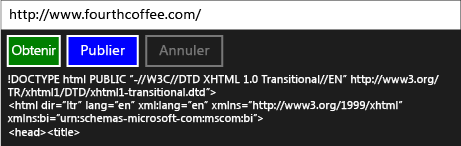

# Proc&#233;dure pas &#224; pas&#160;: connexion &#224; l’aide de t&#226;ches et de requ&#234;tes HTTP XML
[!INCLUDE[vs2017banner](../../assembler/inline/includes/vs2017banner.md)]

Cet exemple montre comment utiliser les interfaces [IXMLHTTPRequest2](http://msdn.microsoft.com/fr-fr/bbc11c4a-aecf-4d6d-8275-3e852e309908) et [IXMLHTTPRequest2Callback](http://msdn.microsoft.com/fr-fr/aa4b3f4c-6e28-458b-be25-6cce8865fc71) avec des tâches pour envoyer des requêtes HTTP GET et POST à un service Web dans une application [!INCLUDE[win8_appname_long](../../build/includes/win8_appname_long_md.md)].  En combinant `IXMLHTTPRequest2` avec des tâches, écrivez du code qui composent avec d'autres tâches.  Par exemple, vous pouvez utiliser la tâche de téléchargement dans le cadre d'une chaîne des tâches.  La tâche de téléchargement peut également répondre quand le travail est annulé.  
  
> [!TIP]
>  Utilisez également le Kit de développement logiciel REST C\+\+ pour exécuter des requêtes HTTP depuis une application [!INCLUDE[win8_appname_long](../../build/includes/win8_appname_long_md.md)] à l'aide d'une l'application C\+\+ ou depuis une application de bureau C\+\+.  Pour plus d'informations, consultez [C\+\+ REST SDK \(Codename "Casablanca"\)](../../top/cpp-rest-sdk-codename-casablanca.md).  
  
 Pour plus d'informations sur les tâches, consultez [Parallélisme des tâches](../../parallel/concrt/task-parallelism-concurrency-runtime.md).  Pour plus d’informations sur l’utilisation d'une tâche dans une application [!INCLUDE[win8_appname_long](../../build/includes/win8_appname_long_md.md)], voir [Asynchronous programming in C\+\+](http://msdn.microsoft.com/fr-fr/512700b7-7863-44cc-93a2-366938052f31) et [Création d'opérations asynchrones en C\+\+ pour les applications Windows Store](../../parallel/concrt/creating-asynchronous-operations-in-cpp-for-windows-store-apps.md).  
  
 Ce document explique d'abord comment créer un `HttpRequest` et ses classes de prise en charge.  Il montre ensuite comment utiliser cette classe depuis une application [!INCLUDE[win8_appname_long](../../build/includes/win8_appname_long_md.md)] qui utilise C\+\+ et XAML.  
  
 Pour obtenir un exemple complet qui utilise la classe `HttpReader` décrite dans ce document, consultez [Développement de l'optimiseur de voyage Bing Maps, une application Windows Store dans JavaScript et C\+\+](../Topic/Developing%20Bing%20Maps%20Trip%20Optimizer,%20a%20Windows%20Store%20app%20in%20JavaScript%20and%20C++.md).  Pour un autre exemple qui utilise `IXMLHTTPRequest2` mais n'utilise pas les tâches, consultez [Quickstart: Connecting using XML HTTP Request \(IXMLHTTPRequest2\)](http://msdn.microsoft.com/fr-fr/cc7aed53-b2c5-4d83-b85d-cff2f5ba7b35).  
  
> [!TIP]
>  `IXMLHTTPRequest2` et `IXMLHTTPRequest2Callback` sont les interfaces que nous recommandons d'utiliser dans une application [!INCLUDE[win8_appname_long](../../build/includes/win8_appname_long_md.md)].  Vous pouvez également adapter cet exemple pour l'utilisation dans une application de bureau.  
  
## Composants requis  
  
## Définition des classes HttpRequest, HttpRequestBuffersCallback et HttpRequestStringCallback  
 Lorsque vous utilisez l'interface `IXMLHTTPRequest2` pour créer des requêtes Web via HTTP, vous implémentez l'interface `IXMLHTTPRequest2Callback` pour recevoir la réponse du serveur et de réagir à d'autres événements.  Cet exemple définit la classe `HttpRequest` pour créer des applications Web, et les classes `HttpRequestBuffersCallback` et `HttpRequestStringCallback` afin de traiter des réponses.  Les classes `HttpRequestBuffersCallback` et `HttpRequestStringCallback` prennent en charge la classe `HttpRequest`; vous travaillez uniquement avec la classe `HttpRequest` du code d'application.  
  
 Les méthodes `GetAsync`, `PostAsync` de la classe `HttpRequest` vous permettent de démarrer respectivement les opérations HTTP GET et POST.  Ces méthodes utilisent la classe `HttpRequestStringCallback` pour lire la réponse du serveur comme une chaîne.  Les méthodes `SendAsync` et `ReadAsync` vous permettent de transmettre un grand contenu en gros fragments.  Ces méthodes retournent chacune [concurrency::task](../../parallel/concrt/reference/task-class-concurrency-runtime.md) pour représenter l'opération.  Les méthodes `GetAsync` et `task<std::wstring>` produisent la valeur de `PostAsync`, où la partie `wstring` représente la réponse du serveur.  Les méthodes `SendAsync` et `task<void>` produisent des valeurs `ReadAsync`; ces tâches se terminent lorsque les opérations d'envoi et de lecture se terminent.  
  
 Les interfaces `IXMLHTTPRequest2` agissant de façon asynchrone, cet exemple utilise [concurrency::task\_completion\_event](../../parallel/concrt/reference/task-completion-event-class.md) afin de créer une tâche qui se termine après l'objet de rappel termine ou annule l'opération de téléchargement.  La classe `HttpRequest` crée une continuation basée sur des tâches depuis cette tâche afin de définir le résultat final.  La classe `HttpRequest` utilise une continuation basée sur des tâches pour garantir que la tâche de continuation s"exécute même si la tâche précédente produit une erreur ou est annulée.  Pour plus d'informations sur les continuation basée sur des tâches, consultez [Parallélisme des tâches](../../parallel/concrt/task-parallelism-concurrency-runtime.md).  
  
 Pour prendre en charge l'annulation, les classes `HttpRequest`, `HttpRequestBuffersCallback`, et `HttpRequestStringCallback` utilisent des jetons d'annulation.  Les classes `HttpRequestBuffersCallback` et `HttpRequestStringCallback` utilisent la méthode [concurrency::cancellation\_token::register\_callback](../Topic/cancellation_token::register_callback%20Method.md) pour permettre à l'événement d'achèvement de tâche de répondre à l'annulation.  Ce rappel d'annulation abandonne le téléchargement.  Pour plus d'informations sur l'annulation, consultez [Annulation](../../parallel/concrt/cancellation-in-the-ppl.md).  
  
#### Pour définir la classe HttpRequest  
  
1.  Utilisez le modèle **Application vide \(XAML\)** de Visual C\+\+ pour créer un projet d'application XAML vierge.  Cet exemple nomme le projet `UsingIXMLHTTPRequest2`.  
  
2.  Ajoutez un fichier d'en\-tête au projet qui sera nommé HttpRequest.h et un fichier source nommé HttpRequest.cpp.  
  
3.  Dans pch.h, ajoutez ce code :  
  
     [!CODE [concrt-using-IXMLHTTPRequest2#1](concrt-using-IXMLHTTPRequest2#1)]  
  
4.  Dans HttpRequest.h, ajoutez ce code :  
  
     [!CODE [concrt-using-IXMLHTTPRequest2#2](concrt-using-IXMLHTTPRequest2#2)]  
  
5.  Dans HttpRequest.cpp, ajoutez ce code :  
  
     [!CODE [concrt-using-IXMLHTTPRequest2#3](concrt-using-IXMLHTTPRequest2#3)]  
  
## Utilisation de la classe HttpRequest dans une application [!INCLUDE[win8_appname_long](../../build/includes/win8_appname_long_md.md)]  
 Cette section montre comment utiliser la classe `HttpRequest` dans une application [!INCLUDE[win8_appname_long](../../build/includes/win8_appname_long_md.md)].  L'application fournit une zone d'entrée qui définit une ressource URL, et des commandes de bouton qui effectuent des opérations GET et POST, et un bouton de commande qui annule l'opération en cours.  
  
#### Pour utiliser la classe HttpRequest  
  
1.  Dans MainPage.xaml, définissez l'élément [StackPanel](http://msdn.microsoft.com/library/windows/apps/xaml/windows.ui.xaml.controls.stackpanel.aspx) comme suit.  
  
     [!CODE [concrt-using-IXMLHTTPRequest2#A1](concrt-using-IXMLHTTPRequest2#A1)]  
  
2.  Dans MainPage.xaml.h, ajoutez la directive `#include`:  
  
     [!CODE [concrt-using-IXMLHTTPRequest2#A2](concrt-using-IXMLHTTPRequest2#A2)]  
  
3.  Dans MainPage.xaml.h, ajoutez ces variables membres `private` à la classe `MainPage`:  
  
     [!CODE [concrt-using-IXMLHTTPRequest2#A3](concrt-using-IXMLHTTPRequest2#A3)]  
  
4.  Dans MainPage.xaml.h, déclarez la méthode `private` `ProcessHttpRequest`:  
  
     [!CODE [concrt-using-IXMLHTTPRequest2#A4](concrt-using-IXMLHTTPRequest2#A4)]  
  
5.  Dans MainPage.xaml.cpp, ajoutez ces relevés `using`:  
  
     [!CODE [concrt-using-IXMLHTTPRequest2#A5](concrt-using-IXMLHTTPRequest2#A5)]  
  
6.  Dans MainPage.xaml.cpp, implémentez les méthodes `GetButton_Click`, `PostButton_Click`, et `CancelButton_Click` de la classe `MainPage`.  
  
     [!CODE [concrt-using-IXMLHTTPRequest2#A6](concrt-using-IXMLHTTPRequest2#A6)]  
  
    > [!TIP]
    >  Si votre application ne requiert pas de prise en charge de l'annulation, passez [concurrency::cancellation\_token::none](../Topic/cancellation_token::none%20Method.md) aux méthodes `HttpRequest::GetAsync` et `HttpRequest::PostAsync`.  
  
7.  Dans MainPage.xaml.cpp, implémentez la méthode `MainPage::ProcessHttpRequest`.  
  
     [!CODE [concrt-using-IXMLHTTPRequest2#A7](concrt-using-IXMLHTTPRequest2#A7)]  
  
8.  Dans les propriétés du projet, sous **Éditeur de liens**, **Entrée**, spécifiez `shcore.lib` et `msxml6.lib`.  
  
 Voici l'application en cours de exécution :  
  
   
  
## Étapes suivantes  
 [Procédures pas à pas relatives au runtime d'accès concurrentiel](../../parallel/concrt/concurrency-runtime-walkthroughs.md)  
  
## Voir aussi  
 [Parallélisme des tâches](../../parallel/concrt/task-parallelism-concurrency-runtime.md)   
 [Annulation](../../parallel/concrt/cancellation-in-the-ppl.md)   
 [Asynchronous programming in C\+\+](http://msdn.microsoft.com/fr-fr/512700b7-7863-44cc-93a2-366938052f31)   
 [Création d'opérations asynchrones en C\+\+ pour les applications Windows Store](../../parallel/concrt/creating-asynchronous-operations-in-cpp-for-windows-store-apps.md)   
 [Quickstart: Connecting using XML HTTP Request \(IXMLHTTPRequest2\)](http://msdn.microsoft.com/fr-fr/cc7aed53-b2c5-4d83-b85d-cff2f5ba7b35)   
 [task \(Concurrency Runtime\), classe](../../parallel/concrt/reference/task-class-concurrency-runtime.md)   
 [task\_completion\_event, classe](../../parallel/concrt/reference/task-completion-event-class.md)   
 [IXMLHTTPRequest2](http://msdn.microsoft.com/fr-fr/bbc11c4a-aecf-4d6d-8275-3e852e309908)   
 [IXMLHTTPRequest2Callback](http://msdn.microsoft.com/fr-fr/aa4b3f4c-6e28-458b-be25-6cce8865fc71)