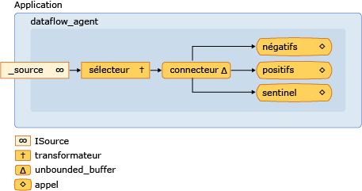

# <a name="walkthrough-creating-a-dataflow-agent"></a>Procédure pas à pas : création des agents de flux de données
Ce document montre comment créer des applications basées sur l’agent qui sont basées sur les flux de données, au lieu de flux de contrôle.  
  
 *Flux de contrôle* fait référence à l’ordre d’exécution des opérations dans un programme. Flux de contrôle est ajustée à l’aide de structures de contrôle telles que des instructions conditionnelles, des boucles et ainsi de suite. Vous pouvez également *flux de données* fait référence à un modèle de programmation dans lequel les calculs sont effectués uniquement lorsque toutes les données requises sont disponibles. Le modèle de programmation de flux de données est lié au concept de passage, de messages dans lequel les composants indépendants d’un programme communiquent entre eux en envoyant des messages.  
  
 Agents asynchrones prennent en charge le flux de contrôle et les modèles de programmation de flux de données. Même si le modèle de flux de contrôle est approprié dans de nombreux cas, le modèle de flux de données est approprié dans d’autres, par exemple, lorsqu’un agent reçoit des données et exécute une action qui est basée sur la charge utile de ces données.  
  
## <a name="prerequisites"></a>Prérequis  
 Lisez les documents suivants avant de commencer cette procédure pas à pas :  
  
- [Agents asynchrones](../../parallel/concrt/asynchronous-agents.md)  
  
- [Blocs de messages asynchrones](../../parallel/concrt/asynchronous-message-blocks.md)  
  
- [Guide pratique pour utiliser un filtre de bloc de message](../../parallel/concrt/how-to-use-a-message-block-filter.md)  
  
##  <a name="top"></a> Sections  
 Cette procédure pas à pas contient les sections suivantes :  
  
- [Création d’un Agent de flux de contrôle de base](#control-flow)  
  
- [Création d’un Agent de flux de données de base](#dataflow)  
  
- [Création d’un Agent de l’enregistrement des messages](#logging)  
  
##  <a name="control-flow"></a>Création d’un Agent de flux de contrôle de base  
 Prenons l’exemple suivant définit la `control_flow_agent` classe. La `control_flow_agent` classe agit sur trois mémoires tampons de messages : une mémoire tampon d’entrée et deux mémoires tampons de sortie. Le `run` méthode lit à partir de la mémoire tampon de message source dans une boucle et utilise une instruction conditionnelle pour diriger le flux d’exécution du programme. L’agent incrémente un compteur pour différente de zéro, les valeurs négatives et incrémente un autre compteur pour les valeurs positifs différent de zéro. Une fois que l’agent reçoit la valeur de sentinelle zéro, il envoie les valeurs des compteurs aux tampons de messages de sortie. Le `negatives` et `positives` méthodes activer l’application de lire le nombre de valeurs positives et négatives à partir de l’agent.  
  
 [!code-cpp[concrt-dataflow-agent#1](../../parallel/concrt/codesnippet/cpp/walkthrough-creating-a-dataflow-agent_1.cpp)]  
  
 Bien que cet exemple montre une utilisation de base du flux de contrôle dans un agent, il montre la nature de série de programmation de flux de contrôle. Chaque message doit être traité de manière séquentielle, même si plusieurs messages peuvent être disponibles dans le tampon de messages d’entrée. Le modèle de flux de données permet aux deux branches de l’instruction conditionnelle à évaluer simultanément. Le modèle de flux de données vous permet également de créer des réseaux de messagerie plus complexes qui agissent sur les données qu’il est disponible.  
  
 [[Haut](#top)]  
  
##  <a name="dataflow"></a>Création d’un Agent de flux de données de base  
 Cette section montre comment convertir le `control_flow_agent` classe à utiliser le modèle de flux de données pour effectuer la même tâche.  
  
 L’agent de flux de données fonctionne en créant un réseau de mémoires tampons de messages, chacun servant à un objectif spécifique. Certains blocs de messages utilisent une fonction de filtre pour accepter ou rejeter un message en fonction de sa charge utile. Une fonction de filtre permet de s’assurer qu’un bloc de message reçoit uniquement certaines valeurs.  
  
#### <a name="to-convert-the-control-flow-agent-to-a-dataflow-agent"></a>Pour convertir l’agent de flux de contrôle à un agent de flux de données  
  
1.  Copiez le corps de la `control_flow_agent` classe à une autre classe, par exemple, `dataflow_agent`. Vous pouvez également renommer le `control_flow_agent` classe.  
  
2.  Supprimez le corps de la boucle qui appelle `receive` à partir de la `run` (méthode).  
  
 [!code-cpp[concrt-dataflow-agent#2](../../parallel/concrt/codesnippet/cpp/walkthrough-creating-a-dataflow-agent_2.cpp)]  
  
3.  Dans le `run` (méthode), après l’initialisation des variables `negative_count` et `positive_count`, ajoutez un `countdown_event` objet qui effectue le suivi du nombre d’opérations actives.  
  
 [!code-cpp[concrt-dataflow-agent#6](../../parallel/concrt/codesnippet/cpp/walkthrough-creating-a-dataflow-agent_3.cpp)]  
  
     La `countdown_event` classe est illustrée plus loin dans cette rubrique.  
  
4.  Créer des objets de mémoire tampon qui participeront le message dans le réseau de flux de données.  
  
 [!code-cpp[concrt-dataflow-agent#3](../../parallel/concrt/codesnippet/cpp/walkthrough-creating-a-dataflow-agent_4.cpp)]  
  
5.  Connectez les mémoires tampons des messages pour former un réseau.  
  
 [!code-cpp[concrt-dataflow-agent#4](../../parallel/concrt/codesnippet/cpp/walkthrough-creating-a-dataflow-agent_5.cpp)]  
  
6.  Attendez que la `event` et `countdown event` objets à définir. Ces événements qui indiquent que l’agent a reçu la valeur de sentinelle et que toutes les opérations ont fini.  
  
 [!code-cpp[concrt-dataflow-agent#5](../../parallel/concrt/codesnippet/cpp/walkthrough-creating-a-dataflow-agent_6.cpp)]  
  
 Le diagramme suivant illustre le réseau de flux de données complète pour la `dataflow_agent` classe :  
  
   
  
 Le tableau ci-dessous décrit les membres du réseau.  
  
|Membre|Description|  
|------------|-----------------|  
|`increment_active`|A [concurrency::transformer](../../parallel/concrt/reference/transformer-class.md) objet qui incrémente le compteur d’événements actifs et passe la valeur d’entrée pour le reste du réseau.|  
|`negatives`, `positives`|[Concurrency::Call](../../parallel/concrt/reference/call-class.md) objets qui incrémente le nombre de nombres et décrémente le compteur d’événements actifs. Les objets utilisent un filtre pour accepter des nombres négatifs ou des nombres positifs.|  
|`sentinel`|A [concurrency::call](../../parallel/concrt/reference/call-class.md) objet qui accepte uniquement la valeur de sentinelle de zéro et décrémente le compteur d’événements actifs.|  
|`connector`|A [concurrency::unbounded_buffer](reference/unbounded-buffer-class.md) objet qui se connecte la mémoire tampon du message source au réseau interne.|  
  
 Étant donné que le `run` est appelée sur un thread séparé, d’autres threads peuvent envoyer des messages au réseau avant que le réseau est entièrement connecté. Le `_source` membre de données est un `unbounded_buffer` objet qui met en mémoire tampon toutes les entrées qui sont envoyée à partir de l’application à l’agent. Pour vous assurer que le réseau traite les messages de toutes les d’entrée, l’agent commence par associer les nœuds internes du réseau et puis associe le début de ce réseau, `connector`, à le `_source` membre de données. Cela garantit que les messages ne sont pas traités comme le réseau est formé.  
  
 Étant donné que le réseau dans cet exemple est basé sur le flux de données, plutôt que sur le flux de contrôle, le réseau doit communiquer à l’agent qu’il a terminé le traitement de chaque valeur d’entrée et que le nœud de sentinelle a reçu sa valeur. Cet exemple utilise un `countdown_event` objet pour signaler que toutes les valeurs d’entrée ont été traitées et une [concurrency::event](../../parallel/concrt/reference/event-class.md) objet pour indiquer que le nœud de sentinelle a reçu sa valeur. Le `countdown_event` classe utilise une `event` objet pour indiquer quand une valeur de compteur atteint zéro. Le début du flux de données réseau incrémente le compteur chaque fois qu’elle reçoit une valeur. Chaque nœud de terminaison du réseau décrémente le compteur lorsqu’il a traité la valeur d’entrée. Une fois que l’agent forme réseau de flux de données, il attend que le nœud de sentinelle définir le `event` objet et pour le `countdown_event` objet signale que son compteur a atteint zéro.  
  
 L’exemple suivant illustre la `control_flow_agent`, `dataflow_agent`, et `countdown_event` classes. Le `wmain` fonction crée un `control_flow_agent` et un `dataflow_agent` objet et utilise le `send_values` fonction pour envoyer une série de valeurs aléatoires aux agents.  
  
 [!code-cpp[concrt-dataflow-agent#7](../../parallel/concrt/codesnippet/cpp/walkthrough-creating-a-dataflow-agent_7.cpp)]  
  
 Cet exemple génère la sortie suivante :  
  
```Output  
Control-flow agent:  
There are 500523 negative numbers.  
There are 499477 positive numbers.  
Dataflow agent:  
There are 500523 negative numbers.  
There are 499477 positive numbers.  
```  
  
### <a name="compiling-the-code"></a>Compilation du code  
 Copiez l’exemple de code et collez-le dans un projet Visual Studio ou collez-le dans un fichier nommé `dataflow-agent.cpp` , puis exécutez la commande suivante dans une fenêtre d’invite de commandes Visual Studio.  
  
 **CL.exe /EHsc dataflow-agent.cpp**  
  
 [[Haut](#top)]  
  
##  <a name="logging"></a>Création d’un Agent de l’enregistrement des messages  
 L’exemple suivant illustre la `log_agent` (classe), qui ressemble à la `dataflow_agent` classe. La `log_agent` classe implémente un agent d’enregistrement asynchrone qu’enregistre les messages du journal dans un fichier et à la console. La `log_agent` classe permet à l’application classer les messages d’information, avertissement ou erreur. Il permet également l’application de spécifier si chaque catégorie d’enregistrement est écrit dans un fichier, la console ou les deux. Cet exemple écrit tous les messages du journal dans un fichier et uniquement les messages d’erreur dans la console.  
  
 [!code-cpp[concrt-log-filter#1](../../parallel/concrt/codesnippet/cpp/walkthrough-creating-a-dataflow-agent_8.cpp)]  
  
 Cet exemple écrit la sortie suivante dans la console.  
  
```Output  
error: This is a sample error message.  
```  
  
 Cet exemple génère également le fichier log.txt, qui contient le texte suivant.  
  
```Output  
info: ===Logging started.=== 
warning: This is a sample warning message.  
error: This is a sample error message.  
info: ===Logging finished.=== 
```  
  
### <a name="compiling-the-code"></a>Compilation du code  
 Copiez l’exemple de code et collez-le dans un projet Visual Studio ou collez-le dans un fichier nommé `log-filter.cpp` , puis exécutez la commande suivante dans une fenêtre d’invite de commandes Visual Studio.  
  
 **CL.exe /EHsc log-Filter.cpp**  
  
 [[Haut](#top)]  
  
## <a name="see-also"></a>Voir aussi  
 [Procédures pas à pas relatives au runtime d’accès concurrentiel](../../parallel/concrt/concurrency-runtime-walkthroughs.md)

