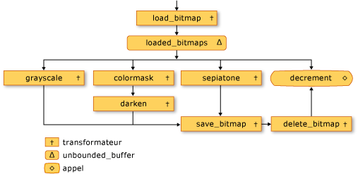
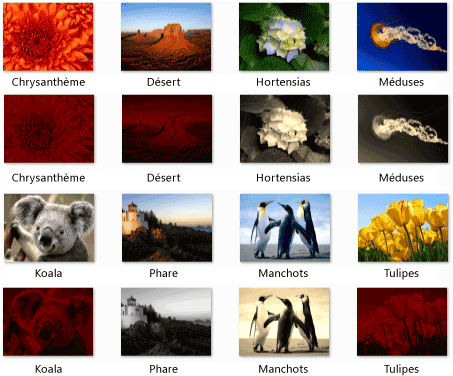

# Proc&#233;dure pas &#224; pas&#160;: cr&#233;ation d&#39;un r&#233;seau de traitement d&#39;image
[!INCLUDE[vs2017banner](../../assembler/inline/includes/vs2017banner.md)]

Ce document montre comment créer un réseau des blocs de messages asynchrones qui effectuent le traitement d'images.  
  
 Le réseau détermine les opérations à effectuer sur une image, en fonction de ses caractéristiques.  Cet exemple utilise le modèle de *flux de données* pour router des images dans le réseau.  Dans le modèle de flux de données, les composants indépendants d'un programme communiquent entre eux en envoyant des messages.  Lorsqu'un composant reçoit un message, il peut exécuter une action, puis passer le résultat de cette action à un autre composant.  Comparez ceci avec le modèle de *flux de contrôle*, dans lequel une application utilise des structures de contrôle, par exemple, des instructions conditionnelles, des boucles, etc., pour contrôler l'ordre des événements dans un programme.  
  
 Un réseau basé sur un flux de données crée un *pipeline* de tâches.  Chaque étape du pipeline effectue simultanément une partie de la tâche globale.  On peut comparer ce processus à une chaîne de montage en construction automobile.  Sur la chaîne de montage, un poste assemble le châssis, un autre installe le moteur, et ainsi de suite.  L'assemblage simultané de plusieurs véhicules génère une productivité supérieure à l'assemblage consécutif des véhicules.  
  
## Composants requis  
 Lisez les documents suivants avant de démarrer cette procédure pas\-à\-pas :  
  
-   [Blocs de messages asynchrones](../../parallel/concrt/asynchronous-message-blocks.md)  
  
-   [Comment : utiliser un filtre de bloc de message](../../parallel/concrt/how-to-use-a-message-block-filter.md)  
  
-   [Procédure pas à pas : création des agents de flux de données](../../parallel/concrt/walkthrough-creating-a-dataflow-agent.md)  
  
 Nous vous conseillons également de comprendre les notions de base de [!INCLUDE[ndptecgdiplus](../../parallel/concrt/includes/ndptecgdiplus_md.md)] avant de démarrer cette procédure pas à pas.  Pour plus d'informations sur [!INCLUDE[ndptecgdiplus](../../parallel/concrt/includes/ndptecgdiplus_md.md)], consultez [GDI\+](_gdiplus_GDI_start_cpp).  
  
##   Sections  
 Cette procédure pas\-à\-pas contient les sections suivantes :  
  
-   [Définition de la fonctionnalité de traitement d'images](#functionality)  
  
-   [Création du réseau de traitement d'images](#network)  
  
-   [Exemple complet](#complete)  
  
##   Définition de la fonctionnalité de traitement d'images  
 Cette section explique les fonctions de support utilisées par le réseau de traitement d'images pour utiliser les images lues à partir du disque.  
  
 Les fonctions suivantes, `GetRGB` et `MakeColor` extraient et combinent les différents composants de la couleur donnée, respectivement.  
  
 [!code-cpp[concrt-image-processing-filter#2](../../parallel/concrt/codesnippet/CPP/walkthrough-creating-an-image-processing-network_1.cpp)]  
  
 La fonction suivante, `ProcessImage`, appelle l'objet [std::function](../../standard-library/function-class.md) donné pour transformer la valeur de couleur de chaque pixel dans un objet [!INCLUDE[ndptecgdiplus](../../parallel/concrt/includes/ndptecgdiplus_md.md)] [Bitmap](https://msdn.microsoft.com/en-us/library/ms534420.aspx).  La fonction `ProcessImage` utilise l'algorithme [concurrency::parallel\_for](../Topic/parallel_for%20Function.md) pour traiter chaque ligne de la bitmap en parallèle.  
  
 [!code-cpp[concrt-image-processing-filter#3](../../parallel/concrt/codesnippet/CPP/walkthrough-creating-an-image-processing-network_2.cpp)]  
  
 Les fonctions suivantes, `Grayscale`, `Sepiatone`, `ColorMask` et `Darken`, appellent la fonction `ProcessImage` pour transformer la valeur de couleur de chaque pixel dans un objet `Bitmap`.  Chacune de ces fonctions utilise une expression lambda pour définir la transformation de couleur d'un pixel.  
  
 [!code-cpp[concrt-image-processing-filter#4](../../parallel/concrt/codesnippet/CPP/walkthrough-creating-an-image-processing-network_3.cpp)]  
  
 La fonction suivante, `GetColorDominance` appelle également la fonction `ProcessImage`.  Toutefois, au lieu de modifier la valeur de chaque couleur, cette fonction utilise les objets [concurrency::combinable](../../parallel/concrt/reference/combinable-class.md) pour calculer si le composant de couleur rouge, celui de couleur verte ou celui de couleur bleue domine l'image.  
  
 [!code-cpp[concrt-image-processing-filter#5](../../parallel/concrt/codesnippet/CPP/walkthrough-creating-an-image-processing-network_4.cpp)]  
  
 La fonction suivante, `GetEncoderClsid`, extrait l'identificateur de classe pour le type MIME donné d'un encodeur.  L'application utilise cette fonction pour extraire l'encodeur pour une bitmap.  
  
 [!code-cpp[concrt-image-processing-filter#6](../../parallel/concrt/codesnippet/CPP/walkthrough-creating-an-image-processing-network_5.cpp)]  
  
 \[[Premières](#top)\]  
  
##   Création du réseau de traitement d'images  
 Cette section décrit comment créer un réseau de blocs de messages asynchrones qui effectuent le traitement d'images sur chaque image [!INCLUDE[TLA#tla_jpeg](../../parallel/concrt/includes/tlasharptla_jpeg_md.md)] \(.jpg\) dans un répertoire donné.  Le réseau effectue les opérations de traitement d'images suivantes :  
  
1.  Pour toute image créée par Tom, convertir en nuances de gris.  
  
2.  Pour toute image dont la couleur dominante est le rouge, supprimer les composants vert et bleu, puis l'assombrir.  
  
3.  Pour toute autre image, appliquer le ton sépia.  
  
 Le réseau applique uniquement la première opération de traitement d'images qui correspond à l'une de ces conditions.  Par exemple, si une image est créée par Tom et que sa couleur dominante est le rouge, l'image est convertie en nuances de gris.  
  
 Une fois que le réseau exécute une opération de traitement d'images, il enregistre l'image sur le disque en tant que fichier bitmap \(.bmp\).  
  
 Les étapes suivantes indiquent comment créer une fonction qui implémente ce réseau de traitement d'images et applique ce réseau à chaque image [!INCLUDE[TLA#tla_jpeg](../../parallel/concrt/includes/tlasharptla_jpeg_md.md)] dans un répertoire donné.  
  
#### Pour créer le réseau de traitement d'images  
  
1.  Créez une fonction, `ProcessImages`, qui prend le nom d'un répertoire du disque.  
  
     [!code-cpp[concrt-image-processing-filter#7](../../parallel/concrt/codesnippet/CPP/walkthrough-creating-an-image-processing-network_6.cpp)]  
  
2.  Dans la fonction `ProcessImages`, créez une variable `countdown_event`.  La classe `countdown_event` est illustrée plus loin dans cette procédure.  
  
     [!code-cpp[concrt-image-processing-filter#8](../../parallel/concrt/codesnippet/CPP/walkthrough-creating-an-image-processing-network_7.cpp)]  
  
3.  Créez un objet [std::map](../../standard-library/map-class.md) qui associe un objet `Bitmap` à son nom de fichier d'origine.  
  
     [!code-cpp[concrt-image-processing-filter#9](../../parallel/concrt/codesnippet/CPP/walkthrough-creating-an-image-processing-network_8.cpp)]  
  
4.  Ajoutez le code suivant pour définir les membres du réseau de traitement d'images.  
  
     [!code-cpp[concrt-image-processing-filter#10](../../parallel/concrt/codesnippet/CPP/walkthrough-creating-an-image-processing-network_9.cpp)]  
  
5.  Ajoutez le code suivant pour connecter le réseau.  
  
     [!code-cpp[concrt-image-processing-filter#11](../../parallel/concrt/codesnippet/CPP/walkthrough-creating-an-image-processing-network_10.cpp)]  
  
6.  Ajoutez le code suivant pour envoyer au début du réseau le chemin d'accès complet de chaque fichier [!INCLUDE[TLA#tla_jpeg](../../parallel/concrt/includes/tlasharptla_jpeg_md.md)] dans le dossier.  
  
     [!code-cpp[concrt-image-processing-filter#12](../../parallel/concrt/codesnippet/CPP/walkthrough-creating-an-image-processing-network_11.cpp)]  
  
7.  Attendez que la variable `countdown_event` atteigne la valeur zéro.  
  
     [!code-cpp[concrt-image-processing-filter#13](../../parallel/concrt/codesnippet/CPP/walkthrough-creating-an-image-processing-network_12.cpp)]  
  
 Le tableau suivant décrit les membres du réseau.  
  
|Membre|Description|  
|------------|-----------------|  
|`load_bitmap`|L'objet [concurrency::transformer](../../parallel/concrt/reference/transformer-class.md) qui charge un objet `Bitmap` à partir du disque et ajoute une entrée à l'objet `map` pour associer l'image avec le nom de son fichier d'origine.|  
|`loaded_bitmaps`|Objet [concurrency::unbounded\_buffer](../Topic/unbounded_buffer%20Class.md), qui envoie les images chargées aux filtres de traitement d'images.|  
|`grayscale`|Objet `transformer`, qui convertit les images créées par Tom en nuances de gris.  Il utilise les métadonnées de l'image pour déterminer son auteur.|  
|`colormask`|Objet `transformer`, qui supprime les composants de couleur verts et bleus des images dont la couleur dominante est le rouge.|  
|`darken`|Objet `transformer`, qui assombrit les images dont la couleur dominante est le rouge.|  
|`sepiatone`|Objet `transformer`, qui applique le ton sépia aux images qui ne sont pas créées par Tom et dont la couleur principale n'est pas le rouge.|  
|`save_bitmap`|Objet `transformer`, qui enregistre l'`image` traitée sur le disque en tant que bitmap.  `save_bitmap` extrait le nom de fichier d'origine à partir de l'objet `map` et modifie son extension de nom de fichier par .bmp.|  
|`delete_bitmap`|Objet `transformer`, qui libère la mémoire pour les images.|  
|`decrement`|Objet [concurrency::call](../../parallel/concrt/reference/call-class.md), qui joue le rôle de nœud de terminaison dans le réseau.  Il décrémente l'objet `countdown_event` pour signaler à l'application principale qu'une image a été traitée.|  
  
 La mémoire tampon de messages `loaded_bitmaps` est importante car, en tant qu'objet `unbounded_buffer`, elle propose des objets `Bitmap` à plusieurs récepteurs.  Lorsqu'un bloc cible accepte un objet `Bitmap`, l'objet `unbounded_buffer` ne propose pas cet objet `Bitmap` à d'autres cibles.  Par conséquent, l'ordre dans lequel vous liez les objets à un objet `unbounded_buffer` est important.  Chaque bloc de messages `grayscale`, `colormask` et `sepiatone` utilise un filtre pour n'accepter que certains objets `Bitmap`.  La mémoire tampon de messages `decrement` est une cible importante de la mémoire tampon de messages `loaded_bitmaps` étant donné qu'il accepte tous les objets `Bitmap` rejetés par les autres mémoires tampons de messages.  Un objet `unbounded_buffer` est nécessaire pour propager les messages dans l'ordre.  Par conséquent, un objet `unbounded_buffer` est bloqué jusqu'à ce qu'un nouveau bloc cible lui soit associé. Il accepte le message si aucun bloc cible actuel ne l'accepte.  
  
 Si votre application nécessite que plusieurs blocs de messages traitent le message, au lieu d'un seul bloc de message qui accepte d'abord le message, vous pouvez utiliser un autre type de bloc de message, comme `overwrite_buffer`.  La classe `overwrite_buffer` conserve un message à la fois, mais il propage ce message à chacune de ses cibles.  
  
 L'illustration suivante montre le réseau de traitement d'images :  
  
   
  
 L'objet `countdown_event` de cet exemple permet au réseau de traitement d'images d'avertir l'application principale lorsque toutes les images ont été traitées.  L'objet `countdown_event` utilise un objet [concurrency::event](../../parallel/concrt/reference/event-class.md) pour signaler lorsqu'une valeur de compteur atteint zéro.  L'application principale incrémente le compteur chaque fois qu'un nom de fichier est envoyé au réseau.  Le nœud de terminaison du réseau décrémente le compteur après chaque traitement d'image.  Une fois que l'application principale a parcouru le répertoire spécifié, elle attend que l'objet `countdown_event` signale que son compteur a atteint zéro.  
  
 L'exemple suivant présente la classe `countdown_event` :  
  
 [!code-cpp[concrt-image-processing-filter#14](../../parallel/concrt/codesnippet/CPP/walkthrough-creating-an-image-processing-network_13.cpp)]  
  
 \[[Premières](#top)\]  
  
##   Exemple complet  
 Le code suivant illustre l'exemple complet.  La fonction `wmain` gère la bibliothèque [!INCLUDE[ndptecgdiplus](../../parallel/concrt/includes/ndptecgdiplus_md.md)] et appelle la fonction `ProcessImages` pour traiter les fichiers [!INCLUDE[TLA#tla_jpeg](../../parallel/concrt/includes/tlasharptla_jpeg_md.md)] dans le répertoire `Échantillons d'images`.  
  
 [!code-cpp[concrt-image-processing-filter#15](../../parallel/concrt/codesnippet/CPP/walkthrough-creating-an-image-processing-network_14.cpp)]  
  
 L'illustration suivante indique le résultat.  Chaque image source est située au\-dessus de l'image modifiée qui lui correspond.  
  
   
  
 L'image `phare` est créée par Tom Alphin. Par conséquent, elle est convertie en nuances de gris.  La couleur dominante des images `chrysanthème`, `désert`, `koala` et `tulipes` est le rouge. Par conséquent, les composants de couleur bleus et verts sont supprimés et assombris.  Les images `hortensias`, `méduses` et `pingouins` correspondent aux critères par défaut. Par conséquent, le ton sépia est appliqué.  
  
 \[[Premières](#top)\]  
  
### Compilation du code  
 Copiez l'exemple de code et collez\-le dans un projet Visual Studio, ou collez\-le dans un fichier nommé `image-processing-network.cpp`, puis exécutez la commande suivante dans une fenêtre d'invite de commandes Visual Studio.  
  
 **cl.exe \/DUNICODE \/EHsc image\-processing\-network.cpp \/link gdiplus.lib**  
  
## Voir aussi  
 [Procédures pas à pas relatives au runtime d'accès concurrentiel](../../parallel/concrt/concurrency-runtime-walkthroughs.md)