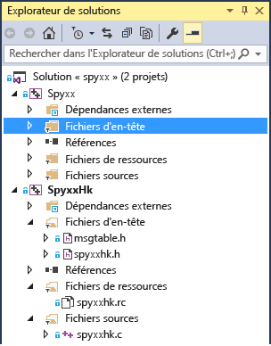

# <a name="porting-guide-spy"></a>Guide du portage : Spy++
Cette étude de cas de portage vise à vous donner une idée de ce qu'est un projet de portage classique et des types de problèmes que vous êtes susceptible de rencontrer. Elle fournit également quelques conseils et astuces généraux qui vous aideront à résoudre certains problèmes liés au portage. Elle n'est pas destinée à être un guide du portage exhaustif, car le déroulement du portage d'un projet dépend beaucoup des spécificités du code.  
  
## <a name="spy"></a>Spy++  
 Spy++ est un outil de diagnostic GUI couramment utilisé qui fournit diverses informations sur les éléments d'interface utilisateur du Bureau Windows. Il montre la structure hiérarchique complète des fenêtres, et permet d'accéder aux métadonnées de chaque fenêtre et contrôle. Cette application utile est fournie avec Visual Studio depuis de nombreuses années. Nous avons trouvé une ancienne version de cette application qui avait été compilée dans Visual C++ 6.0 et portée vers Visual Studio 2015. L’expérience pour Visual Studio 2017 doit être presque identique.
  
 Cette étude de cas nous semble représentative des scénarios de portage des applications de bureau Windows qui utilisent MFC et l’API Win32, en particulier pour les anciens projets qui n’ont pas été mis à jour avec chaque mise en production de Visual C++ depuis Visual C++ 6.0.  
  
##  <a name="convert_project_file"></a> Étape 1. Conversion du fichier projet  
 Le fichier projet, constitué de deux anciens fichiers .dsw de Visual C++ 6.0, ont été rapidement convertis, sans problème nécessitant une attention particulière. Le premier projet correspond à l'application Spy++. Le deuxième est SpyHk, une DLL de prise en charge écrite en C. La mise à niveau de projets plus complexes n’est pas toujours aussi simple, comme cela est expliqué [ici](../porting/visual-cpp-porting-and-upgrading-guide.md).  
  
 Une fois la mise à niveau des deux projets terminée, notre solution se présentait ainsi :  
  
   
  
 Nous avons ici deux projets, l'un avec un grand nombre de fichiers C++ et l'autre une DLL écrite en C.  
  
##  <a name="header_file_problems"></a> Étape 2. Problèmes liés aux fichiers d'en-tête  
 Lors de la génération d'un projet qui vient d'être converti, un des premiers problèmes fréquemment rencontrés est que votre projet ne trouve pas les fichiers d'en-tête dont il a besoin.  
  
 verstamp.h est l'un des fichiers qui n'a pas été trouvé dans Spy++. En effectuant une recherche sur Internet, nous avons vu que ce fichier provenait d'un Kit de développement logiciel (SDK) DAO, une technologie de données obsolète. Nous voulions savoir quels symboles de ce fichier d'en-tête étaient utilisés, pour déterminer si ce fichier était réellement nécessaire ou si ces symboles étaient définis ailleurs. Nous avons donc commenté la déclaration du fichier d'en-tête, puis recompilé. Au final, seul le symbole VER_FILEFLAGSMASK était vraiment nécessaire.  
  
```  
1>C:\Program Files (x86)\Windows Kits\8.1\Include\shared\common.ver(212): error RC2104: undefined keyword or key name: VER_FILEFLAGSMASK  
```  
  
 Pour rechercher un symbole dans les fichiers Include disponibles, le plus simple est d’utiliser la commande Rechercher dans les fichiers (Ctrl+Maj+F) et de choisir **Dossiers Include Visual C++**. Nous avons trouvé le symbole dans ntverp.h. Nous avons remplacé le fichier include verstamp.h par ntverp.h, ce qui a résolu l'erreur.  
  
##  <a name="linker_output_settings"></a> Étape 3. Paramètre OutputFile de l'éditeur de liens  
 Certains fichiers des anciens projets se trouvent parfois à des emplacements non standard, ce qui peut engendrer des problèmes après la mise à niveau. Dans ce cas, nous devons ajouter add $(SolutionDir) au chemin d'accès include défini dans les propriétés du projet pour que Visual Studio retrouve les fichiers d'en-tête situés dans ces dossiers particuliers au lieu d'être dans un des dossiers du projet.  
  
 MSBuild signale que la propriété Link.OutputFile ne correspond pas aux valeurs TargetPath et TargetName, et affiche l'avertissement MSB8012.  
  
```Output  
warning MSB8012: TargetPath(...\spyxx\spyxxhk\.\..\Debug\SpyxxHk.dll) does not match the Linker's OutputFile property value (...\spyxx\Debug\SpyHk55.dll). This may cause your project to build incorrectly. To correct this, please make sure that $(OutDir), $(TargetName) and $(TargetExt) property values match the value specified in %(Link.OutputFile).warning MSB8012: TargetName(SpyxxHk) does not match the Linker's OutputFile property value (SpyHk55). This may cause your project to build incorrectly. To correct this, please make sure that $(OutDir), $(TargetName) and $(TargetExt) property values match the value specified in %(Link.OutputFile).  
```  
  
 **Link.OutputFile** est la sortie de génération (EXE ou DLL, par exemple). Sa valeur est généralement construite à partir de $(TargetDir)$(TargetName)$(TargetExt), qui indique respectivement le chemin d’accès, le nom de fichier et l’extension. C'est une erreur courante lors de la migration de projets de l'ancien outil de génération de projets Visual C++ (vcbuild.exe) vers le nouvel outil de génération (MSBuild.exe). Étant donné que ce nouvel outil de génération a été introduit dans Visual Studio 2010, vous risquez de rencontrer ce problème quand vous migrez un projet d'une version antérieure à 2010 vers la version 2010 ou ultérieure. Le principal problème est que l’Assistant Migration de projet ne met pas à jour la valeur **Link.OutputFile**, car il n’est pas toujours possible de déterminer cette valeur en fonction des autres paramètres du projet. Par conséquent, vous devez généralement la définir manuellement. Pour plus d’informations, consultez ce [billet](http://blogs.msdn.com/b/vcblog/archive/2010/03/02/visual-studio-2010-c-project-upgrade-guide.aspx) du blog Visual C++.  
  
 Dans cet exemple, la propriété **Link.OutputFile** dans le projet converti avait la valeur .\Debug\Spyxx.exe et la valeur .\Release\Spyxx.exe pour le projet Spy++, selon la configuration choisie. La meilleure solution consiste simplement à remplacer ces valeurs codées en dur par $(TargetDir)$(TargetName)$(TargetExt) pour toutes les configurations. Si cela ne résout pas le problème, vous pouvez personnaliser les valeurs à partir de là, ou modifier les propriétés **Répertoire de sortie**, **Nom cible** et **Extension cible** dans la section Général où ces valeurs sont définies. N’oubliez pas que, si la propriété que vous affichez utilise des macros, vous pouvez choisir **Modifier** dans la liste déroulante pour afficher une boîte de dialogue qui montre la chaîne finale obtenue après les substitutions de macros. Vous pouvez afficher toutes les macros disponibles et leurs valeurs actuelles en sélectionnant le bouton **Macros**.  
  
##  <a name="updating_winver"></a> Étape 4. Mise à jour de la version cible de Windows  
 L'erreur suivante indique que la version WINVER n'est plus prise en charge dans MFC. La version WINVER pour Windows XP est 0x0501.  
  
```Output  
C:\Program Files (x86)\Microsoft Visual Studio 14.0\VC\atlmfc\include\afxv_w32.h(40): fatal error C1189: #error:  MFC does not support WINVER less than 0x0501.  Please change the definition of WINVER in your project properties or precompiled header.  
```  
  
 Microsoft n’assure plus le support de Windows XP. Le ciblage de cette version est autorisé dans Visual Studio 2015, mais nous vous recommandons d’abandonner progressivement la prise en charge de cette version cible dans vos applications, et d’inciter les utilisateurs à installer les nouvelles versions de Windows.  
  
 Pour résoudre cette erreur, définissez WINVER en mettant à jour le paramètre **Propriétés du projet** vers la plus ancienne version de Windows que vous voulez cibler. Pour obtenir un tableau des valeurs correspondant aux différentes versions de Windows, cliquez [ici](http://msdn.microsoft.com/library/windows/desktop/aa383745.aspx).  
  
 Le fichier stdafx.h contenait certaines de ces définitions de macros.  
  
```cpp  
#define WINVER       0x0500  // these defines are set so that we get the  
#define _WIN32_WINNT 0x0500  // maximum set of message/flag definitions,  
#define _WIN32_IE    0x0400  // from both winuser.h and commctrl.h.  
  
```  
  
 Nous allons définir WINVER sur Windows 7. Utilisez la macro pour Windows 7 (_WIN32_WINNT_WIN7) au lieu de la valeur elle-même (0x0601) pour faciliter la lecture ultérieure du code.  
  
```cpp  
#define WINVER _WINNT_WIN32_WIN7 // Minimum targeted Windows version is Windows 7  
```  
  
##  <a name="linker_errors"></a> Étape 5. Erreurs de l'éditeur de liens  
 Grâce aux modifications apportées, le projet SpyHk (DLL) a pu être généré, mais une erreur d'éditeur de liens s'est produite.  
  
```  
LINK : warning LNK4216: Exported entry point _DLLEntryPoint@12  
```  
  
 Le point d'entrée d'une DLL ne doit pas être exporté. Le point d'entrée est uniquement destiné à être appelé par le chargeur lors du chargement en mémoire initial de la DLL. Il ne doit donc pas figurer dans la table d'exportation, qui est réservée aux autres appelants. Nous devons juste nous assurer qu'aucune directive `__declspec(dllexport)` n'y est attachée. Dans spyxxhk.c, nous devons la supprimer à deux endroits, à savoir dans la déclaration et la définition de DLLEntryPoint. L'utilisation de cette directive n'a jamais été conseillée, mais les versions précédentes de l'éditeur et du compilateur ne la signalaient pas comme un problème. Les versions plus récentes de l'éditeur affichent un avertissement.  
  
```cpp  
// deleted __declspec(dllexport)  
BOOL WINAPI DLLEntryPoint(HINSTANCE hinstDLL,DWORD fdwReason, LPVOID lpvReserved);  
  
```  
  
 La génération et la liaison du projet DLL en C, SpyHK.dll, s'effectuent maintenant sans erreur.  
  
##  <a name="outdated_header_files"></a> Étape 6. Autres fichiers d'en-tête obsolètes  
 À ce stade, nous commençons à travailler sur le projet exécutable principal, Spyxx.  
  
 Deux autres fichiers include n'ont pas pu être trouvés : ctl3d.h et penwin.h. Nous pourrions rechercher sur Internet des informations sur le contenu de l'en-tête, mais cela ne nous serait pas forcément utile. Nous avons découvert que ctl3d.h était inclus dans Exchange Development Kit (EDK) pour prendre en charge un style spécifique de contrôles Windows 95, et que penwin.h gérait Windows Pen Computing, une API aujourd'hui obsolète. Ici, nous avons simplement commenté la ligne #include et géré les symboles non définis comme nous l'avons fait pour verstamp.h. Tout ce qui concerne les contrôles 3D et Pen Computing a été supprimé du projet.  
  
 Dans un projet où il y a beaucoup d'erreurs de compilation à éliminer progressivement, il n'est pas réaliste de rechercher toutes les utilisations d'une API obsolète au moment même où vous supprimez la directive #include. Nous ne l'avons pas détecté immédiatement, mais plus tard, quand une erreur a été signalée parce que WM_DLGBORDER n'était pas défini. En fait, c'est l'un des nombreux autres symboles non définis provenant de ctl3d.h. Ayant déterminé que le symbole concernait une API obsolète, nous avons supprimé toutes les références à cette API dans le code.  
  
##  <a name="updating_iostreams_code"></a> Étape 7. Mise à jour de l'ancien code iostreams  
 L'erreur suivante est courante avec l'ancien code C++ qui utilise iostreams.  
  
 mstream.h(40): fatal error C1083: Cannot open include file: 'iostream.h': No such file or directory  
  
 Le problème est dû au fait que l'ancienne bibliothèque iostreams a été supprimée et remplacée. Nous devons donc remplacer l'ancien code iostreams par le code normalisé actuel.  
  
```cpp  
#include <iostream.h>  
#include <strstrea.h>  
#include <iomanip.h>  
  
```  
  
 Voici les fichiers include mis à jour :  
  
```cpp  
#include <iostream>  
#include <sstream>  
#include <iomanip>  
  
```  
  
 Avec cette modification, nous avons des problèmes avec ostrstream, qui n'est plus utilisé. Il faut le remplacer par ostringstream. Nous essayons d'ajouter un typedef pour ostrstream pour ne pas avoir à modifier trop de code, au moins au début.  
  
```cpp  
typedef std::basic_ostringstream<TCHAR> ostrstream;  
  
```  
  
 Comme le projet est actuellement généré avec MBCS (Multi-byte Character Set), `char` est le type de données caractères approprié. Toutefois, pour faciliter la mise à jour du code vers Unicode UTF-16, nous changeons le type en `TCHAR`, qui se résout en `char` ou en `wchar_t`, selon que la propriété **Jeu de caractères** est définie sur MBCS ou sur Unicode dans les paramètres du projet.  
  
 Quelques éléments de code supplémentaires doivent également être mis à jour.  Nous avons remplacé le code ios de la classe de base par ios_base et ostream par basic_ostream\<T>. Nous ajoutons deux typedef supplémentaires, puis compilons cette section.  
  
```cpp  
typedef std::basic_ostream<TCHAR> ostream;  
typedef ios_base ios;  
  
```  
  
 L'utilisation de ces typedef n'est qu'une solution temporaire. La solution définitive serait de mettre à jour chaque référence à l'API renommée ou obsolète.  
  
 Voici l'erreur suivante.  
  
```Output  
error C2039: 'freeze': is not a member of 'std::basic_stringbuf<char,std::char_traits<char>,std::allocator<char>>'  
```  
  
 Le problème suivant est que basic_stringbuf n'a pas de méthode freeze. La méthode freeze est utilisée pour empêcher toute fuite de mémoire dans l'ancien ostream. Nous n'en avons plus besoin puisque nous utilisons maintenant le nouveau ostringstream. Nous pouvons donc supprimer l'appel à la méthode freeze.  
  
```cpp  
//rdbuf()->freeze(0);  
```  
  
 Les deux erreurs ci-dessous se sont produites sur des lignes adjacentes. La première signale que des terminaisons ont été utilisées. C'est le manipulateur d'E/S de l'ancienne bibliothèque iostream qui a ajouté un terminateur Null à une chaîne.  La deuxième erreur explique que la sortie de la méthode str ne peut pas être assignée à un pointeur non const.  
  
```cpp  
// Null terminate the string in the buffer and  
// get a pointer to it.  
//  
*this << ends;  
LPSTR psz = str();  
  
```  
  
```Output  
2>mstream.cpp(167): error C2065: 'ends': undeclared identifier2>mstream.cpp(168): error C2440: 'initializing': cannot convert from 'std::basic_string<char,std::char_traits<char>,std::allocator<char>>' to 'LPSTR'  
```  
  
 Avec la nouvelle bibliothèque stream, il n'est plus utile d'utiliser des terminaisons, car la chaîne se termine toujours par une valeur Null de toutes façons. Cette ligne peut donc être supprimée. Pour la deuxième erreur, le problème vient du fait que str() ne retourne pas un pointeur vers le tableau de caractères d'une chaîne, mais le type std::string. La solution au second problème consiste à changer le type en LPCSTR et à utiliser la méthode c_str() pour demander le pointeur.  
  
```cpp  
//*this << ends;  
LPCTSTR psz = str().c_str();  
  
```  
  
 Ce code a généré une erreur déroutante au premier abord.  
  
```cpp  
MOUT << _T(" chUser:'") << chUser  
<< _T("' (") << (INT)(UCHAR)chUser << _T(')');  
  
```  
  
 La macro `MOUT` se résout en *g_pmout, qui est un objet de type `mstream`. La classe mstream est dérivée de la classe string de sortie standard, `std::basic_ostream<TCHAR>.`. Toutefois, à cause du _T que nous avons ajouté autour du littéral de chaîne en vue de la conversion en Unicode, la résolution de surcharge de l'opérateur << a échoué avec le message d'erreur suivant :  
  
```Output  
1>winmsgs.cpp(4612): error C2666: 'mstream::operator <<': 2 overloads have similar conversions
1>  c:\source\spyxx\spyxx\mstream.h(120): note: could be 'mstream &mstream::operator <<(ios &(__cdecl *)(ios &))'
1>  c:\source\spyxx\spyxx\mstream.h(118): note: or       'mstream &mstream::operator <<(ostream &(__cdecl *)(ostream &))'
1>  c:\source\spyxx\spyxx\mstream.h(116): note: or       'mstream &mstream::operator <<(ostrstream &(__cdecl *)(ostrstream &))'
1>  c:\source\spyxx\spyxx\mstream.h(114): note: or       'mstream &mstream::operator <<(mstream &(__cdecl *)(mstream &))'
1>  c:\source\spyxx\spyxx\mstream.h(109): note: or       'mstream &mstream::operator <<(LPTSTR)'
1>  c:\source\spyxx\spyxx\mstream.h(104): note: or       'mstream &mstream::operator <<(TCHAR)'
1>  c:\source\spyxx\spyxx\mstream.h(102): note: or       'mstream &mstream::operator <<(DWORD)'
1>  c:\source\spyxx\spyxx\mstream.h(101): note: or       'mstream &mstream::operator <<(WORD)'
1>  c:\source\spyxx\spyxx\mstream.h(100): note: or       'mstream &mstream::operator <<(BYTE)'
1>  c:\source\spyxx\spyxx\mstream.h(95): note: or       'mstream &mstream::operator <<(long)'
1>  c:\source\spyxx\spyxx\mstream.h(90): note: or       'mstream &mstream::operator <<(unsigned int)'
1>  c:\source\spyxx\spyxx\mstream.h(85): note: or       'mstream &mstream::operator <<(int)'
1>  c:\source\spyxx\spyxx\mstream.h(83): note: or       'mstream &mstream::operator <<(HWND)'
1>  C:\Program Files (x86)\Microsoft Visual Studio 14.0\VC\atlmfc\include\afxdisp.h(1132): note: or       'CDumpContext &operator <<(CDumpContext &,COleSafeArray &)'
1>  C:\Program Files (x86)\Microsoft Visual Studio 14.0\VC\atlmfc\include\afxdisp.h(1044): note: or       'CArchive &operator <<(CArchive &,ATL::COleDateTimeSpan)'
1>  C:\Program Files (x86)\Microsoft Visual Studio 14.0\VC\atlmfc\include\afxdisp.h(1042): note: or       'CDumpContext &operator <<(CDumpContext &,ATL::COleDateTimeSpan)'
1>  C:\Program Files (x86)\Microsoft Visual Studio 14.0\VC\atlmfc\include\afxdisp.h(1037): note: or       'CArchive &operator <<(CArchive &,ATL::COleDateTime)'
1>  C:\Program Files (x86)\Microsoft Visual Studio 14.0\VC\atlmfc\include\afxdisp.h(1035): note: or       'CDumpContext &operator <<(CDumpContext &,ATL::COleDateTime)'
1>  C:\Program Files (x86)\Microsoft Visual Studio 14.0\VC\atlmfc\include\afxdisp.h(1030): note: or       'CArchive &operator <<(CArchive &,COleCurrency)'
1>  C:\Program Files (x86)\Microsoft Visual Studio 14.0\VC\atlmfc\include\afxdisp.h(1028): note: or       'CDumpContext &operator <<(CDumpContext &,COleCurrency)'
1>  C:\Program Files (x86)\Microsoft Visual Studio 14.0\VC\atlmfc\include\afxdisp.h(955): note: or       'CArchive &operator <<(CArchive &,ATL::CComBSTR)'
1>  C:\Program Files (x86)\Microsoft Visual Studio 14.0\VC\atlmfc\include\afxdisp.h(951): note: or       'CArchive &operator <<(CArchive &,COleVariant)'
1>  C:\Program Files (x86)\Microsoft Visual Studio 14.0\VC\atlmfc\include\afxdisp.h(949): note: or       'CDumpContext &operator <<(CDumpContext &,COleVariant)'
1>  C:\Program Files (x86)\Microsoft Visual Studio 14.0\VC\atlmfc\include\afxwin.h(248): note: or       'CArchive &operator <<(CArchive &,const RECT &)'
1>  C:\Program Files (x86)\Microsoft Visual Studio 14.0\VC\atlmfc\include\afxwin.h(247): note: or       'CArchive &operator <<(CArchive &,POINT)'
1>  C:\Program Files (x86)\Microsoft Visual Studio 14.0\VC\atlmfc\include\afxwin.h(246): note: or       'CArchive &operator <<(CArchive &,SIZE)'
1>  C:\Program Files (x86)\Microsoft Visual Studio 14.0\VC\atlmfc\include\afxwin.h(242): note: or       'CDumpContext &operator <<(CDumpContext &,const RECT &)'
1>  C:\Program Files (x86)\Microsoft Visual Studio 14.0\VC\atlmfc\include\afxwin.h(241): note: or       'CDumpContext &operator <<(CDumpContext &,POINT)'
1>  C:\Program Files (x86)\Microsoft Visual Studio 14.0\VC\atlmfc\include\afxwin.h(240): note: or       'CDumpContext &operator <<(CDumpContext &,SIZE)'
1>  C:\Program Files (x86)\Microsoft Visual Studio 14.0\VC\atlmfc\include\afx.h(1639): note: or       'CArchive &operator <<(CArchive &,const CObject *)'
1>  C:\Program Files (x86)\Microsoft Visual Studio 14.0\VC\atlmfc\include\afx.h(1425): note: or       'CArchive &operator <<(CArchive &,ATL::CTime)'
1>  C:\Program Files (x86)\Microsoft Visual Studio 14.0\VC\atlmfc\include\afx.h(1423): note: or       'CDumpContext &operator <<(CDumpContext &,ATL::CTime)'
1>  C:\Program Files (x86)\Microsoft Visual Studio 14.0\VC\atlmfc\include\afx.h(1418): note: or       'CArchive &operator <<(CArchive &,ATL::CTimeSpan)'
1>  C:\Program Files (x86)\Microsoft Visual Studio 14.0\VC\atlmfc\include\afx.h(1416): note: or       'CDumpContext &operator <<(CDumpContext &,ATL::CTimeSpan)'
1>  C:\Program Files (x86)\Microsoft Visual Studio 14.0\VC\include\ostream(694): note: or       'std::basic_ostream<wchar_t,std::char_traits<wchar_t>> &std::operator <<<wchar_t,std::char_traits<wchar_t>>(std::basic_ostream<wchar_t,std::char_traits<wchar_t>> &,const char *)'
1>  C:\Program Files (x86)\Microsoft Visual Studio 14.0\VC\include\ostream(741): note: or       'std::basic_ostream<wchar_t,std::char_traits<wchar_t>> &std::operator <<<wchar_t,std::char_traits<wchar_t>>(std::basic_ostream<wchar_t,std::char_traits<wchar_t>> &,char)'
1>  C:\Program Files (x86)\Microsoft Visual Studio 14.0\VC\include\ostream(866): note: or       'std::basic_ostream<wchar_t,std::char_traits<wchar_t>> &std::operator <<<wchar_t,std::char_traits<wchar_t>>(std::basic_ostream<wchar_t,std::char_traits<wchar_t>> &,const _Elem *)'
1>          with
1>          [
1>              _Elem=wchar_t
1>          ]
1>  C:\Program Files (x86)\Microsoft Visual Studio 14.0\VC\include\ostream(983): note: or       'std::basic_ostream<wchar_t,std::char_traits<wchar_t>> &std::operator <<<wchar_t,std::char_traits<wchar_t>,wchar_t[10]>(std::basic_ostream<wchar_t,std::char_traits<wchar_t>> &&,const _Ty (&))'
1>          with
1>          [
1>              _Ty=wchar_t [10]
1>          ]
1>  C:\Program Files (x86)\Microsoft Visual Studio 14.0\VC\include\ostream(1021): note: or       'std::basic_ostream<wchar_t,std::char_traits<wchar_t>> &std::operator <<<wchar_t,std::char_traits<wchar_t>>(std::basic_ostream<wchar_t,std::char_traits<wchar_t>> &,const std::error_code &)'
1>  winmsgs.cpp(4612): note: while trying to match the argument list '(CMsgStream, const wchar_t [10])'  
```  
  
 Face à une telle quantité de définitions d'opérateur <<, ce type d'erreur peut être déroutant. En examinant plus attentivement les surcharges disponibles, nous nous rendons compte que la plupart d'entre elles ne sont pas utiles et, en regardant de plus près la définition de la classe `mstream`, nous déterminons que c'est la fonction suivante qui devrait être appelée ici.  
  
```cpp  
mstream& operator<<(LPTSTR psz)  
{  
  return (mstream&)ostrstream::operator<<(psz);  
}  
  
```  
  
 La raison pour laquelle elle n'est pas appelée est que le littéral de chaîne a le type `const wchar_t[10]`, comme vous pouvez le voir sur la dernière ligne de ce long message d'erreur, ce qui ne permet pas la conversion automatique en un pointeur non const. Néanmoins, comme cet opérateur ne doit pas modifier le paramètre d'entrée, le type de paramètre le plus approprié est LPCTSTR (`const char*` pour une compilation en MBCS ou `const wchar_t*` en Unicode), et pas LPTSTR (`char*` pour une compilation en MBCS ou `wchar_t*` en Unicode). Cette modification nous a permis de résoudre cette erreur.  
  
 Ce type de conversion était autorisé dans l'ancien compilateur, moins strict, mais les modifications récentes de mise en conformité du compilateur imposent une syntaxe de code correcte.  
  
##  <a name="stricter_conversions"></a> Étape 8. Conversions plus strictes du compilateur  
 Nous avons également de nombreuses erreurs comme celles-ci :  
  
```  
error C2440: 'static_cast': cannot convert from 'UINT (__thiscall CHotLinkCtrl::* )(CPoint)' to 'LRESULT (__thiscall CWnd::* )(CPoint)'  
```  
  
 L'erreur se produit dans une table des messages qui est simplement une macro :  
  
```cpp  
BEGIN_MESSAGE_MAP(CFindToolIcon, CWnd)  
// other messages omitted...  
ON_WM_NCHITTEST() // Error occurs on this line.  
END_MESSAGE_MAP()  
```  
  
 En regardant la définition de cette macro, nous voyons qu'elle fait référence à la fonction OnNcHitTest.  
  
```cpp  
#define ON_WM_NCHITTEST() \  
{ WM_NCHITTEST, 0, 0, 0, AfxSig_l_p, \  
(AFX_PMSG)(AFX_PMSGW) \  
(static_cast< LRESULT (AFX_MSG_CALL CWnd::*)(CPoint) > (&ThisClass :: OnNcHitTest)) },  
```  
  
 Le problème est dû à une incompatibilité du pointeur avec les types de fonctions membres. Le problème n'est pas la conversion du type de classe CHotLinkCtrl en type de classe CWnd, car il s'agit d'une conversion classe dérivée-classe de base valide. Le problème provient du type de retour UINT, utilisé à la place de LRESULT. LRESULT se résout en LONG_PTR, qui est un pointeur 64 bits ou 32 bits selon le type du fichier binaire cible, mais UINT ne peut pas être converti en ce type. Cette erreur n'est pas rare lors des mises à niveau de code ayant été écrit avant 2005. En effet, le type de retour de nombreuses méthodes de la table des messages a été changé de UINT en LRESULT dans Visual Studio 2005 pour garantir la compatibilité 64 bits. Nous changeons le type de retour UINT en LRESULT dans le code suivant :  
  
```cpp  
afx_msg UINT OnNcHitTest(CPoint point);  
```  
  
 Après la modification, nous obtenons le code suivant :  
  
```cpp  
afx_msg LRESULT OnNcHitTest(CPoint point);  
```  
  
 Étant donné qu’il y a environ 10 occurrences de cette fonction dans les différentes classes dérivées de CWnd, le plus rapide est d’utiliser les commandes **Atteindre la définition** (raccourci clavier : F12) et **Atteindre la déclaration** (raccourci clavier : Ctrl+F12) quand le curseur est placé sur la fonction dans l’éditeur. Cela permet de localiser ces occurrences et d’y accéder à partir de la fenêtre Outil **Rechercher un symbole**. La commande **Atteindre la définition** est généralement la plus pratique des deux. La commande **Atteindre la déclaration** permet de trouver les déclarations autres que la déclaration de la classe de définition, par exemple les déclarations de classe Friend ou les références anticipées.  
  
##  <a name="mfc_changes"></a> Étape 9. Modifications MFC  
 L'erreur suivante est également liée à un type de déclaration qui a changé et se produit aussi dans une macro.  
  
```Output  
error C2440: 'static_cast': cannot convert from 'void (__thiscall CFindWindowDlg::* )(BOOL,HTASK)' to 'void (__thiscall CWnd::* )(BOOL,DWORD)'  
```  
  
 Le problème est que le deuxième paramètre de CWnd::OnActivateApp, HTASK, a été remplacé par DWORD. Cette modification a été effectuée dans la version 2002 de Visual Studio, Visual Studio .NET.  
  
```cpp  
afx_msg void OnActivateApp(BOOL bActive, HTASK hTask);  
```  
  
 Nous devons donc mettre à jour les déclarations de OnActivateApp dans les classes dérivées, comme suit :  
  
```cpp  
afx_msg void OnActivateApp(BOOL bActive, DWORD dwThreadId);  
```  
  
 À ce stade, nous sommes en mesure de compiler le projet. Il nous reste toutefois quelques avertissements à traiter, ainsi que certaines étapes facultatives de la mise à niveau à voir, notamment la conversion de MBCS en Unicode ou l'amélioration de la sécurité à l'aide des fonctions CRT sécurisées.  
  
##  <a name="compiler_warnings"></a> Étape 10. Traitement des avertissements du compilateur  
 Pour obtenir une liste complète des avertissements, vous devez effectuer une régénération globale de la solution (avec **Régénérer tout**) plutôt qu’une génération ordinaire. Ainsi, vous êtes sûr que tous les éléments déjà compilés seront recompilés, les rapports d’avertissements étant créés uniquement pour la compilation en cours. L'autre question est de savoir si nous acceptons le niveau d'avertissement actuel ou si nous utilisons un niveau d'avertissement plus élevé.  Si l'opération de portage implique une grande quantité de code, surtout s'il s'agit de code écrit il y a longtemps, il peut être utile de choisir un niveau d'avertissement plus élevé.  Vous pouvez aussi démarrer avec le niveau d'avertissement par défaut, puis augmenter le niveau d'avertissement quand vous avez besoin d'obtenir tous les avertissements. Si vous utilisez /Wall, des avertissements sont inclus dans les fichiers d'en-tête système. C'est pourquoi beaucoup d'utilisateurs utilisent /W4 pour obtenir le maximum d'avertissements sur leur code sans recevoir les avertissements relatifs aux en-têtes système. Si vous souhaitez afficher les avertissements en tant qu'erreurs, ajoutez l'option /WX. Ces paramètres se trouvent dans la section C/C++ de la boîte de dialogue Propriétés du projet.  
  
 Une des méthodes de la classe CSpyApp génère un avertissement à propos d'une fonction qui n'est plus prise en charge.  
  
```cpp  
void SetDialogBkColor() {CWinApp::SetDialogBkColor(::GetSysColor(COLOR_BTNFACE));}  
```  
  
 Cet avertissement est le suivant.  
  
```Output  
warning C4996: 'CWinApp::SetDialogBkColor': CWinApp::SetDialogBkColor is no longer supported. Instead, handle WM_CTLCOLORDLG in your dialog  
```  
  
 Comme le message WM_CTLCOLORDLG a déjà été géré dans le code Spy++, le seul changement nécessaire a été de supprimer toutes les références à SetDialogBkColor, devenu inutile.  
  
 L'avertissement suivant a été très facile à corriger. Nous avons juste commenté le nom de la variable. Nous avons reçu l'avertissement suivant :  
  
```Output  
warning C4456: declaration of 'lpszBuffer' hides previous local declaration  
```  
  
 Le code qui a généré cet avertissement utilise une macro.  
  
```cpp  
DECODEPARM(CB_GETLBTEXT)  
{  
  P2WPOUT();  
  
  P2LPOUTPTRSTR;  
  P2IFDATA()  
  {  
    PARM(lpszBuffer, PPACK_STRINGORD, ED2);  
      
    INDENT();  
      
    P2IFISORD(lpszBuffer)  
    {  
      P2OUTORD(lpszBuffer);  
    }  
    else  
    {  
      PARM(lpszBuffer, LPTSTR, ED2);  
      P2OUTS(lpszBuffer);  
    }  
  }  
}  
  
```  
  
 Une utilisation intensive des macros dans le code, comme ici, complique généralement la mise à jour du code. Dans cet exemple, les macros incluent les déclarations des variables. La macro PARM est définie comme suit :  
  
```cpp  
#define PARM(var, type, src)type var = (type)src  
```  
  
 Par conséquent, la variable lpszBuffer a été déclarée deux fois dans la même fonction. Ce problème ne serait pas difficile à corriger si le code ne contenait pas de macro. Il suffirait alors de supprimer la seconde déclaration de type. Comme il y a une macro, nous n'avons pas d'autre choix que de réécrire le code macro comme du code ordinaire (une tâche fastidieuse et source d'erreurs) ou de désactiver l'avertissement.  
  
 Nous choisissons de désactiver l'avertissement. Pour cela, nous ajoutons un pragma de la façon suivante :  
  
```cpp  
#pragma warning(disable : 4456)  
```  
  
 Quand vous désactivez un avertissement, vous pouvez limiter cette opération uniquement au code qui est à l'origine de l'avertissement, pour continuer à obtenir d'autres informations utiles fournies par cet avertissement. Nous ajoutons du code pour réactiver l'avertissement juste après la ligne où il a été déclenché ou, mieux encore, dans la mesure où cet avertissement s'est produit dans une macro, pour utiliser le mot clé `__pragma`, qui fonctionne dans les macros (contrairement à `#pragma`).  
  
```cpp  
#define PARM(var, type, src)__pragma(warning(disable : 4456))  \  
type var = (type)src \  
__pragma(warning(default : 4456))  
  
```  
  
 L'avertissement suivant indique que du code doit être modifié. L'API Win32 GetVersion (et GetVersionEx) est déconseillée.  
  
```Output  
warning C4996: 'GetVersion': was declared deprecated  
```  
  
 Le code suivant montre la façon dont la version est obtenue.  
  
```cpp  
// check Windows version and set m_bIsWindows9x/m_bIsWindows4x/m_bIsWindows5x flags accordingly.  
DWORD dwWindowsVersion = GetVersion();  
  
```  
  
 Après cela, nous avons une grande section de code qui examine la valeur dwWindowsVersion pour déterminer si Windows 95 est exécuté et avec quelle version de Windows NT. Étant donné que tout ce code est obsolète, nous le supprimons et traitons toutes les références à ces variables.  
  
 L’article [Operating system version changes in Windows 8.1 and Windows Server 2012 R2](https://msdn.microsoft.com/library/windows/desktop/dn302074.aspx) explique ce cas de figure.  
  
 La classe CSpyApp fournit plusieurs méthodes pour vérifier la version du système d'exploitation : IsWindows9x, IsWindows4x et IsWindows5x. Un bon point de départ est de considérer que les versions de Windows que nous voulons prendre en charge (Windows 7 et versions ultérieures) ressemblent toutes à Windows NT 5 sur le plan des technologies utilisées par cette application plus ancienne. Ces méthodes étaient destinées à gérer les limitations des systèmes d'exploitation plus anciens. Nous avons donc modifié ces méthodes pour qu'elles retournent la valeur TRUE pour IsWindows5x et FALSE pour les autres.  
  
```cpp  
BOOL IsWindows9x() {/*return(m_bIsWindows9x);*/ return FALSE;  }  
BOOL IsWindows4x() {/*return(m_bIsWindows4x);*/ return FALSE;  }  
BOOL IsWindows5x() {/*return(m_bIsWindows5x);*/ return TRUE;  }  
  
```  
  
 Il restait quelques endroits où les variables internes étaient utilisées directement. La suppression de ces variables a provoqué quelques erreurs qui doivent être gérées explicitement.  
  
```Output  
error C2065: 'm_bIsWindows9x': undeclared identifier  
```  
  
```cpp  
void CSpyApp::OnUpdateSpyProcesses(CCmdUI *pCmdUI)  
{  
  pCmdUI->Enable(m_bIsWindows9x || hToolhelp32 != NULL);  
}  
  
```  
  
 Nous pourrions remplacer ceci par un appel de méthode ou simplement passer TRUE et supprimer l'ancien code propre à Windows 9x.  
  
```cpp  
void CSpyApp::OnUpdateSpyProcesses(CCmdUI *pCmdUI)  
{  
  pCmdUI->Enable(TRUE /*!m_bIsWindows9x || hToolhelp32 != NULL*/);  
}  
  
```  
  
 Le dernier avertissement du niveau par défaut (3) a trait à un champ de bits.  
  
```Output  
treectl.cpp(1656): warning C4463: overflow; assigning 1 to bit-field that can only hold values from -1 to 0  
```  
  
 Voici le code qui déclenche cet avertissement :  
  
```cpp  
m_bStdMouse = TRUE;  
```  
  
 La déclaration de m_bStdMouse indique qu'il s'agit d'un champ de bits.  
  
```cpp  
class CTreeListBox : public CListBox  
{  
  DECLARE_DYNCREATE(CTreeListBox)  
    
  CTreeListBox();  
    
  private:  
  int ItemFromPoint(const CPoint& point);  
    
  class CTreeCtl* m_pTree;  
  BOOL m_bGotMouseDown : 1;  
  BOOL m_bDeferedDeselection : 1;  
  BOOL m_bStdMouse : 1;  
  
```  
  
 Ce code a été écrit avant que le type bool intégré soit pris en charge dans Visual C++. Dans ce code, BOOL était un typedef pour int. Le type int est un type signé et la représentation binaire d'un int signé est d'utiliser le premier bit comme bit de signe. Ainsi, un champ de bits de type int pouvait être interprété comme représentant 0 ou -1, ce qui n'était probablement pas le comportement prévu.  
  
 Vous ne pourriez pas savoir que ce sont des champs de bits simplement en examinant le code. Était-ce voulu de conserver l'objet à une petite taille, ou la disposition binaire de l'objet était-elle utilisée ailleurs ? Nous avons remplacé ces objets par des membres BOOL ordinaires, car nous ne voyions pas de raison justifiant l'utilisation d'un champ de bits. L'utilisation de champs de bits pour limiter la taille d'un objet ne donne pas toujours le résultat escompté. Cela dépend de la façon dont le compilateur dispose le type.  
  
 Vous vous demandez peut-être si l'utilisation du membre BOOL de type standard serait utile. De nombreux anciens modèles de code tels que le type BOOL ont été conçus pour résoudre des problèmes qui ont ensuite été résolus avec le langage C++ standard. Remplacer le type BOOL par le type intégré bool est un exemple des modifications que vous pouvez envisager de faire une fois que vous avez réussi à exécuter votre code dans la nouvelle version.  
  
 Après avoir traité tous les avertissements du niveau par défaut (3), nous sommes passés au niveau 4 pour intercepter quelques avertissements supplémentaires. Le premier à apparaître était le suivant :  
  
```Output  
warning C4100: 'nTab': unreferenced formal parameter  
```  
  
 Voici le code ayant généré cet avertissement :  
  
```cpp  
virtual void OnSelectTab(int nTab) {};  
```  
  
 Cela peut paraître anodin, mais comme nous voulions une compilation propre avec /W4 et /WX, nous avons simplement commenté le nom de la variable, en le laissant pour plus de lisibilité.  
  
```cpp  
virtual void OnSelectTab(int /*nTab*/) {};  
```  
  
 Les autres avertissements que nous avons reçus nous ont été utiles pour le nettoyage général du code. Des conversions implicites sont effectuées de `int` ou `unsigned int` en `WORD` (qui est un typedef pour `unsigned short`). Elles peuvent donner lieu à une perte de données. Nous avons ajouté un cast en type `WORD` pour ces cas de figure.  
  
 Nous avons eu cet autre avertissement de niveau 4 pour ce code :  
  
```Output  
warning C4211: nonstandard extension used: redefined extern to static  
```  
  
 Ce problème se produit quand une variable est initialement déclarée `extern`, puis déclarée `static`. Les significations de ces deux spécificateurs de classe de stockage s'excluent mutuellement, mais cela est autorisé en tant qu'extension Microsoft. Pour garantir la portabilité du code vers d'autres compilateurs ou compiler le code avec /Za (compatibilité ANSI), il faudrait modifier les déclarations pour faire correspondre les spécificateurs de classe de stockage.  
  
##  <a name="porting_to_unicode"></a> Étape 11. Portage de MBCS vers Unicode

 Notez que, dans l'univers Windows, le terme Unicode désigne généralement UTF-16. D'autres systèmes d'exploitation tels que Linux utilisent UTF-8, ce qui n'est pas le cas de Windows en général. La version MBCS de MFC était dépréciée dans Visual Studio 2013 et 2015, mais elle ne l’est plus dans Visual Studio 2017. Si vous utilisez Visual Studio 2013 ou 2015, avant de procéder au portage du code MBCS vers Unicode UTF-16, nous pouvons éliminer temporairement les avertissements signalant que MBCS est dépréciée, afin d’effectuer d’autres tâches ou de reporter le portage à un autre moment. Le code actuel utilise MBCS. Pour continuer à l’utiliser, nous devons installer la version ANSI/MBCS de MFC. Comme la bibliothèque MFC, qui est relativement volumineuse, ne fait pas partie de l’installation **Développement Desktop en C++** de Visual Studio par défaut, elle doit être sélectionnée dans les composants facultatifs proposés dans le programme d’installation. Consultez [MFC MBCS DLL, complément](../mfc/mfc-mbcs-dll-add-on.md). Une fois que vous avez téléchargé ce complément et redémarré Visual Studio, vous pouvez effectuer la compilation et la liaison avec la version MBCS de MFC. Toutefois, pour supprimer les avertissements relatifs à MBCS si vous utilisez Visual Studio 2013 ou 2015, vous devez également ajouter **NO_WARN_MBCS_MFC_DEPRECATION** à la liste des macros prédéfinies dans la section Préprocesseur des propriétés du projet, ou au début de votre fichier d’en-tête stdafx.h ou d’un autre fichier d’en-tête courants.  
  
 Nous avons maintenant des erreurs de l'éditeur de liens.  
  
```Output  
fatal error LNK1181: cannot open input file 'mfc42d.lib'  
```  
  
 L'erreur LNK1181 se produit parce qu'une version obsolète de la bibliothèque statique MFC est spécifiée dans l'entrée de l'éditeur de liens. Cette bibliothèque n'est plus nécessaire, puisque les liaisons MFC s'effectuent de façon dynamique. Il suffit donc de supprimer toutes les bibliothèques statiques MFC dans la propriété d'entrée (Input) définie dans la section Éditeur des propriétés du projet. Ce projet utilise également l'option /NODEFAULTLIB et il répertorie toutes les dépendances de bibliothèque à la place.  
  
```  
msvcrtd.lib;msvcirtd.lib;kernel32.lib;user32.lib;gdi32.lib;advapi32.lib;Debug\SpyHk55.lib;%(AdditionalDependencies)  
```  
  
 Nous allons maintenant mettre à jour l'ancien code MBCS (Multi-byte Character Set ) au format Unicode. Dans la mesure où il s'agit d'une application Windows étroitement liée à la plateforme de Bureau Windows, nous choisissons de la porter vers le format Unicode UTF-16 utilisé par Windows. Si vous écrivez du code interplateforme ou que vous portez une application Windows vers une autre plateforme, vous préférerez peut-être la porter vers UTF-8, qui est plus largement utilisé sur d'autres systèmes d'exploitation.  
  
 Dans le cadre d'un portage vers Unicode UTF-16, nous devons déterminer si nous conservons ou non la possibilité de compiler en MBCS.  Pour offrir une prise en charge de MBCS, nous devons utiliser la macro TCHAR comme type de caractère, qui se résout en `char` ou en `wchar_t`, selon que _MBCS ou _UNICODE est définie pour la compilation. Si vous optez pour TCHAR et les versions TCHAR de diverses API au lieu de `wchar_t` et des API qui lui sont associées, vous pourrez revenir à une version MBCS de votre code simplement en remplaçant la macro _UNICODE par _MBCS. Outre TCHAR, il existe diverses versions TCHAR largement répandues pour les typedef, les macros et les fonctions (par exemple, LPCTSTR au lieu de LPCSTR, etc.). Dans la boîte de dialogue Propriétés du projet, sous **Propriétés de configuration**, dans la section **Général**, remplacez la valeur **Utiliser le jeu de caractères multioctet (MBCS)** de la propriété **Jeu de caractères** par **Utiliser le jeu de caractères Unicode**. Ce paramètre détermine quelle macro est prédéfinie lors de la compilation. Il existe une macro UNICODE et une macro _UNICODE. La propriété du projet s'applique aux deux systématiquement. Les en-têtes Windows utilisent UNICODE là où les en-têtes Visual C++, tels que MFC, utilisent _UNICODE. Notez que les deux sont toujours définis ensemble.  
  
 Il existe un [guide](http://msdn.microsoft.com/library/cc194801.aspx) intéressant pour le portage de MBCS vers Unicode UTF-16 à l’aide de TCHAR. Nous choisissons cette option. Tout d’abord, nous affectons à la propriété **Jeu de caractères** la valeur **Utiliser le jeu de caractères Unicode**, puis régénérons le projet.  
  
 À certains endroits dans le code, `TCHAR` était déjà utilisé, probablement en prévision d'une prise en charge éventuelle d'Unicode. À d'autres endroits, il ne l'était pas. Nous avons recherché les instances de `CHAR`, qui est un typedef pour char, et remplacé la plupart d'entre elles par TCHAR. Nous avons aussi recherché `sizeof (CHAR)`. Chaque fois que nous avons modifié `CHAR` en `TCHAR`, nous avons généralement dû modifier `sizeof(TCHAR)`, qui était souvent utilisé pour déterminer le nombre de caractères dans une chaîne. La spécification d'un type incorrect ici ne provoque pas d'erreur de compilateur. Il est donc important d'y être attentif.  
  
 Ce type d'erreur est très courant juste après la conversion en Unicode.  
  
```Output  
error C2664: 'int wsprintfW(LPWSTR,LPCWSTR,...)': cannot convert argument 1 from 'CHAR [16]' to 'LPWSTR'  
```  
  
 Voici un exemple de code qui génère cette erreur :  
  
```cpp  
wsprintf(szTmp, "%d.%2.2d.%4.4d", rmj, rmm, rup);  
```  
  
 Nous avons ajouté _T autour du littéral de chaîne pour supprimer l'erreur.  
  
```cpp  
wsprintf(szTmp, _T("%d.%2.2d.%4.4d"), rmj, rmm, rup);  
```  
  
 Avec la macro _T, un littéral de chaîne se compile en chaîne `char` ou en `wchar_t`, selon le paramètre MBCS ou UNICODE choisi. Pour remplacer toutes les chaînes par _T dans Visual Studio, ouvrez d’abord la zone **Remplacement rapide** (raccourci clavier : Ctrl+F) ou **Remplacer dans les fichiers** (raccourci clavier : Ctrl+Maj+H), puis cochez la case **Utiliser des expressions régulières**. Entrez le texte recherché `((\".*?\")|('.+?'))` et le texte de remplacement `_T($1)`. Si la macro _T existe déjà autour de certaines chaînes, cette procédure en ajoute une nouvelle. Pour les cas où la macro _T n’est pas nécessaire (par exemple, avec `#include`), utilisez **Suivant** plutôt que **Remplacer tout**.  
  
 Cette fonction spécifique, [wsprintf](https://msdn.microsoft.com/library/windows/desktop/ms647550.aspx), est définie dans les en-têtes Windows, mais la documentation la concernant recommande de ne pas l’utiliser, en raison d’un risque de dépassement de mémoire. Aucune taille n'étant spécifiée pour la mémoire tampon `szTmp`, la fonction n'est pas en mesure de vérifier si la mémoire tampon sera suffisante pour contenir toutes les données qui y seront écrites. Consultez la section suivante sur le portage vers les fonctions CRT sécurisées, où nous verrons comment résoudre d'autres problèmes similaires. Nous l’avons finalement remplacée par [_stprintf_s](../c-runtime-library/reference/sprintf-s-sprintf-s-l-swprintf-s-swprintf-s-l.md).  
  
 Voici un autre problème courant lié à la conversion en Unicode.  
  
```Output  
error C2440: '=': cannot convert from 'char *' to 'TCHAR *'  
```  
  
 Voici le code qui génère cette erreur :  
  
```cpp  
pParentNode->m_szText = new char[strTitle.GetLength() + 1];  
_tcscpy(pParentNode->m_szText, strTitle);  
  
```  
  
 La fonction _tcscpy qui a été utilisée est la fonction strcpy TCHAR appropriée pour copier une chaîne, mais c’est une mémoire tampon `char` qui a été allouée. Nous l'avons facilement remplacée par TCHAR.  
  
```cpp  
pParentNode->m_szText = new TCHAR[strTitle.GetLength() + 1];  
_tcscpy(pParentNode->m_szText, strTitle);  
  
```  
  
 De même, nous avons remplacé `LPSTR` (Long Pointer to STRing) et `LPCSTR` (Long Pointer to Constant STRing) par `LPTSTR` (Long Pointer to TCHAR STRing) et `LPCTSTR` (Long Pointer to Constant TCHAR STRing) respectivement, dans les cas générant une erreur de compilateur. Nous avons choisi de ne pas faire ces remplacements à l'aide d'une opération globale de recherche et remplacement, car chaque cas devait être examiné individuellement. La version `char` est parfois nécessaire, notamment pour le traitement de certains messages Windows qui utilisent des structures ayant le suffixe A. Dans l'API Windows, le suffixe A correspond à ASCII ou ANSI (et s'applique également à MBCS) et le suffixe W représente les caractères larges (ou Unicode UTF-16). Ce modèle d'affectation des noms est utilisé dans les en-têtes Windows, mais nous l'avons également adopté dans le code Spy++ pour ajouter une version Unicode d'une fonction qui était déjà définie dans une version MBCS uniquement.  
  
 Dans quelques cas, nous avons dû remplacer un type pour utiliser une version qui se résout correctement (WNDCLASS au lieu de WNDCLASSA, par exemple).  
  
 Dans de nombreux cas, nous avons dû utiliser la version générique (macro) d'une API Win32 comme GetClassName (au lieu de GetClassNameA). Dans l'instruction switch du gestionnaire de messages, certains messages sont propres à MBCS ou Unicode. Pour ces cas, nous avons dû modifier le code pour appeler explicitement la version MBCS, car nous avons remplacé les fonctions nommées de façon générique par les fonctions A et W spécifiques, et ajouté une macro pour le nom générique qui se résout en nom A ou W correct quand UNICODE est défini.  Dans de nombreuses parties du code, là où nous avons utilisé _UNICODE, la version W est désormais choisie même si la version A est demandée.  
  
 Des actions particulières sont requises à quelques endroits précis. L'utilisation de WideCharToMultiByte ou MultiByteToWideChar doit être examinée avec soin. Voici un exemple où WideCharToMultiByte a été utilisé.  
  
```cpp  
BOOL C3dDialogTemplate::GetFont(CString& strFace, WORD& nFontSize)  
{  
  ASSERT(m_hTemplate != NULL);  
    
  DLGTEMPLATE* pTemplate = (DLGTEMPLATE*)GlobalLock(m_hTemplate);  
  if ((pTemplate->style & DS_SETFONT) == 0)  
  {  
    GlobalUnlock(m_hTemplate);  
    return FALSE;  
  }  
    
  BYTE* pb = GetFontSizeField(pTemplate);  
  nFontSize = *(WORD*)pb;  
  pb += sizeof (WORD);  
  WideCharToMultiByte(CP_ACP, 0, (LPCWSTR)pb, -1,  
  strFace.GetBufferSetLength(LF_FACESIZE), LF_FACESIZE, NULL, NULL);  
  strFace.ReleaseBuffer();  
  GlobalUnlock(m_hTemplate);  
  return TRUE;  
}  
  
```  
  
 Avant tout, rappelons que cette fonction permettait de copier une chaîne de caractères larges représentant le nom d'une police dans la mémoire tampon interne d'un objet CString, strFace. Comme le code nécessaire pour les chaînes CString multioctets était légèrement différent de celui des chaînes CString de caractères larges, nous avons ajouté une directive #ifdef dans ce cas.  
  
```cpp  
#ifdef _MBCS  
WideCharToMultiByte(CP_ACP, 0, (LPCWSTR)pb, -1,  
strFace.GetBufferSetLength(LF_FACESIZE), LF_FACESIZE, NULL, NULL);  
strFace.ReleaseBuffer();  
#else  
wcscpy(strFace.GetBufferSetLength(LF_FACESIZE), (LPCWSTR)pb);  
strFace.ReleaseBuffer();  
#endif  
  
```  
  
 Bien sûr, au lieu de wcscpy, nous devrions utiliser wcscpy_s, la version sécurisée de la fonction. La section suivante traite de ce point.  
  
 Pour vérifier notre travail, nous devons redéfinir le jeu de caractères sur le paramètre Utiliser le jeu de caractères multioctets (MBCS) et nous assurer que le code se compile encore correctement avec MBCS et Unicode. Bien entendu, un test complet doit être exécuté sur l'application ayant été recompilée après toutes ces modifications.  
  
 Sur l'ensemble des tâches réalisées sur cette solution Spy++, la conversion du code en Unicode a demandé environ deux jours de travail à un développeur C++ de niveau intermédiaire, sans compter le temps consacré aux nouveaux tests.  
  
##  <a name="porting_to_secure_crt"></a> Étape 12. Portage pour utiliser les fonctions CRT sécurisées  
 Porter le code pour utiliser les versions sécurisées (c'est-à-dire les versions avec le suffixe _s) des fonctions CRT est la prochaine étape. Dans ce cas, la stratégie globale consiste à remplacer la fonction par la version _s et, en règle générale, à ajouter ensuite les paramètres supplémentaires requis pour la taille de mémoire tampon. Le plus souvent, cette opération est simple, car la taille est connue. Quand la taille n'est pas immédiatement disponible, vous devez ajouter des paramètres supplémentaires à la fonction qui utilise la fonction CRT, ou éventuellement examiner l'utilisation de la mémoire tampon de destination pour connaître les limites de taille appropriées.  
  
 Dans Visual C++, il y a une astuce pour sécuriser le code sans avoir à ajouter autant de paramètres de taille. La clé est d'utiliser des surcharges de modèles. Dans la mesure où ces surcharges sont des modèles, elles sont uniquement disponibles avec une compilation en C++, pas en C. L’astuce ne fonctionne pas pour Spyxxhk, qui est un projet en C.  contrairement à Spyxx. L'astuce consiste à ajouter une ligne de code comme celle-ci à un endroit où elle sera compilée dans chaque fichier du projet, notamment dans stdafx.h :  
  
```cpp  
#define _CRT_SECURE_TEMPLATE_OVERLOADS 1  
```  
  
 Quand vous définissez cette ligne, la taille de toute mémoire tampon qui est un tableau, au lieu d'un pointeur brut, est déduite du type de tableau et utilisée en tant que paramètre de taille. Vous n'avez ainsi pas à la spécifier, ce qui facilite la réécriture du code. Vous devez encore remplacer manuellement le nom de fonction par la version _s, mais cela peut se faire rapidement à l'aide d'une opération de recherche et remplacement.  
  
 Les valeurs de retour de certaines fonctions ont changé. Par exemple, _itoa_s (et aussi, _itow_s et la macro _itot_s) retourne un code d'erreur (errno_t) au lieu de la chaîne. Dans ces cas, vous devez donc déplacer l'appel vers _itoa_s sur une ligne distincte et le remplacer par l'identificateur de la mémoire tampon.  
  
 Voici quelques cas courants : quand memcpy est remplacé par memcpy_s, il faut souvent ajouter la taille de la structure vers laquelle seront copiées les données. De la même façon, pour la plupart des chaînes et des mémoires tampons, la taille du tableau ou de la mémoire tampon est déterminée facilement à partir de la déclaration de la mémoire tampon ou en recherchant l'emplacement d'allocation initiale de la mémoire tampon. Dans certains cas, vous devez déterminer la quantité d'une mémoire tampon qui est réellement disponible et, si cette information n'est pas fournie dans la portée de la fonction que vous modifiez, elle doit être ajoutée sous la forme d'un paramètre supplémentaire et le code appelant doit être modifié pour fournir cette information.  
  
 Avec ces techniques, il a fallu environ une demi-journée pour convertir le code pour utiliser les fonctions CRT sécurisées. Si vous aviez choisi de ne pas utiliser les surcharges de modèles et d'ajouter manuellement les paramètres de taille, il aurait probablement fallu deux ou trois fois plus de temps.  
  
##  <a name="deprecated_forscope"></a> Étape 13. /Zc:forScope- est déconseillé.  
 Depuis Visual C++ 6.0, le compilateur est conforme à la norme actuelle, qui limite la portée des variables déclarées dans une boucle à la portée de la boucle elle-même. L’option de compilateur [/Zc:forScope](../build/reference/zc-forscope-force-conformance-in-for-loop-scope.md) (**Conformité forcée dans la portée d’une boucle For** dans les propriétés du projet) détermine si cela est signalé comme une erreur. Nous devons mettre à jour notre code pour le rendre conforme et ajouter des déclarations en dehors de la boucle. Pour éviter d’effectuer ces modifications dans le code, vous pouvez affecter à ce paramètre dans la section Langage des propriétés du projet C++ la valeur **Non (/Zc:forScope-)**. Toutefois, si **/Zc:forScope-** est supprimé dans une mise en production ultérieure de Visual C++, vous devrez modifier votre code pour le rendre conforme à la norme.  
  
 Ces problèmes sont relativement faciles à corriger, mais les modifications à apporter peuvent être plus ou moins importantes en fonction de votre code. Voici un problème courant.  
  
```cpp  
int CPerfTextDataBase::NumStrings(LPCTSTR mszStrings) const  
{  
  for (int n = 0; mszStrings[0] != 0; n++)  
  mszStrings = _tcschr(mszStrings, 0) + 1;  
  return(n);  
}  
  
```  
  
 Le code ci-dessus génère cette erreur :  
  
```Output  
'n': undeclared identifier  
```  
  
 Cette erreur se produit parce que le compilateur a déconseillé une option du compilateur qui permettait d'utiliser du code non conforme à la norme C++. Selon la norme, déclarer une variable dans une boucle restreint sa portée à la boucle uniquement. Si vous utilisez un compteur de boucle en dehors de la boucle, comme beaucoup de développeurs le font, vous devez aussi déplacer la déclaration du compteur hors de la boucle, comme dans le code révisé suivant :  
  
```cpp  
int CPerfTextDataBase::NumStrings(LPCTSTR mszStrings) const  
{  
  int n;  
  for (n = 0; mszStrings[0] != 0; n++)  
  mszStrings = _tcschr(mszStrings, 0) + 1;  
  return(n);  
}  
  
```  
  
## <a name="summary"></a>Récapitulatif  
 Il nous a fallu environ 20 heures de codage pendant une semaine pour porter la solution Spy++ conçue initialement en code Visual C++ 6.0 vers la dernière version du compilateur. Nous avons effectué la mise à niveau de huit versions du produit en même temps de Visual Studio 6.0 vers Visual Studio 2015. Il s’agit désormais de la démarche conseillée pour toutes les mises à niveau concernant les projets, petits et grands.  
  
## <a name="see-also"></a>Voir aussi  
 [Portage et mise à niveau : exemples et études de cas](../porting/porting-and-upgrading-examples-and-case-studies.md)   
 [Étude de cas précédente : COMSpy](../porting/porting-guide-com-spy.md)