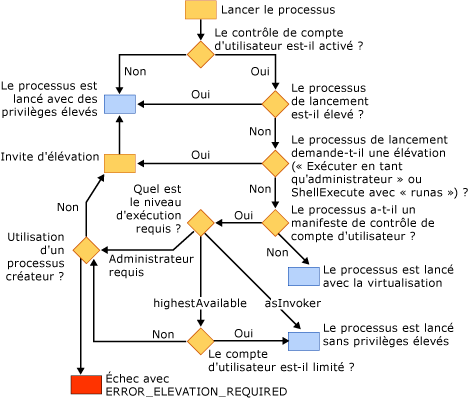

# R&#233;percussions du contr&#244;le de compte utilisateur sur votre application
[!INCLUDE[vs2017banner](../assembler/inline/includes/vs2017banner.md)]

Le contrôle de compte d'utilisateur \(UAC\) est une fonctionnalité de Windows Vista dans laquelle les comptes d'utilisateurs ont des privilèges limités.  Vous pouvez rechercher des informations détaillées concernant le contrôle de compte d'utilisateur sur les sites Web suivants :  
  
-   [Guide pas à pas du contrôle de compte d'utilisateur Windows](http://go.microsoft.com/fwlink/?linkid=53781)  
  
-   [Meilleures pratiques et instructions à l'attention du développeur pour les applications dans un environnement avec moins de privilèges](http://go.microsoft.com/fwlink/?linkid=82444)  
  
-   [Comprendre et configurer le contrôle de compte d'utilisateur dans Windows Vista](http://go.microsoft.com/fwlink/?LinkId=82445)  
  
## Génération de projets après l'activation du contrôle de compte d'utilisateur  
 Si vous générez un projet Visual C\+\+ sur Windows Vista avec le contrôle de compte d'utilisateur désactivé et que vous activez ultérieurement le contrôle de compte d'utilisateur, vous devez nettoyer et régénérer le projet pour qu'il fonctionne correctement.  
  
## Applications qui requièrent des privilèges d'administrateur  
 Par défaut, l'éditeur de liens Visual C\+\+ incorpore un fragment du contrôle de compte d'utilisateur dans le manifeste d'une application avec un niveau d'exécution `asInvoker`.  Si votre application nécessite des privilèges d'administrateur pour s'exécuter correctement \(par exemple, si elle modifie le nœud HKLM du Registre ou si elle écrit dans des zones protégées du disque, comme le répertoire Windows\), vous devez modifier votre application.  
  
 La première option est de modifier le fragment du contrôle de compte d'utilisateur du manifeste pour modifier le niveau d'exécution en *requireAdministrator*.  L'application demande ensuite à l'utilisateur ses informations d'identification administratives avant de s'exécuter.  Pour plus d'informations sur la procédure à suivre, consultez [\/MANIFESTUAC \(Incorporer des informations sur le contrôle de compte d'utilisateur dans le manifeste\)](../build/reference/manifestuac-embeds-uac-information-in-manifest.md).  
  
 La deuxième option consiste à ne pas incorporer de fragment du contrôle de compte d'utilisateur dans le manifeste en spécifiant l'option de l'éditeur de liens **\/MANIFESTUAC:NO**.  Dans ce cas, votre application s'exécutera en mode virtualisé.  Toute modification apportée au Registre ou au système de fichiers ne sera pas rendue persistante une fois que votre application est terminée.  
  
 L'organigramme suivant décrit comment votre application s'exécutera selon que le contrôle de compte d'utilisateur est activé et que l'application a un manifeste de contrôle de compte d'utilisateur ou pas :  
  
   
  
## Voir aussi  
 [Meilleures pratiques pour la sécurité](../top/security-best-practices-for-cpp.md)