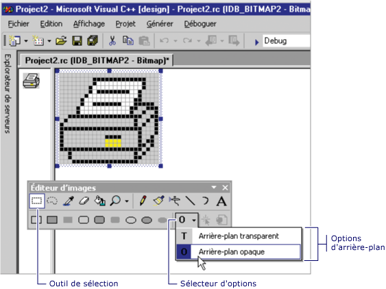

# Choosing a Transparent or Opaque Background (Image Editor for Icons)
[!INCLUDE[vs2017banner](../assembler/inline/includes/vs2017banner.md)]

Lorsque vous déplacez ou copiez une sélection à partir d'une image, les pixels de la sélection qui correspondent à la couleur d'arrière\-plan actuelle sont, par défaut, transparents ; ils ne cachent pas de pixels sur l'emplacement cible.  
  
 Vous pouvez passer d'un arrière\-plan transparent \(par défaut\) à un arrière\-plan opaque et vice\-versa.  Lorsque vous utilisez un outil de sélection, les options **Arrière\-plan transparent** et **Arrière\-plan opaque** s'affichent dans le sélecteur d'options de la barre d'outils **Éditeur d'images** \(comme indiqué ci\-dessous\).  
  
   
Options Arrière\-plan transparent et opaque dans la barre d'outils Éditeur d'options  
  
### Pour basculer entre un arrière\-plan transparent et un arrière\-plan opaque  
  
1.  Dans la barre d'outils **Éditeur d'images**, cliquez sur le sélecteur **Option**, puis sur l'arrière\-plan approprié :  
  
    -   **Arrière\-plan opaque \(O\)** : l'image existante est obscurcie par la sélection.  
  
    -   **Arrière\-plan transparent \(T\)** : l'image existante apparaît sous la sélection qui correspond à la couleur d'arrière\-plan actuelle.  
  
 \- ou \-  
  
-   Dans le menu **Image**, activez ou désactivez **Dessin opaque**.  
  
 Vous pouvez changer la couleur d'arrière\-plan une fois la sélection effectuée pour changer les parties d'une image qui sont transparentes.  
  
 Pour plus d'informations sur l'ajout de ressources aux projets managés, consultez [Ressources dans les applications](../Topic/Resources%20in%20Desktop%20Apps.md) dans le *Guide du développeur .NET Framework.* Pour obtenir des informations sur l'ajout de fichiers de ressources aux projets managés, l'accès aux ressources, l'affichage de ressources statiques et l'assignation de chaînes de ressources aux propriétés, et ce manuellement, consultez [Procédure pas à pas : localisation des applications Windows Forms](http://msdn.microsoft.com/fr-fr/9a96220d-a19b-4de0-9f48-01e5d82679e5) et [Walkthrough: Using Resources for Localization with ASP.NET](../Topic/Walkthrough:%20Using%20Resources%20for%20Localization%20with%20ASP.NET.md).  
  
 Configuration requise  
  
 Aucun  
  
## Voir aussi  
 [Accelerator Keys](../mfc/accelerator-keys-image-editor-for-icons.md)   
 [Working with Color](../mfc/working-with-color-image-editor-for-icons.md)