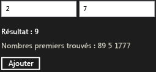

# Procédure pas à pas : création d'un composant Windows Runtime de base à l'aide de WRL
Ce document montre comment utiliser la bibliothèque de modèles C++ (WRL) de Windows Runtime pour créer un composant Windows Runtime de base. Le composant ajoute deux nombres et déclenche un événement lorsque le résultat est un nombre premier. Ce document montre également comment utiliser le composant à partir d’une application de plateforme Windows universelle qui utilise JavaScript.  
  
## Prérequis  
  
-   Expérience avec le [Windows Runtime](http://msdn.microsoft.com/library/windows/apps/br211377.aspx).  
  
-   Expérience avec COM.  
  
### Pour créer un composant Windows Runtime de base qui additionne deux nombres  
  
1.  Dans Visual Studio, créez un Visual C++ `WRLClassLibrary` projet. Le document [modèle de projet de bibliothèque de classes](../windows/wrl-class-library-project-template.md) décrit comment télécharger ce modèle. Attribuez un nom au projet `Contoso`.  
  
2.  Dans Contoso.cpp et Contoso.idl, remplacez toutes les instances de « WinRTClass » avec « Calculator ».  
  
3.  Dans Contoso.idl, ajoutez le `Add` méthode à la `ICalculator` interface.  
  
     [!code-cpp[wrl-basic-component#1](../windows/codesnippet/CPP/walkthrough-creating-a-basic-windows-runtime-component-using-wrl_1.idl)]  
  
4.  Dans Contoso.cpp, ajoutez le `Add` méthode à la `public` section de la `Calculator` classe.  
  
     [!code-cpp[wrl-basic-component#2](../windows/codesnippet/CPP/walkthrough-creating-a-basic-windows-runtime-component-using-wrl_2.cpp)]  
  
    > [!IMPORTANT]
    >  Étant donné que vous créez un composant COM, n’oubliez pas d’utiliser le `__stdcall` convention d’appel.  
  
     Nous vous recommandons d’utiliser `_Out_` et d’autres annotations de langage (SAL) source annotation pour décrire comment une fonction utilise ses paramètres. Les annotations SAL permettent également de décrire des valeurs de retour. Les annotations SAL fonctionnent avec les [outil d’analyse du Code C/C++](/visualstudio/code-quality/code-analysis-for-c-cpp-overview) pour découvrir les erreurs possibles dans C et C++ de code source. Des erreurs de codage courantes signalées par l’outil incluent des dépassements de mémoire tampon, mémoire non initialisée, déréférencements du pointeur null et les fuites de mémoire et ressources.  
  
### Pour utiliser le composant à partir d’une application de plateforme Windows universelle qui utilise JavaScript  
  
1.  Dans Visual Studio, ajoutez un nouveau code JavaScript `Blank App` de projet pour le `Contoso` solution. Attribuez un nom au projet `CalculatorJS`.  
  
2.  Dans le `CalculatorJS` de projet, ajoutez une référence à la `Contoso` projet.  
  
3.  Dans le fichier default.html, remplacez le `body` section avec ces éléments d’interface utilisateur :  
  
     [!code-html[wrl-basic-component#3](../windows/codesnippet/Html/walkthrough-creating-a-basic-windows-runtime-component-using-wrl_3.html)]  
  
4.  Dans default.js, vous devez implémenter le `OnClick` (fonction).  
  
     [!code-javascript[wrl-basic-component#4](../windows/codesnippet/JavaScript/walkthrough-creating-a-basic-windows-runtime-component-using-wrl_4.js)]  
  
    > [!NOTE]
    >  Dans JavaScript, la première lettre d’un nom de la méthode est en minuscule pour respecter les conventions d’affectation de noms standards.  
  
### Pour ajouter un événement qui se déclenche lorsqu’un nombre est calculée.  
  
1.  Dans Contoso.idl, avant la déclaration de `ICalculator`, définissez le type délégué, `PrimeNumberEvent`, qui fournit un `int` argument.  
  
     [!code-cpp[wrl-basic-component#5](../windows/codesnippet/CPP/walkthrough-creating-a-basic-windows-runtime-component-using-wrl_5.idl)]  
  
     Lorsque vous utilisez la `delegate` (mot clé), le compilateur MIDL crée une interface qui contient un `Invoke` méthode qui correspond à la signature de ce délégué. Dans cet exemple, le fichier généré Contoso_h.h définit le `IPrimeNumberEvent` interface, qui est utilisé ultérieurement dans cette procédure.  
  
     [!code-cpp[wrl-basic-component#13](../windows/codesnippet/CPP/walkthrough-creating-a-basic-windows-runtime-component-using-wrl_6.cpp)]  
  
2.  Dans le `ICalculator` de l’interface, définissez la `PrimeNumberFound` événement. Le `eventadd` et `eventremove` attributs spécifient que le consommateur de la `ICalculator` interface peut à la fois s’abonner et annuler l’abonnement à cet événement.  
  
     [!code-cpp[wrl-basic-component#6](../windows/codesnippet/CPP/walkthrough-creating-a-basic-windows-runtime-component-using-wrl_7.idl)]  
  
3.  Dans Contoso.cpp, ajoutez un `private` [Microsoft::WRL::EventSource](../windows/eventsource-class.md) variable membre pour gérer les abonnés aux événements et appeler le Gestionnaire d’événements.  
  
     [!code-cpp[wrl-basic-component#7](../windows/codesnippet/CPP/walkthrough-creating-a-basic-windows-runtime-component-using-wrl_8.cpp)]  
  
4.  Dans Contoso.cpp, implémentez le `add_PrimeNumberFound` et `remove_PrimeNumberFound` méthodes.  
  
     [!code-cpp[wrl-basic-component#8](../windows/codesnippet/CPP/walkthrough-creating-a-basic-windows-runtime-component-using-wrl_9.cpp)]  
  
### Pour déclencher l’événement lorsqu’un nombre est calculée.  
  
1.  Dans Contoso.cpp, ajoutez le `IsPrime` méthode à la `private` section de la `Calculator` classe.  
  
     [!code-cpp[wrl-basic-component#12](../windows/codesnippet/CPP/walkthrough-creating-a-basic-windows-runtime-component-using-wrl_10.cpp)]  
  
2.  Modifier la `Calculator`de `Add` méthode à appeler le [Microsoft::WRL::EventSource::InvokeAll](../windows/eventsource-invokeall-method.md) méthode lors du calcul d’un nombre premier.  
  
     [!code-cpp[wrl-basic-component#11](../windows/codesnippet/CPP/walkthrough-creating-a-basic-windows-runtime-component-using-wrl_11.cpp)]  
  
### Pour gérer l’événement à partir de JavaScript  
  
1.  Dans le fichier default.html, modifiez le `body` section à inclure une zone de texte qui contient les nombres premiers.  
  
     [!code-html[wrl-basic-component#9](../windows/codesnippet/Html/walkthrough-creating-a-basic-windows-runtime-component-using-wrl_12.html)]  
  
2.  Dans default.js, modifiez le `Add` fonction pour gérer la `PrimeNumberFound` événement. Le Gestionnaire d’événements ajoute le nombre de premiers à la zone de texte qui a été définie à l’étape précédente.  
  
     [!code-javascript[wrl-basic-component#10](../windows/codesnippet/JavaScript/walkthrough-creating-a-basic-windows-runtime-component-using-wrl_13.js)]  
  
    > [!NOTE]
    >  Dans JavaScript, les noms d’événements sont changés en minuscules et sont précédées de « on » pour respecter les conventions d’affectation de noms standards.  
  
 L’illustration suivante montre l’application Calculatrice de base.  
  
   
  
## Étapes suivantes  
  
## Voir aussi  
 [Windows Runtime bibliothèque de modèles C++ (WRL)](../windows/windows-runtime-cpp-template-library-wrl.md)   
 [Modèle de projet de bibliothèque de classes](../windows/wrl-class-library-project-template.md)   
 [Outil d’analyse du Code C/C++](/visualstudio/code-quality/code-analysis-for-c-cpp-overview)