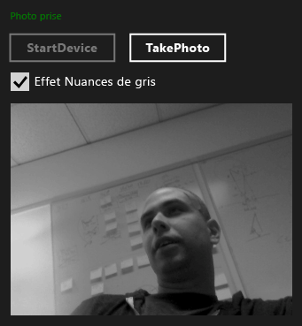

# Proc&#233;dure pas &#224; pas&#160;: cr&#233;ation d&#39;une application Windows Store &#224; l&#39;aide de WRL et Media Foundation
[!INCLUDE[vs2017banner](../assembler/inline/includes/vs2017banner.md)]

Découvrez comment utiliser le [!INCLUDE[cppwrl](../windows/includes/cppwrl_md.md)] ([!INCLUDE[cppwrl_short](../windows/includes/cppwrl_short_md.md)]) pour créer un [!INCLUDE[win8_appname_long](../build/includes/win8_appname_long_md.md)] application qui utilise [Microsoft Media Foundation](http://msdn.microsoft.com/library/windows/apps/ms694197).  
  
 Cet exemple crée une transformation Media Fondation personnalisée qui applique un effet de nuances de gris aux images capturées par une webcam. L'application utilise C++ pour définir la transformation personnalisée et C# pour utiliser le composant afin de transformer les images capturées.  
  
> [!NOTE]
>  Au lieu de C#, vous pouvez également utiliser JavaScript, Visual Basic, ou C++ pour recourir au composant de transformation personnalisée.  
  
 Dans la plupart des cas, vous pouvez utiliser les [!INCLUDE[cppwrt](../build/reference/includes/cppwrt_md.md)] ([!INCLUDE[cppwrt_short](../build/reference/includes/cppwrt_short_md.md)]) pour créer des composants [!INCLUDE[wrt](../atl/reference/includes/wrt_md.md)]. (Pour plus d’informations, consultez [Référence du langage Visual C++](../Topic/Visual%20C++%20Language%20Reference%20\(C++-CX\).md).) Toutefois, vous devez parfois utiliser la [!INCLUDE[cppwrl_short](../windows/includes/cppwrl_short_md.md)]. Par exemple, quand vous créez une extension de média pour Microsoft Media Foundation, vous devez créer un composant qui implémente à la fois les interfaces COM et [!INCLUDE[wrt](../atl/reference/includes/wrt_md.md)]. Étant donné que [!INCLUDE[cppwrt_short](../build/reference/includes/cppwrt_short_md.md)] peut uniquement créer des objets [!INCLUDE[wrt](../atl/reference/includes/wrt_md.md)], pour créer une extension de média, vous devez utiliser la [!INCLUDE[cppwrl_short](../windows/includes/cppwrl_short_md.md)], car elle permet l'implémentation à la fois des interfaces COM et [!INCLUDE[wrt](../atl/reference/includes/wrt_md.md)].  
  
> [!NOTE]
>  Bien que cet exemple de code soit long, il montre le minimum nécessaire pour créer une transformation Media Foundation utile. Vous pouvez l'utiliser comme point de départ pour votre propre transformation personnalisée. Cet exemple est une adaptation de la [exemple extensions de média](http://code.msdn.microsoft.com/windowsapps/Media-extensions-sample-7b466096), les extensions de média utilise pour appliquer des effets vidéo, encoder une vidéo et créer des gestionnaires de schéma qui produisent des flux de données.  
  
## Prérequis  
  
-   Expérience avec les [Windows Runtime](http://msdn.microsoft.com/library/windows/apps/br211377.aspx).  
  
-   Expérience avec COM.  
  
-   Une webcam.  
  
## Points clés  
  
-   Pour créer un composant Media Foundation personnalisé, utilisez un fichier de définition MIDL (Microsoft Interface Definition Language) pour définir une interface, implémentez celle-ci, puis rendez-la activable à partir d'autres composants.  
  
-   Le `namespace` et `runtimeclass` les attributs et les `NTDDI_WIN8`[version](http://msdn.microsoft.com/fr-fr/66ac5cf3-2230-44fd-aaf6-8013e4a4ae81) valeur d’attribut sont des parties importantes de la définition de MIDL pour un composant de Media Foundation utilise [!INCLUDE[cppwrl_short](../windows/includes/cppwrl_short_md.md)].  
  
-   [Microsoft::wrl::RuntimeClass](../windows/runtimeclass-class.md) est la classe de base pour le composant de Media Foundation personnalisé. Le [Microsoft::WRL::RuntimeClassType::WinRtClassicComMix](../windows/runtimeclasstype-enumeration.md) valeur enum, qui est fourni comme argument de modèle, marque la classe à utiliser comme un [!INCLUDE[wrt](../atl/reference/includes/wrt_md.md)] classe et comme une classe d’exécution COM classique.  
  
-   Le [InspectableClass](../windows/inspectableclass-macro.md) macro implémente la fonctionnalité COM de base telles que le décompte de références et les `QueryInterface` (méthode) et définit l’exécution du nom de la classe et le niveau de confiance.  
  
-   Utilisez le Microsoft::WRL ::[classe de Module](https://www.microsoftonedoc.com/#/organizations/e6f6a65cf14f462597b64ac058dbe1d0/projects/3fedad16-eaf1-41a6-8f96-0c1949c68f32/containers/a3daf831-1c5f-4bbe-964d-503870caf874/tocpaths/b4acf5de-2f4c-4c8b-b5ff-9140d023ecbe/locales/en-US) pour implémenter des fonctions de point d’entrée DLL comme [DllGetActivationFactory](http://msdn.microsoft.com/library/br205771.aspx), [DllCanUnloadNow](http://msdn.microsoft.com/library/windows/desktop/ms690368\(v=vs.85\).aspx), et [DllGetClassObject](http://msdn.microsoft.com/library/windows/desktop/ms680760\(v=vs.85\).aspx).  
  
-   Liez votre DLL de composant à runtimeobject.lib. Spécifiez également [/WINMD](../Topic/Compiler%20and%20Linker%20options%20\(C++-CX\).md) sur la ligne de l’éditeur de liens pour générer des métadonnées Windows.  
  
-   Utilisez les références de projet pour rendre les composants [!INCLUDE[cppwrl_short](../windows/includes/cppwrl_short_md.md)] accessibles aux applications du [!INCLUDE[win8_appname_long](../build/includes/win8_appname_long_md.md)].  
  
### Pour utiliser la [!INCLUDE[cppwrl_short](../windows/includes/cppwrl_short_md.md)] afin de créer le composant Media Foundation de transformation en nuances de gris  
  
1.  Dans Visual Studio, créez un **blanc** projet. Nommez le projet, par exemple, `MediaCapture`.  
  
2.  Ajouter un **DLL (applications du Windows Store)** projet à la solution. Nommez le projet, par exemple, `GrayscaleTransform`.  
  
3.  Ajouter un **fichier Midl (.idl)** fichier au projet. Nommez le fichier, par exemple, `GrayscaleTransform.idl`.  
  
4.  Ajoutez ce code à GrayscaleTransform.idl.  
  
     [!code-cpp[wrl-media-capture#1](../windows/codesnippet/CPP/walkthrough-creating-a-windows-store-app-using-wrl-and-media-foundation_1.idl)]  
  
5.  Utilisez le code suivant pour remplacer le contenu de pch.h.  
  
     [!code-cpp[wrl-media-capture#2](../windows/codesnippet/CPP/walkthrough-creating-a-windows-store-app-using-wrl-and-media-foundation_2.h)]  
  
6.  Ajouter un nouveau fichier d’en-tête au projet, nommez-le `BufferLock.h`, puis ajoutez ce code :  
  
     [!code-cpp[wrl-media-capture#3](../windows/codesnippet/CPP/walkthrough-creating-a-windows-store-app-using-wrl-and-media-foundation_3.h)]  
  
7.  GrayscaleTransform.h n'est pas utilisé dans cet exemple. Vous pouvez le supprimer du projet si vous le souhaitez.  
  
8.  Utilisez le code suivant pour remplacer le contenu de GrayscaleTransform.cpp.  
  
     [!code-cpp[wrl-media-capture#4](../windows/codesnippet/CPP/walkthrough-creating-a-windows-store-app-using-wrl-and-media-foundation_4.cpp)]  
  
9. Ajoutez un nouveau fichier de définition de module au projet, nommez-le `GrayscaleTransform.def`, puis ajoutez ce code :  
  
     [!CODE [wrl-media-capture#5](../CodeSnippet/VS_Snippets_Misc/wrl-media-capture#5)]  
  
10. Utilisez le code suivant pour remplacer le contenu de dllmain.cpp.  
  
     [!code-cpp[wrl-media-capture#6](../windows/codesnippet/CPP/walkthrough-creating-a-windows-store-app-using-wrl-and-media-foundation_6.cpp)]  
  
11. Dans le fichier **Pages de propriétés** boîte de dialogue, définissez les éléments suivants **l’éditeur de liens** Propriétés.  
  
    1.  Sous **entrée**, pour le **fichier de définition de Module**, spécifiez `GrayScaleTransform.def`.  
  
    2.  Également sous **entrée**, ajouter `runtimeobject.lib`, `mfuuid.lib`, et `mfplatf.lib` à la **dépendances supplémentaires** propriété.  
  
    3.  Sous **métadonnées Windows**, définissez **Générer des métadonnées Windows** à **Oui (/ WINMD)**.  
  
### Pour utiliser le composant Media Foundation personnalisé de la [!INCLUDE[cppwrl_short](../windows/includes/cppwrl_short_md.md)] à partir d'une application C#  
  
1.  Ajouter un nouveau **c# application vide (XAML)** de projet pour la `MediaCapture` solution. Nommez le projet, par exemple, `MediaCapture`.  
  
2.  Dans le **MediaCapture** de projet, ajoutez une référence à la `GrayscaleTransform` projet. Pour savoir comment procéder, consultez [Comment : ajouter ou supprimer des références à l’aide du Gestionnaire de références](../Topic/How%20to:%20Add%20or%20Remove%20References%20By%20Using%20the%20Reference%20Manager.md).  
  
3.  Dans Package.appxmanifest, sur le **fonctionnalités** onglet, sélectionnez **Microphone** et **Webcam**. Les deux capacités sont nécessaires pour capturer des photos à partir de la webcam.  
  
4.  Dans MainPage.xaml, ajoutez ce code à la racine [grille](http://msdn.microsoft.com/library/windows/apps/xaml/windows.ui.xaml.controls.grid.aspx) élément :  
  
     [!code-xml[wrl-media-capture#7](../windows/codesnippet/Xaml/walkthrough-creating-a-windows-store-app-using-wrl-and-media-foundation_7.xaml)]  
  
5.  Utilisez le code suivant pour remplacer le contenu de MainPage.xaml.cs.  
  
     [!code-cs[wrl-media-capture#8](../windows/codesnippet/CSharp/walkthrough-creating-a-windows-store-app-using-wrl-and-media-foundation_8.cs)]  
  
 L'illustration suivante montre l'application MediaCapture.  
  
   
  
## Étapes suivantes  
 L'exemple montre comment capturer des photos à partir de la webcam par défaut une à la fois. Les [exemples d’extensions Media](http://code.msdn.microsoft.com/windowsapps/Media-extensions-sample-7b466096) ne se limite pas. Il montre comment énumérer les dispositifs de webcam et utiliser les gestionnaires de schéma locaux, et illustre des effets multimédias supplémentaires applicables aux photos et aux flux de vidéo.  
  
## Voir aussi  
 [Windows Runtime bibliothèque de modèles C++ (WRL)](../windows/windows-runtime-cpp-template-library-wrl.md)   
 [Microsoft Media Foundation](http://msdn.microsoft.com/library/windows/apps/ms694197)   
 [Exemple d’extensions de média](http://code.msdn.microsoft.com/windowsapps/Media-extensions-sample-7b466096)